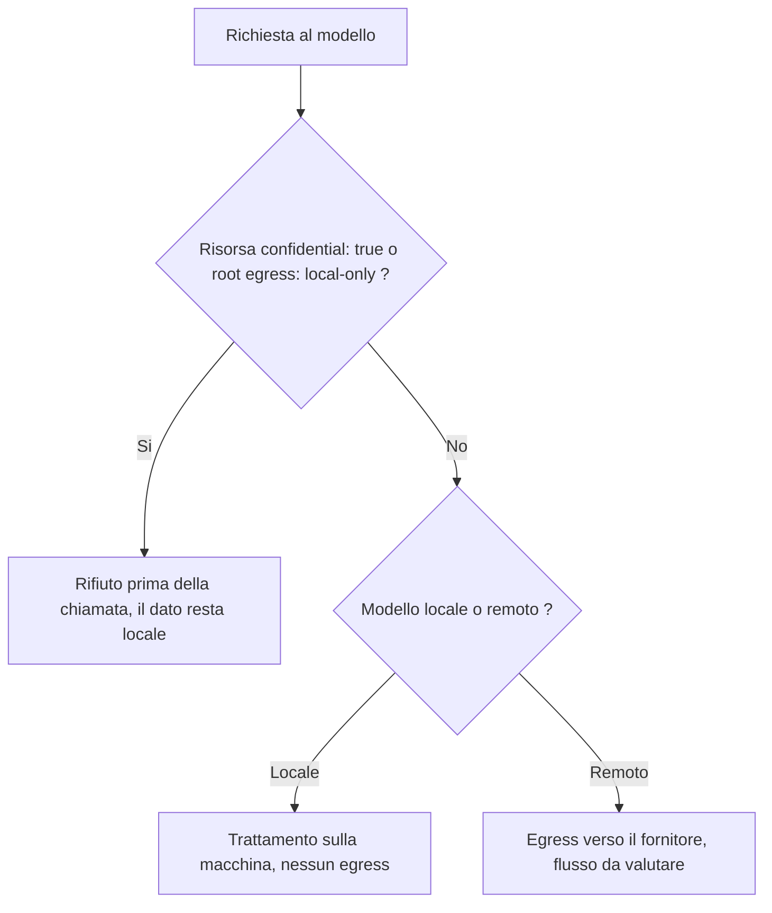

<!-- fr-synced: 7303fe6266734682aecc6efc5960aa2dfd50407e -->

# Modello di valutazione d'impatto (DPIA)

Prima di mettere un assistente nelle mani dei vostri team, dovete poter giustificare cosa fa con i dati, di fronte alla vostra istituzione e al vostro responsabile della protezione dei dati (DPO). Questo scheletro vi offre una traccia difendibile per questa analisi e separa nettamente cio che BASE garantisce tecnicamente da cio che resta sotto la vostra responsabilita: sapete cosi esattamente cosa vi impegna.

> **Pagina informativa, non un parere legale.** Questo documento e un punto di partenza riutilizzabile. Non sostituisce una valutazione d'impatto sulla protezione dei dati (DPIA ai sensi del GDPR, AIPD ai sensi della nLPD/nFADP). L'analisi effettiva, la sua convalida e il suo aggiornamento competono alla vostra istituzione e al suo responsabile della protezione dei dati (DPO). BASE non fornisce ne IAM, ne DLP, ne SIEM, ne la conservazione regolamentare (vedi [Sicurezza e limiti](../trust/securite-et-limites.md)).

## Come usare questo scheletro

Copiate questa struttura nel vostro registro. Sostituite ogni marcatore `[A COMPLETER]` con gli elementi propri del vostro trattamento. La struttura segue una traccia compatibile con nLPD/nFADP e GDPR, ma l'adeguatezza al vostro esatto quadro giuridico resta da verificare a cura del vostro DPO.

Una distinzione attraversa tutto il documento, perche e al cuore dell'onesta di BASE:

- **Meccanismo**: una regola applicata dal mediatore di BASE (il codice), quindi opponibile e verificabile.
- **Consigne**: un'istruzione seguita dal modello, quindi utile ma non garantita.

Una misura e una garanzia solo se si fonda su un meccanismo. Non accreditate una consigne come controllo tecnico nella vostra analisi del rischio.

## 1. Descrizione del trattamento

- **Denominazione del trattamento:** [A COMPLETER]
- **Titolare del trattamento:** [A COMPLETER]
- **Servizio o unita operativa:** [A COMPLETER]
- **Descrizione funzionale:** [A COMPLETER] (per esempio: assistente per la redazione di lettere interne, strutturazione di procedure, supporto alla risposta a richieste).
- **Ruolo di BASE:** BASE struttura il sapere operativo in file che possedete e media le azioni sensibili. BASE non e ne un runtime di agente, ne un motore di orchestrazione, ne un dispositivo di RAG, ne una piattaforma di conformita.
- **Ruolo del modello:** l'esecuzione generativa (il modello) e una vostra scelta e vive fuori da BASE. Il modello puo essere locale (per esempio tramite Ollama) o remoto (API). Questa scelta e determinante per l'analisi (vedi sezione 5).

## 2. Categorie di dati

BASE in se memorizza solo cio che vi inserite:

- i **file di risorse** che depositate (il sapere operativo, in Markdown);
- un **registro di traccia locale** (`.ai/trace`) che registra le operazioni mediate: operazione, risorsa, stato, durata, senza contenuto operativo per impostazione predefinita.

Il routing predefinito e **100 % locale** (lessicale, zero rete). Il routing semantico avanzato invia testo a un fornitore di embeddings solo se lo attivate esplicitamente, ed esiste un'opzione locale (vedi [Sicurezza dei dati di routing](../trust/securite-donnees-routage.md)).

Da completare per il vostro trattamento:

- **Categorie di dati trattati:** [A COMPLETER] (dati interni, dati personali, dati sensibili ai sensi della legge, ecc.).
- **Persone interessate:** [A COMPLETER] (collaboratori, cittadini, clienti, ecc.).
- **Volume e frequenza stimati:** [A COMPLETER].
- **Eventuali dati personali sensibili:** [A COMPLETER]. Raccomandazione prudente: nessun dato personale sensibile in un primo assistente.

## 3. Finalita

- **Finalita principale:** [A COMPLETER].
- **Finalita secondarie:** [A COMPLETER].
- **Minimizzazione:** [A COMPLETER] (giustificare che vengono trattati solo i dati necessari alle finalita).
- **Limitazione della conservazione:** vedi sezione 7.

## 4. Base giuridica

La determinazione della base giuridica compete alla vostra istituzione e al suo DPO.

- **Base giuridica adottata:** [A COMPLETER] (per esempio: consenso, esecuzione di un contratto, obbligo legale, compito di interesse pubblico, interesse legittimo, secondo il quadro applicabile).
- **Quadro giuridico di riferimento:** [A COMPLETER] (nLPD/nFADP, diritto cantonale o comunale pertinente, GDPR se applicabile).
- **Informazione delle persone interessate:** [A COMPLETER].

## 5. Flussi di dati e frontiera

Per impostazione predefinita, tutto resta locale. Il punto da analizzare in via prioritaria e l'**egress**: la chiamata al modello remoto, se avviene. Vedi il tutorial [Perimetri e governance dell'egress](../tutoriel/equipe-2-perimetres-et-egress.md).

Meccanismo applicato da BASE: una risorsa contrassegnata `confidential: true`, o un intero root contrassegnato `egress: local-only`, **non viene inviata a un modello remoto**. Il controllo avviene **prima** della chiamata, quindi il dato non lascia la macchina; il rifiuto e mostrato, mai silenzioso. E un meccanismo, non una consigne.

Riserva: la distinzione locale/remoto si basa sulla localita dichiarata o dedotta del fornitore (`tools/core/model-settings.mjs`), che un proxy mal configurato posto davanti a un servizio remoto potrebbe travisare; e quindi un controllo onesto, non una prova assoluta.

Da completare per il vostro trattamento:

- **Mappatura dei flussi:** [A COMPLETER] (chi inserisce cosa, dove sono memorizzati i file, quali flussi escono dalla macchina).
- **Localizzazione dell'archiviazione dei file:** [A COMPLETER].
- **Localizzazione del registro di traccia:** locale, sulla macchina su cui gira BASE (`.ai/trace`).
- **Modello scelto:** [A COMPLETER] (locale o remoto). Se remoto, descrivere la chiamata di rete verso il fornitore come il flusso di egress da valutare.
- **Dati contrassegnati `confidential: true` / root in `egress: local-only`:** [A COMPLETER].

## 6. Destinatari e responsabili del trattamento

- **Destinatari interni:** [A COMPLETER].
- **Responsabile del trattamento principale da valutare:** il fornitore del modello remoto scelto, se del caso. BASE non vi lega ad alcun fornitore; se eseguite un modello locale, non vi e a tale titolo alcun trasferimento verso un terzo.
- **Clausole contrattuali da verificare (se modello remoto):** [A COMPLETER] (localizzazione dei dati, subappalto ulteriore, durata di conservazione lato fornitore, uso per l'addestramento, sicurezza).
- **Trasferimenti fuori dal paese / fuori dalla zona applicabile:** [A COMPLETER].
- **Giurisdizione dell'hoster ed esposizione extraterritoriale:** [A COMPLETER]. La localita di esecuzione non risolve la giurisdizione: un hoster soggetto a una legge straniera, come il CLOUD Act statunitense, puo essere costretto a consegnare i dati ovunque siano memorizzati, mentre un attore svizzero resta vincolabile dal diritto svizzero. Vedi [`souverainete-et-confiance.md`](../trust/souverainete-et-confiance.md).

Nota: BASE memorizza nelle sue impostazioni i **nomi** delle variabili d'ambiente, non le chiavi API in chiaro. La gestione effettiva dei segreti resta di vostra competenza.

## 7. Conservazione e cancellazione

- **Durata di conservazione dei file di risorse:** [A COMPLETER] (definita dalla vostra politica di archiviazione).
- **Durata di conservazione del registro di traccia:** [A COMPLETER]. Il registro `.ai/trace` e locale e puo essere ripulito secondo la vostra politica. Descrivete la procedura di pulizia adottata.
- **Procedura di cancellazione / diritto all'oblio:** [A COMPLETER].

Promemoria: BASE non fornisce conservazione regolamentare o archiviazione legale automatiche. Tali obblighi competono ai vostri sistemi e alle vostre procedure.

## 8. Rischi e misure di mitigazione

Per ogni rischio, distinguete cio che e coperto da un **meccanismo** di BASE da cio che dipende da una **consigne** o dai vostri sistemi.

| Rischio | Misura | Tipo |
|---|---|---|
| Fuga di dati riservati verso un modello remoto | Rifiuto di egress prima della chiamata (risorsa `confidential: true` o radice `egress: local-only`) | Meccanismo |
| Scrittura fuori dal perimetro autorizzato | Confinamento dei percorsi e rifiuto delle evasioni tramite link simbolico (`tools/core/confine.mjs`) | Meccanismo |
| Modifica non convalidata di un file | Disciplina propone poi committa; scritture mediate e atomiche; un diff e mostrato prima della scrittura | Meccanismo |
| Esecuzione involontaria di un'azione | Tools in dry-run per impostazione predefinita | Meccanismo |
| Risposta inventata dal router | Astensione anziche falsa certezza (`out_of_scope`, `ambiguous`, `needs_clarification`) | Meccanismo |
| Accesso non controllato al server MCP | MCP HTTP in sola lettura per impostazione predefinita, opzione di token bearer | Meccanismo |
| Esposizione di rete di Studio | Studio solo in loopback | Meccanismo |
| Assenza di tracciabilita delle azioni | Registro locale delle operazioni mediate (`.ai/trace`) | Meccanismo |
| Inserimento di dati sensibili in un assistente | Classificazione delle risorse, consignes di manipolazione | Consigne / organizzazione |
| Esattezza degli output del modello | Convalida umana (proporre poi committare); rilettura | Consigne / organizzazione |
| Autenticazione, RBAC, DLP, SIEM | Fuori da BASE: da coprire con i vostri sistemi | Fuori perimetro |

Misure complementari da documentare: [A COMPLETER].

## 9. Rischio residuo

- **Valutazione del rischio residuo dopo le misure:** [A COMPLETER] (basso / medio / elevato, con giustificazione).
- **Rischi non coperti da BASE:** [A COMPLETER] (per esempio: autenticazione, prevenzione della fuga di dati nel senso DLP, registrazione centralizzata, conservazione regolamentare).
- **Decisione:** [A COMPLETER] (trattamento accettabile allo stato attuale, a determinate condizioni, o da rivedere).

## 10. Convalida

- **Analisi redatta da:** [A COMPLETER], il [A COMPLETER].
- **Parere del responsabile della protezione dei dati (DPO):** [A COMPLETER].
- **Consultazione dell'autorita di controllo se richiesta:** [A COMPLETER].
- **Approvazione del titolare del trattamento:** [A COMPLETER], il [A COMPLETER].
- **Data di revisione prevista:** [A COMPLETER].

---

Il DPO della vostra istituzione e proprietario della DPIA effettiva. Questo scheletro si limita a facilitarne la redazione. Per il modello di minaccia pubblico e i limiti del nucleo locale, vedi [Sicurezza e limiti](../trust/securite-et-limites.md) e [Sovranita e fiducia](../trust/souverainete-et-confiance.md).
