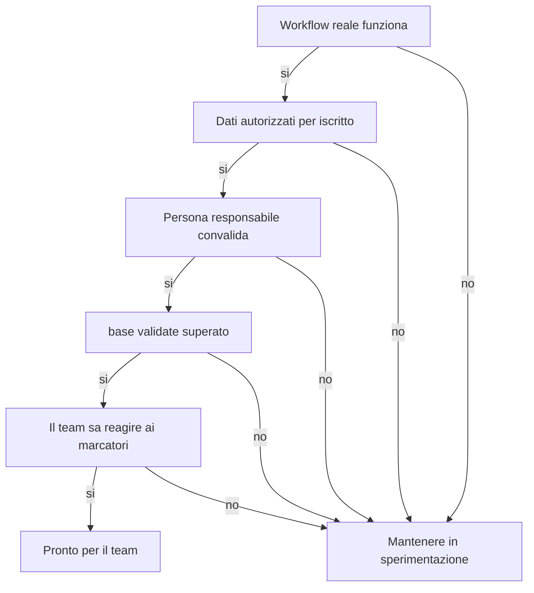

<!-- fr-synced: 1d39f832c6d003d277090020b9bf68b30b09fe48 -->

# Iniziare con BASE in una PMI svizzera

Far lavorare un piccolo team svizzero con l'IA senza sbandare ne distribuire una piattaforma pesante: e questo che e in gioco qui. Questo kit fornisce il minimo praticabile per iniziare in modo pulito con BASE e inquadrare un primo uso controllato. Non sostituisce ne un parere legale, ne una politica di sicurezza, ne una governance documentale.

## 1. Scegliere un primo workflow

Cominciate con un compito ripetibile, visibile e a basso rischio:

- preparare un preventivo;
- redigere una newsletter;
- preparare un colloquio;
- strutturare un progetto;
- gestire una richiesta di supporto.

Evitate come primo caso d'uso le decisioni legali, quelle HR sensibili, mediche, finanziarie regolamentate o irreversibili.

## 2. Definire i dati autorizzati

Prima di utilizzare uno strumento IA, il team scrive una regola semplice:

```text
On peut entrer: informations publiques, exemples fictifs, modèles internes non sensibles, données client nécessaires à la tâche et validées pour cet usage.
On n'entre pas: secrets, mots de passe, données médicales, données RH sensibles, données client non nécessaires, documents confidentiels sans accord ou environnement adapté.
```

BASE conserva i file localmente, ma lo strumento IA utilizzato puo trattare il contenuto della conversazione secondo le proprie condizioni. Per la nLPD, il RGPD o gli obblighi settoriali, l'organizzazione resta responsabile del trattamento, del fornitore scelto e dei diritti di accesso.

## 3. Nominare le responsabilita

Per ogni assistente condiviso, decidete:

- chi tiene aggiornati i file di lavoro;
- chi convalida gli output prima dell'invio esterno;
- chi puo modificare prezzi, condizioni, modelli e regole;
- chi avvia la manutenzione mensile;
- chi decide quando l'assistente segnala un'incertezza.

Una buona regola: l'IA propone, la persona responsabile firma.

## 4. Versionare in modo semplice

Per un piccolo team, Git e ideale se lo padroneggia. Altrimenti, cominciate in modo piu semplice:

- tenete i file in una cartella condivisa controllata;
- datate i cambiamenti importanti in un registro;
- non modificate i modelli critici senza una rilettura;
- conservate una copia prima dei cambiamenti maggiori;
- eseguite `base validate` prima di condividere una nuova versione.

Se il team cresce, passate a Git, alle revisioni dei cambiamenti e a diritti di accesso formalizzati.

## 5. Installare il rituale mensile

Una volta al mese, o prima di ogni condivisione importante, eseguite questi tre comandi. Passano attraverso un terminale e presuppongono che Node sia installato (come all'installazione); se nessuno nel team ha dimestichezza con il terminale, affidate questo rituale alla persona che ha installato BASE, oppure chiedete al vostro assistente IA di eseguirli per voi.

```bash
base validate --root <dossier>
base entretien --root <dossier>
base route-test --root <dossier>
```

Poi verificate in team:

- i marcatori `[A VALIDER]`, `[A COMPLETER]`, `[ATTENTION]`, `[DECISION]`. Il rapporto segnala quelli che invecchiano: se i vostri marcatori restano aperti per mesi, la vostra convalida e diventata decorativa;
- i link interrotti;
- le descrizioni mancanti;
- i dati obsoleti;
- i workflow che non corrispondono piu alla pratica reale;
- le risorse personali da promuovere verso il team.

## 6. Mantenere visibili i limiti

BASE aiuta una PMI a strutturare il lavoro con l'IA. Da solo non fornisce:

- IAM, SSO o RBAC;
- DLP;
- SIEM;
- archiviazione legale;
- conservazione regolamentare;
- gestione centralizzata dei segreti;
- una garanzia di esattezza delle risposte del modello.

Se questi bisogni emergono, mantenete BASE come livello di strutturazione e aggiungete i controlli tecnici attorno.

## 7. Regola di decisione

Un uso di BASE e pronto per il team quando:

1. un primo workflow reale funziona;
2. i dati autorizzati sono messi per iscritto;
3. una persona responsabile convalida gli output;
4. `base validate` viene superato;
5. il team sa cosa fare quando l'assistente segna `[A VALIDER]` o `[ATTENTION]`.



Se uno di questi punti manca, mantenete l'uso in sperimentazione.
