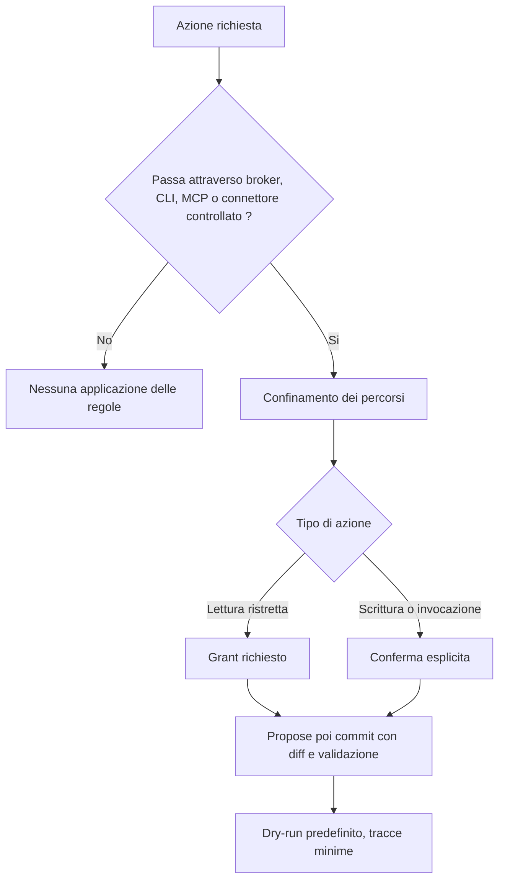

<!-- fr-synced: 875227e79f92bee9f1a6bea6ec0140894b3f83b8 -->

# Distribuire BASE in un'organizzazione

Distribuire BASE in un'organizzazione significa decidere chi può fare cosa con i vostri assistenti e mantenere il controllo sulle azioni sensibili, senza cedere il vostro know-how a una piattaforma. La sfida per un team o per un reparto IT: mantenere il controllo di ciò che il framework applica davvero, sapere come blindarlo e scegliere una modalità di distribuzione adeguata alle vostre esigenze. BASE porta due cose che completano la vostra base esistente: un linguaggio dell'esperienza in file di vostra proprietà e una mediazione onesta delle azioni sensibili, collegabile senza fare il fork del nucleo. Ma non è una piattaforma di conformità: BASE non sostituisce né IAM, né SSO, né RBAC, né DLP, né SIEM, né la conservazione normativa (vedi [Sicurezza e limiti](../trust/securite-et-limites.md)).

## Ciò che viene realmente applicato

L'applicazione delle regole vale solo per le azioni che passano attraverso il broker, la CLI, il MCP o un connettore controllato. Lì BASE fornisce: il confinamento dei percorsi, la modalità propose e poi commit con diff e validazione, il dry-run come impostazione predefinita per i tool, tracce minime e punti di estensione (validatori, policy, ranker, auth) configurati tramite `base.config.{json,mjs}`. Il routing, da parte sua, sceglie il workflow adatto alla richiesta ed evita all'utente di dover cercare il processo giusto: non applica i permessi.



## Esempio di configurazione rigorosa

`base.config.mjs` è codice di progetto attendibile, caricato unicamente dalla radice confinata della BASE (mai dai dati delle risorse). Gli stessi descrittori funzionano in `base.config.json`; il formato `.mjs` permette inoltre di passare funzioni per i casi avanzati.

```js
// base.config.mjs : configuration stricte (équipe / organisation).
export default {
  // Enforcement médié : exige un grant pour les lectures restreintes,
  // et une confirmation explicite pour les écritures et invocations.
  policy: { type: "strict", grants: ["devis:nouveau-devis"] },

  // Validateurs d'organisation, appliqués par `base validate` et `base entretien`.
  validators: [
    { type: "requireSchemaVersion" },
    { type: "requireFields", fields: ["owner", "review_date"], whenScope: "team" },
    { type: "forbidSensitivity", level: "restricted" },
    { type: "piiScanner", patterns: ["\\b\\d{13,16}\\b"], severity: "error" },
    { type: "routability" },
  ],

  // Seuils de routage plus prudents, et repli vers le concierge sur abstention honnête.
  routing: {
    floor_score: 40,
    top2_margin: 0.15,
    max_candidates: 5,
    fallback: { agent: "concierge-base", process: "accueil" },
  },
};
```

Il fallback qui sopra presuppone che la radice distribuita contenga `concierge-base` e il suo processo `accueil`. Se copiate solo un assistente di dominio, puntate il fallback verso un punto di accesso locale equivalente, oppure copiate anche il concierge.

Per il MCP, aggiungete un descrittore `auth` (token bearer o un `AuthProvider` fatto in casa): il server MCP rifiuta già qualsiasi esposizione non loopback senza autenticazione (vedi [`mcp/`](../../mcp/)).

## Modalità di distribuzione

| Modalità | Mediazione | Per chi |
| --- | --- | --- |
| Locale, solo browser | Nessuna (istruzioni seguite dal modello) | Scoperta, senza installazione |
| Strumento IA + cartella (per esempio GitHub Copilot, Antigravity, Claude Code o Cowork, OpenCode, Kilo Code) | Debole (lo strumento segue il routing) | Singolo utente, prima configurazione |
| CLI locale | Forte sulle azioni mediate (propose/commit, dry-run) | Team, manutenzione di una BASE |
| MCP autenticato | Sola lettura per impostazione predefinita, scritture esplicite, auth richiesta fuori da loopback | Integrazione multi-client |
| Policy rigorosa (`policy: { type: "strict" }`) | Grant di lettura e conferme esplicite sulle azioni mediate | Organizzazione, governance granulare |

## Per approfondire

- Garanzie e fuori perimetro: [Sicurezza e limiti](../trust/securite-et-limites.md).
- Sovranità e fiducia (reparti IT, conformità): [Sovranità e fiducia](../trust/souverainete-et-confiance.md).
- Modelli locali e svizzeri (Ollama, Infomaniak): [Modelli sovrani e locali](../guides/modeles-souverains.md).
- Contratto di ingegneria e punti di estensione: [`specs/current/README.md`](../../specs/current/README.md).
- Stabilità della superficie pubblica: [Versioni e stabilità](../reference/versions-et-stabilite.md).
