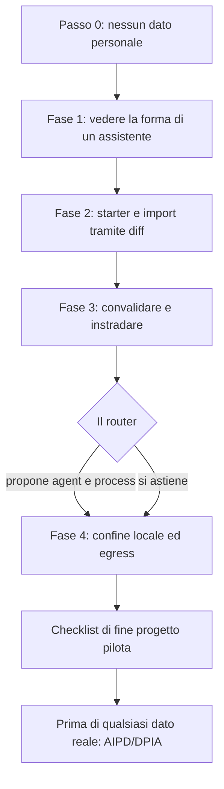

<!-- fr-synced: 05e7b530b270929c91cdca4e4b11fde9564a9a10 -->

# Progetto pilota in un'istituzione, 90 minuti, nessun dato personale

Prima di impegnare un'istituzione su uno strumento di IA, volete giudicare su prove concrete, senza rischiare nulla: questo progetto pilota vi permette di vedere BASE con i vostri occhi, **senza alcun dato personale di cittadini**, e di decidere con piena cognizione di causa se proseguire. Concretamente si tratta di un **progetto pilota circoscritto nel tempo** (circa 90 minuti) che un'amministrazione può condurre su comandi reali: non mettere un servizio in produzione, ma vedere cosa fa BASE, cosa rifiuta di fare senza di voi e cosa resta locale. Ciò presuppone soltanto di lavorare su procedure interne non personali.

> **Nota.** Questa pagina è **informativa**, non è un parere legale né di conformità. Non sostituisce né la vostra valutazione d'impatto (AIPD/DPIA) né la vostra politica di sicurezza. Un progetto pilota, anche riuscito, **non stabilisce** la conformità di un futuro trattamento reale: vi fornisce gli elementi per decidere, con piena cognizione di causa, se proseguire.

## Cosa stabilisce questo progetto pilota e cosa non stabilisce

**Stabilisce:**

- che il routing predefinito gira **in locale** (lessicale, zero rete) e può **astenersi** anziché indovinare;
- che una scrittura è **proposta sotto forma di diff** e avviene solo dopo la vostra convalida;
- che `base validate` controlla la coerenza del vostro corpus;
- dove si situa il **confine** tra ciò che resta sulla vostra postazione e ciò che una chiamata a un modello invierebbe.

**Non stabilisce:**

- la conformità di un trattamento reale (questo compete alla vostra AIPD/DPIA e al vostro registro);
- la qualità o l'esattezza delle risposte di un modello (il modello è una vostra scelta, al di fuori di BASE);
- l'integrazione con il vostro IAM, SSO, RBAC, DLP, SIEM, né con le vostre regole di conservazione o di archiviazione legale. BASE non fornisce nessuno di questi componenti (vedere [Sicurezza e limiti](../trust/securite-et-limites.md)).

## Meccanismo e istruzione: la distinzione da tenere a mente

Per tutta la durata del progetto pilota, distinguete due cose:

- un **meccanismo** è applicato dal mediatore (il broker): si verifica che il modello lo «voglia» o no. Esempi: confinamento dei percorsi e rifiuto dei collegamenti simbolici che escono dal perimetro (`tools/core/confine.mjs`), scritture **mediate e atomiche** dopo la convalida, tool in **dry-run per impostazione predefinita**, controllo di egress **prima** della chiamata a un modello remoto.
- un'**istruzione** è un'indicazione che il modello segue (o no): un tono, un formato, un richiamo alla prudenza.

Quando chiedete «è garantito?», la risposta corretta dipende sempre da questa parola: **meccanismo** (sì, applicato) o **istruzione** (seguita, non garantita).

## Passo 0: nessun dato personale nel primo assistente

Prima di qualsiasi comando, fissate per iscritto la regola del progetto pilota, per la squadra:

- **Nessun dato personale di cittadini** entra in questo progetto pilota. Niente nomi, niente pratiche, niente estratti di corrispondenza reale.
- Si lavora unicamente su **modelli e procedure interne** non personali: un modello di lettera tipo, una procedura di accoglienza, una checklist interna, una nota di inquadramento.
- Se un documento candidato contiene il minimo elemento personale, è **fuori dal progetto pilota**.

Questa regola è un'**istruzione organizzativa**, non un meccanismo: BASE non sa, al posto vostro, che un testo contiene dati personali. Spetta a voi filtrare a monte. BASE aiuta poi a mantenere visibile il confine (metadato `sensitivity`, controllo di egress), ma la decisione di far entrare i contenuti spetta a voi.

Panoramica dello svolgimento del progetto pilota:



## Fase 1: vedere la forma di un assistente (15 min)

Aprite l'esempio dell'ufficio del turismo di Veytaux per vedere, senza installare nulla di nuovo, com'è fatto un assistente BASE: un agent, dei process, dei dati, un template, degli scenari.

- Aprite la cartella `exemples/veytaux-tourisme/` in uno strumento di IA capace di leggere i vostri file (per esempio GitHub Copilot, Antigravity, Claude Code o Cowork, OpenCode, Kilo Code), **questa cartella**, non la radice del repository.
- Leggete `exemples/veytaux-tourisme/README.md`, poi scorrete l'agent e i due process.
- Dal lato riga di comando, a partire da questa cartella, osservate come una richiesta viene instradata:

  ```
  node .ai/base.mjs route "Quelles activités à faire cet après-midi ?" --root .
  ```

Obiettivo della fase: riconoscere la **forma** (agent, process, dati, template) che riprodurrete con le vostre procedure interne. L'ufficio di Veytaux è volutamente fittizio e privo di dati personali.

## Fase 2: partire da uno starter e importare 1 o 2 procedure interne non personali (40 min)

Copiate una cartella di partenza, poi fate entrare una o due delle vostre procedure interne **non personali**.

1. Copiate uno starter in una cartella di lavoro vostra, per esempio a partire da `exemples/starter-perso/`. Lavorate in questa copia, mai nel repository d'origine.
2. Scegliete **una o due** procedure interne non personali (un modello di lettera tipo, una procedura di accoglienza).
3. Importatele tramite una **proposta mostrata sotto forma di diff**: nulla viene scritto senza di voi. Il meccanismo è «proponi poi conferma».

   ```
   node .ai/base.mjs propose <chemin-cible> --from <votre-fichier> --root .
   ```

   La proposta vi mostra la modifica. **Finché non convalidate, nessun file viene scritto.** Quando il diff vi va bene, confermate la scrittura mediata e atomica:

   ```
   node .ai/base.mjs commit <id-du-changement> --root . --confirmed
   ```

Ciò che osservate qui è un **meccanismo**: l'import passa per una fase di proposta, la scrittura è differita fino al vostro accordo, poi applicata in modo atomico. Le operazioni mediate sono registrate localmente nel journal `.ai/trace` (operazione, risorsa, stato, durata), senza contenuto di merito per impostazione predefinita.

## Fase 3: dimostrare che funziona, convalidare e instradare (15 min)

Verificate la coerenza del corpus, poi instradate due o tre richieste realistiche.

- Convalidate il corpus:

  ```
  node .ai/base.mjs validate --root .
  ```

  `base validate` controlla la coerenza (frontmatter, schema, riferimenti). È lo stesso comando che esegue la CI (con `npm audit`, dev esclusi, soglia elevata).

- Instradate alcune richieste corrispondenti alle vostre procedure importate:

  ```
  node .ai/base.mjs route "rediger une lettre type d'accuse de reception" --root .
  ```

  Notate due comportamenti possibili, entrambi **meccanismi**:
  - il router propone l'agent e il process pertinenti, **in locale** (lessicale, zero rete per impostazione predefinita);
  - oppure si **astiene** (fuori perimetro, ambiguo, chiarimento necessario) anziché dare una falsa certezza. L'astensione è un risultato **voluto**, non un fallimento.

> Per andare oltre, il repository fornisce un insieme di route attese rigiocabili (`route-test`). Il contratto di test è documentato in [`specs/TESTING.md`](../../specs/TESTING.md).

## Fase 4: cosa è rimasto locale, cosa invierebbe una chiamata al modello (20 min)

Fate il punto, in modo esplicito, sul confine dei dati.

- **Resta locale senza alcuna chiamata al modello:** il routing predefinito (lessicale), `base validate`, l'import tramite diff, il journal `.ai/trace`. Il ranking semantico avanzato invia testo a un fornitore di embedding **solo se lo attivate**, ed esiste un'opzione locale (Ollama) (vedere [Sicurezza dei dati di routing](../trust/securite-donnees-routage.md)).
- **Cosa invierebbe una chiamata a un modello:** non appena un assistente fa ricorso a un modello generativo, il contesto proiettato parte verso quel modello. È una **vostra scelta** di fornitore e vive **al di fuori di BASE**.
- **Il dispositivo di sicurezza di BASE:** il controllo di **egress** verifica, **prima** della chiamata, che una risorsa confidenziale o una radice dichiarata local-only **non** venga inviata a un modello remoto. È un **meccanismo**, non un'istruzione. L'MCP è in sola lettura per impostazione predefinita (opzione token bearer), lo Studio è in loop locale soltanto, e l'archiviazione delle impostazioni conserva i **nomi** delle variabili d'ambiente, non le chiavi API in chiaro.

Per comprendere questo confine nel dettaglio, leggete la pagina di riferimento: [Perimetri e governance dell'egress](../tutoriel/equipe-2-perimetres-et-egress.md), completata da [Protezione dei dati](../trust/protection-des-donnees.md).

## Checklist di fine progetto pilota

- [ ] Regola del Passo 0 fissata per iscritto: nessun dato personale, solo procedure interne.
- [ ] Esempio dell'ufficio del turismo di Veytaux aperto e routing osservato (Fase 1).
- [ ] Starter copiato in una cartella di lavoro, 1 o 2 procedure interne importate tramite diff, nulla scritto senza convalida (Fase 2).
- [ ] `base validate` passa; `base route` propone o si astiene come previsto (Fase 3).
- [ ] Confine locale / chiamata al modello riletto, controllo di egress compreso (Fase 4).
- [ ] Distinzione meccanismo / istruzione chiara per la squadra.
- [ ] Limiti annotati: BASE non fornisce né IAM, SSO, RBAC, DLP, SIEM, conservazione, archiviazione legale, né garanzia di esattezza.

## Prima di qualsiasi dato reale: l'AIPD/DPIA

Questo progetto pilota si ferma **prima** del minimo dato personale reale. Per superare questa tappa, la vostra istituzione deve condurre la propria valutazione d'impatto (AIPD/DPIA) e tenere il proprio registro dei trattamenti. BASE fornisce uno **scheletro riutilizzabile** da completare, il [Modello di valutazione d'impatto DPIA](dpia-modele.md), ma **non realizza** l'analisi al posto vostro e non costituisce un parere legale. L'inquadramento istituzionale (classificazione, base giuridica, fornitore di modello autorizzato, conservazione) è dettagliato, dal lato delle decisioni, nel [Kit amministrazione e settore pubblico](kit-administration-secteur-public.md) e nella pagina [Protezione dei dati](../trust/protection-des-donnees.md).

Promemoria: questa pagina è informativa. La responsabilità dell'AIPD/DPIA e della politica di sicurezza resta della vostra istituzione.

## Contatto

Per uno scambio istituzionale (valutazione, progetto pilota, domande di conformità), contattate **AI Swiss** tramite [a-i.swiss](https://a-i.swiss).
