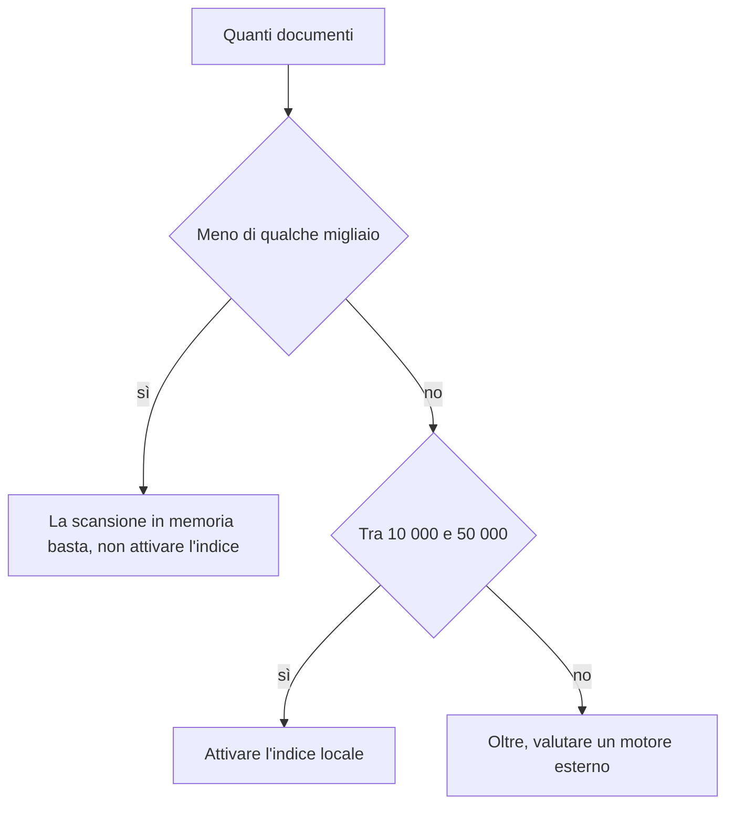

<!-- fr-synced: cc8b7a7584246944c3f41d7c8428bc5d99bf0df1 -->

# Sapere quando attivare l'indice locale (benchmark)

Se gestisci un repository BASE e sei incerto se attivare l'indice locale, questa pagina ti fornisce numeri riproducibili per decidere. Vedrai a partire da quanti documenti la scansione in memoria non basta più, cosa apporta l'indice a quel punto e quanto costa.

## Riprodurre

```bash
node packages/base-index-local/bin/base-index-local.mjs bench --sizes 100,1000,10000,50000
# oppure
npm run bench:index
```

Corpus sintetico (agent + processi, 20 processi per agent), mediana di 20 query per dimensione. Build a freddo; ricerca misurata a freddo (vocabolario scansionato a ogni query) e a caldo (vocabolario in cache sull'oggetto indice).

## Risultati (portabile, Node 24)

| documenti | build | ricerca (a freddo) | ricerca (a caldo) |
|---:|---:|---:|---:|
| 105 | 9 ms | 0,01 ms | 0 ms |
| 1 050 | 10 ms | 0,03 ms | 0,01 ms |
| 10 500 | 83 ms | 0,65 ms | 0,13 ms |
| 52 500 | 394 ms | 5,3 ms | 0,9 ms |

I numeri variano da una macchina all'altra: rilancia `bench` per misurare i tuoi. In CI non viene imposta alcuna soglia aggressiva: un test *smoke* verifica solo che il report venga prodotto, non che raggiunga un numero fragile.

## Lettura



- **Fino a qualche migliaio di documenti**, la scansione in memoria del cuore è già istantanea: l'indice non apporta nulla di osservabile. Non attivarlo.
- **A 10 000-50 000**, la costruzione resta sotto il secondo e la ricerca a caldo sotto il millisecondo: l'indice rende comodo ciò che una scansione ripetuta renderebbe costoso.
- **Oltre**, vedi [Comprendere la scala](../learn/comprendre-echelle.md): un motore esterno diventa legittimo, dietro la stessa forma candidati -> decisione.

## Con e senza embedding

I numeri qui sopra sono **lessicali** (zero dipendenze). Gli embedding precalcolati aggiungono un costo al build (una chiamata al fornitore per documento, raggruppata in lotti) e un vettore memorizzato per documento; al momento della query, viene incorporata solo la query. Questa parte viene eseguita al momento dell'uso e dipende dal modello o dal fornitore; non rientra nel gate di freschezza deterministico dell'indice.
