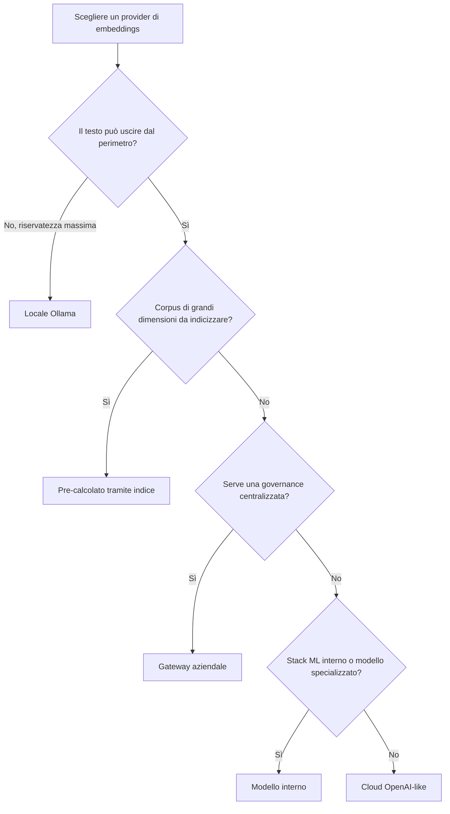

<!-- fr-synced: f1811e6c781b84473f80663efc3332688f47619f -->

# Scegliere il proprio provider di embeddings

Questa pagina aiuta chiunque metta BASE in produzione a scegliere da dove provengono i suoi embeddings, in base ai propri vincoli di riservatezza, costo e governance. Fare l'embedding del testo è una scelta esplicita: passi un `embed` a `createSemanticRanker`, e BASE non te ne impone **nessuno** al posto tuo.

## Le opzioni

| Opzione | Come | Quando |
|---|---|---|
| **Locale (Ollama)** | `createOllamaEmbedder()`, tutto resta su `localhost` | riservatezza massima, offline, demo, postazioni individuali |
| **Cloud (OpenAI-like)** | `createOpenAICompatibleEmbedder({ model })` | qualità elevata, nessuna infrastruttura da gestire, i dati possono uscire |
| **Gateway aziendale** | `createOpenAICompatibleEmbedder({ baseUrl })` verso un proxy interno | grande organizzazione: auth, logging, DLP a livello di proxy |
| **Modello interno** | un qualsiasi `embed: async (t) => ilMioModello.embed(t)` | stack ML interno, sovranità, modello specializzato |
| **Pre-calcolato (indice)** | `getResourceEmbedding` servito da `vectorFor(index, resource)` di `@ai-swiss/base-index-local` | corpus di grandi dimensioni; il testo della risorsa non transita al momento della richiesta |

BASE volutamente non fornisce **alcun** helper «provider migliore»: fissare una preferenza tecnica nel cuore equivarrebbe a scegliere al posto tuo.

## I criteri

- **Riservatezza.** Il testo esce dal tuo perimetro? Locale e gateway interno lo trattengono; il cloud pubblico lo invia all'esterno. Vedi [Sicurezza & dati](../trust/securite-donnees-routage.md).
- **Costo.** Cloud = costo per token; locale = costo hardware; pre-calcolato = costo ammortizzato al build.
- **Latenza.** Locale dipende dalla tua macchina; cloud dal collegamento di rete; pre-calcolato è quasi nullo al momento della richiesta (solo la richiesta viene embeddata).
- **Qualità.** I grandi modelli cloud spesso dominano; un buon modello locale è spesso sufficiente per il routing (il `route_text` è breve e discriminante).
- **Governance.** Un gateway offre un punto unico per auth, logging espunto, retention e conformità, senza toccare il cuore di BASE.

## Robustezza, qualunque sia la scelta

Tutti i provider del pacchetto ereditano le stesse garanzie: `timeoutMs`, `AbortSignal` (`ctx.signal`), retry limitati solo su errori transitori, backoff con jitter, errori tipizzati (`.code`). Una key errata fallisce subito (`semantic.auth`, mai ritentata); un guasto di rete viene ritentato (`semantic.network`).

## Ridurre ciò che viene inviato

- **Pre-calcola** i vettori delle risorse tramite un indice: solo la richiesta viene inviata in tempo reale.
- **Limita `textOf`** allo stretto necessario (spesso `route_text` basta).
- **Passa da un proxy** interno per evitare di esporre direttamente un endpoint pubblico.

Dettaglio completo: [Sicurezza & dati del routing](../trust/securite-donnees-routage.md).
