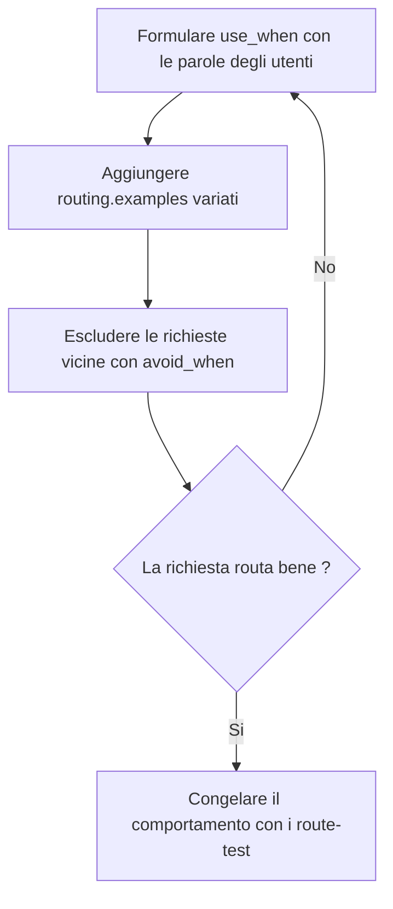

<!-- fr-synced: 8ea40981db54eae95e0b6ee6811e2a7dd8b35d37 -->

# Scrivere per il router

Se una richiesta come «Prepara un preventivo per Dupont SA» non raggiunge il process giusto, il vostro assistente resta muto o risponde a sproposito: è la formulazione dei vostri file a decidere. Questa guida si rivolge a chi crea assistenti: spiega come il router legge i vostri file, come scrivere per lui e come verificare che le vostre richieste arrivino a destinazione. Non è richiesta alcuna competenza tecnica, tranne un comando da terminale per testare.



## Come il router legge i vostri file

Il router non comprende il significato del vostro testo: **confronta le parole**. Per ogni process costruisce un testo di routing a partire dallo `use_when` (il segnale più forte), completato dai `routing.examples`; in mancanza, ripiega sulla descrizione, poi sul titolo e infine sulle parole chiave. Una richiesta routa bene quando le sue parole si sovrappongono a quel testo. In pratica, il vostro `use_when` deve soprattutto contenere **le parole che i vostri utenti userebbero**, e non una formulazione elegante.

## Formulare un buon `use_when`

Scrivete lo `use_when` dal punto di vista dell'utente, non dal vostro. Il gergo interno («gestione del ciclo di vendita») non routa nulla se nessuno lo digita; le parole concrete («preventivo», «prezzo», «offerta») routano.

Prima, uno `use_when` debole:

```yaml
use_when: Gestion des propositions commerciales et du cycle de vente.
```

Dopo, uno `use_when` forte:

```yaml
use_when: Quand un client demande un devis, un prix ou une offre chiffrée.
routing:
  examples:
    - Prépare un devis pour Dupont SA, 3 jours de conseil
    - Combien ça coûterait pour ce projet ?
    - Il me faut une offre avant vendredi
  avoid_when:
    - Relancer une facture impayée.
```

## Fornire esempi variati

I `routing.examples` sono formulazioni reali degli utenti. Fornitene almeno tre per la stessa intenzione, con parole diverse: una formulazione diretta, una domanda, poi una richiesta espressa nell'urgenza. Il router ritrova allora l'intenzione più spesso, anche quando la richiesta riprende le parole di un esempio invece delle vostre.

## Escludere le richieste vicine

`routing.avoid_when` elenca i controesempi: richieste simili che devono andare altrove. Se «sollecitare una fattura» appartiene a un altro process, dichiararlo qui annulla il punteggio del candidato sbagliato invece di lasciare che due process si contendano la richiesta.

## Verificare che routi

```bash
node tools/base.mjs route "il me faut une offre pour un client" --root <dossier>
```

Leggete il risultato: il process scelto, il punteggio e le ragioni (`route:<terme>` indica quali parole hanno fatto match). Se il router si astiene o esita, le ragioni dicono perché: di solito è una parola che manca nel vostro `use_when` o nei vostri esempi. Aggiungete `--json` per il dettaglio completo.

## Congelare il comportamento

Una volta che le route sono corrette, dichiaratele in `.ai/routing/route-tests.json`: ogni voce indica una richiesta e la route attesa. Poi:

```bash
node tools/base.mjs route-test --root <dossier>
```

Il comando riproduce tutte le route e fallisce se una di esse si rompe. Le vostre route importanti sono protette dalle regressioni, anche quando l'assistente cresce.

## Un limite onesto

Il router lessicale predefinito è rudimentale ma efficace, e resta sensibile alla formulazione: le parole assenti non corrispondono a nulla, anche quando il significato è vicino. È il prezzo della spiegabilità: ogni punteggio si giustifica con ragioni ispezionabili, senza rete né dipendenze. È inoltre estensibile tramite adattatori. Per i corpora difficili (molti process simili, vocabolario molto variato), esiste un ranker semantico opzionale: vedere il [Quickstart routing semantico](routage-semantique-quickstart.md).

---

BASE è un framework di [AI Swiss](https://a-i.swiss). Caso d'uso in partnership con [Innovaud](https://innovaud.ch).
