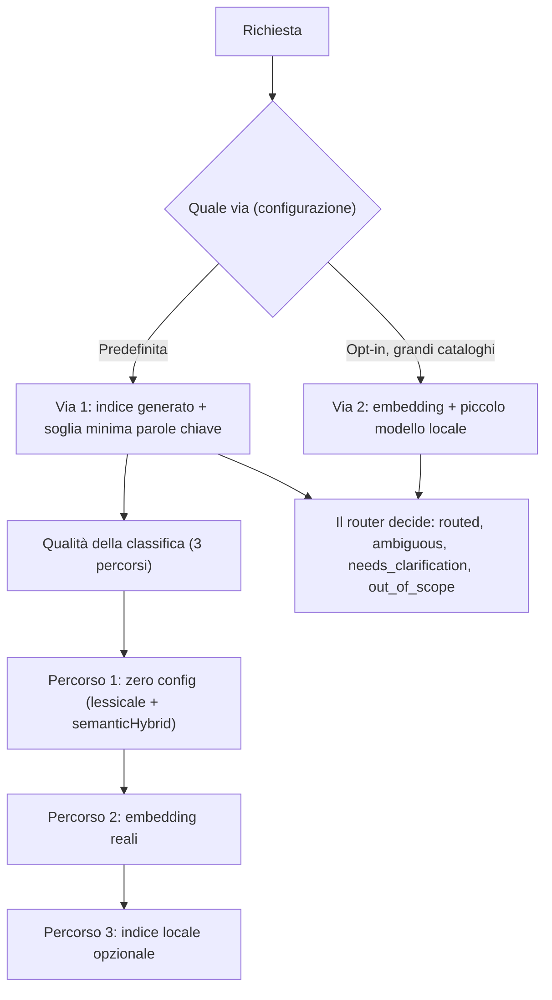

<!-- fr-synced: a57a9c3ec1fbbf766b4471bdc4eecfa4258e080f -->

# Impostare il routing semantico, dallo zero config agli embedding reali

Appena installate BASE, le richieste devono raggiungere l'agent giusto e il process giusto senza alcuna
configurazione iniziale, per poi guadagnare in qualità quando se ne presenta il bisogno: è proprio questo
che impostate qui. BASE instrada una richiesta, oppure si astiene onestamente quando nulla è adatto.

BASE instrada in **due modi, scelti dalla configurazione**. La **Via 1** è quella predefinita: l'assistente
legge l'indice generato e sceglie, con una soglia minima deterministica basata sulle parole chiave come rete
di sicurezza offline. La **Via 2** è opzionale, per i grandi cataloghi: degli embedding recuperano alcuni
candidati e un piccolo modello locale li raffina (sceglie, oppure chiede una precisazione); vedi
[Via 2, il routing tramite embedding](voie-2-routage-embeddings.md). Questa pagina descrive la Via 1 e, al
suo interno, la **qualità della classifica** dei candidati: un ranker classifica, ma è il router a decidere.
Percorrerete tre percorsi, dal più semplice al più robusto; iniziate dal primo e proseguite oltre solo se ne
avete bisogno.



Il routing di BASE sceglie il workflow primario, non tutte le risorse possibili. La catena completa è la
seguente: scegliere un agent, instradare verso un process, poi aprire le competenze, i tools, i template, i
documenti o i dati di cui quel process ha bisogno. Per la dottrina completa, vedi
[`docs/reference/routage-process-et-ressources.md`](../reference/routage-process-et-ressources.md).

## Raggiungere l'agent giusto (prima il più semplice)

Prima della *qualità* della classifica (i "percorsi" qui sotto), ecco come l'assistente arriva all'agent
giusto, dal più manuale al più automatico:

- **Manuale, zero strumenti.** Se sapete quale agent volete, puntate direttamente al suo `AGENT.md`: è
  l'unico file da caricare. "Leggi `exemples/assistant-devis/.ai/agents/assistant-devis/AGENT.md`" basta
  (percorso relativo al repository; in un progetto di assistente, è semplicemente
  `.ai/agents/<agent>/AGENT.md`). Nessun routing, nessuna installazione.
- **CLI.** `base route "<richiesta>" --root <progetto>` sceglie l'agent → process in modo deterministico e
  si astiene onestamente se nulla è adatto. Lo stesso router, dal terminale.
- **MCP.** Lo strumento `route_request` espone questo stesso router a uno strumento IA capace di leggere i
  vostri file (per esempio GitHub Copilot, Antigravity, Claude Code o Cowork, OpenCode, Kilo Code). Per
  collegarlo, seguite il process `activer-routage`.

Il routing (CLI/MCP), deterministico per impostazione predefinita, è utile soprattutto quando più process o
agent potrebbero rispondere, oppure quando volete delle garanzie (astensione testata, fixture). Risparmia
all'utente la fatica di cercare il process giusto. Appena entra in gioco un ranker a embedding, la classifica
dipende dal provider scelto; gli stati e le fixture, invece, non cambiano. Per un singolo assistente
semplice, il caricamento manuale basta.

I tre "percorsi" qui sotto affrontano una domanda diversa: la qualità della classifica dei candidati
all'interno della Via 1, dal lessicale zero-config agli embedding reali. (Da non confondere con la Via 2,
che è un'altra via di routing, non un ranker.)

## Percorso 1: zero configurazione

Scrivete agent e process in Markdown, con un `use_when` per process. BASE instrada con il suo nucleo a zero
dipendenze: lessicale + `semanticHybridRanker` (sovrapposizione di token, alias per sottoinsieme di token,
somiglianza fuzzy), astensione strutturata, fixture di routing, MCP.

```bash
node tools/base.mjs route "le client conteste sa facture" --root exemples/routage-pme
node tools/base.mjs route-test --root exemples/routage-pme   # rejoue les routes attendues
```

Ideale per una singola persona, un piccolo team, una demo, un primo deployment. Vedi l'esempio
[`exemples/routage-pme`](../../exemples/routage-pme/README.md).

### Rafforzare senza dipendenze: `semanticHybrid`

In `base.config.json`, dichiarate degli alias (sinonimi di settore), sempre a zero dipendenze:

```json
{
  "rankers": [
    { "type": "semanticHybrid", "aliases": { "proposition": ["offre commerciale", "devis"] } }
  ]
}
```

La regola è semplice: usate `base.config.json` per le opzioni dichiarative (`semanticHybrid`, soglie,
validatori) e `base.config.mjs` quando dovete importare del codice, per esempio un provider di embedding. Se
esistono entrambi, BASE preferisce il JSON dichiarativo; mantenete quindi un solo formato per progetto quando
attivate embedding reali.

## Percorso 2: embedding reali

Installate `@ai-swiss/base-ranker-semantic`, scegliete un provider, aggiungete un ranker in `base.config.mjs`
(configurazione eseguibile, perché un ranker è codice). Il nucleo non guadagna alcuna dipendenza da modello o
cloud.

```bash
npm install @ai-swiss/base-ranker-semantic
```

Nel monorepo BASE, per contribuire localmente, il package vive in `packages/base-ranker-semantic/`.

```js
// base.config.mjs : endpoint OpenAI-compatible (OpenAI, Azure-like, gateway interne)
import { createOpenAICompatibleEmbedder, createSemanticRanker } from "@ai-swiss/base-ranker-semantic";

const embed = createOpenAICompatibleEmbedder({
  model: "text-embedding-3-small",
  // baseUrl: "https://gateway.interne/v1",  // un gateway d'entreprise
  timeoutMs: 10_000,
  retries: 2,
});

export default { rankers: [createSemanticRanker({ embed, minSimilarity: 0.25 })] };
```

```js
// base.config.mjs : Ollama, tout reste en local
import { createOllamaEmbedder, createSemanticRanker } from "@ai-swiss/base-ranker-semantic";
export default { rankers: [createSemanticRanker({ embed: createOllamaEmbedder() })] };
```

```js
// base.config.mjs : n'importe quel provider, ou des vecteurs pré-calculés (aucun texte ressource envoyé)
import { createSemanticRanker } from "@ai-swiss/base-ranker-semantic";
import { vectorFor } from "@ai-swiss/base-index-local";
export default {
  rankers: [createSemanticRanker({
    embed: async (textOrTexts, ctx) => monModele.embed(textOrTexts, { signal: ctx?.signal }),
    getResourceEmbedding: (r) => vectorFor(index, r),
  })],
};
```

Il package è robusto per impostazione predefinita sulle chiamate al provider: gestisce timeout, l'`AbortSignal`,
retry limitati (solo transitori) ed errori tipizzati. Per accorpare molte chiamate concorrenti, avvolgete il
provider con `createBatchingEmbedder`. Dettagli:
[`packages/base-ranker-semantic/README.md`](../../packages/base-ranker-semantic/README.md) e
[la pagina del provider](choisir-provider-embeddings.md).

## Percorso 3: indice locale opzionale

Quando il corpus diventa grande, derivate un indice locale cancellabile con `@ai-swiss/base-index-local`. Il
modello utente resta lo stesso, senza un catalogo da tenere a mano, e gli stati di routing predefiniti non si
muovono. Vedi [Comprendere la scala](../learn/comprendre-echelle.md).

## Avviare le fixture

`.ai/routing/route-tests.json` elenca delle richieste e la route attesa (stato, agent, process). È un test di
regressione, non una misura di prestazione accademica:

```bash
node tools/base.mjs route-test --root <projet>          # sortie lisible, exit ≠ 0 si une route casse
```

## Leggere le ragioni del punteggio

`route --json` rende esplicita ogni componente del punteggio, con ragioni consultabili anziché un punteggio di
confidenza opaco.

```bash
node tools/base.mjs route "panne au login" --root exemples/routage-pme --json
```

| Ragione | Significa |
|---|---|
| `route:<terme>` | il termine ha fatto match con il `route_text` (segnale di routing più forte) |
| `route_text:use_when` | il `route_text` viene dallo `use_when` (segnale voluto); `:title`/`:path` = segnale debole |
| `route_avoid:<terme>` | un `routing.avoid_when` ha fatto match: il punteggio viene **annullato** (controesempio) |
| `semantic:alias:*`, `semantic:fuzzy:*` | apporto del `semanticHybridRanker` a zero dipendenze |
| `semantic:embedding:<sim>` | somiglianza coseno di embedding reali (package semantico) |

Lo stato (`routed | ambiguous | needs_clarification | out_of_scope`) e il suo `reason_code` dicono *perché*
BASE ha deciso, oppure perché ha preferito chiedere.
