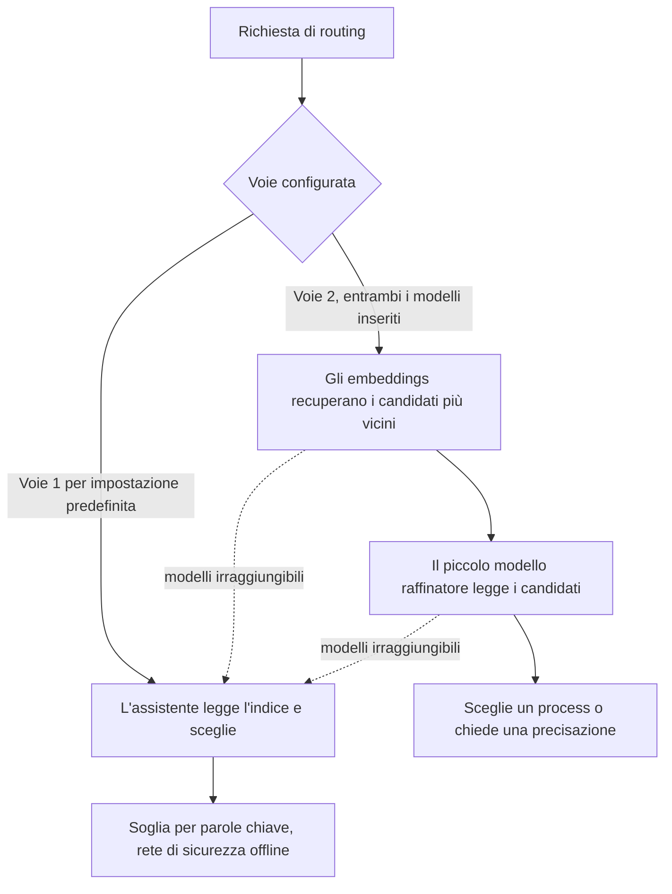

<!-- fr-synced: d582ba5e1b080529a75ebb6cbf80f42cfe706bb5 -->

# Voie 2, il routing tramite embeddings (opzionale, per la scala)

BASE effettua il routing in due modi, e si sceglie tramite la configurazione. La Voie 1 è il valore
predefinito e basta per la maggior parte dei BASE. La Voie 2 è una comodità per i grandi cataloghi. Ne avete
bisogno solo se lo avete deciso.

## Le due Voies, in una frase ciascuna

- **Voie 1 (predefinita, già attiva).** L'assistente legge l'indice generato e sceglie; una soglia
  deterministica per parole chiave funge da rete di sicurezza offline. Nessun modello, niente da installare.
- **Voie 2 (opzionale).** Gli embeddings recuperano i pochi candidati più vicini alla richiesta, poi un
  piccolo modello li legge e decide (sceglie, oppure chiede una precisazione). In locale.

Le due Voies sono indipendenti: la Voie 2 non è un livello sopra la Voie 1, è un'altra Voie che la
configurazione seleziona.

## Ne avete bisogno?

Siate onesti con voi stessi prima di installare qualsiasi cosa.

- **BASE piccolo o medio** (qualche agent, qualche decina di process): la **Voie 1 basta**. La Voie 2 non
  porterebbe nulla, e aggiungerebbe un'installazione da mantenere.
- **BASE grande** (molti process, o un routing che esita perché la lista è lunga da distinguere per parole
  chiave): la Voie 2 affina la scelta. È qui che si guadagna il suo posto.

## L'installazione è essenzialmente «solo Ollama»

La promessa è semplice. Ecco cosa fare:

1. Installare **Ollama** (l'applicazione che fa girare i modelli in locale).
2. Scaricare **due modelli**: un modello di embedding e un piccolo modello raffinatore.
3. Inserirli entrambi nella pagina **Impostazioni** dello Studio, sezione «Routing / Voie 2» (oppure
   direttamente nel file di configurazione).

**Locale, sovrano, senza cloud, senza chiave API.** Tutto resta sulla vostra macchina. Un provider ospitato
compatibile con OpenAI resta possibile per chi lo desidera, ma il racconto predefinito è *Ollama da solo*.

La Voie 2 si attiva solo quando **entrambi** i modelli sono inseriti. Uno solo non fa nulla, e BASE resta
sulla Voie 1. E se un modello diventa irraggiungibile, BASE ricade automaticamente sulla Voie 1: mai un
blocco, mai un silenzio.

## Quali modelli scegliere? (siete liberi)

BASE non vi impone alcun modello. A titolo **illustrativo e non prescrittivo**, due modelli locali leggeri
fanno una buona dimostrazione: `qwen3-embedding:0.6b` per l'embedding (multilingue, utile perché BASE è
francofono) e `qwen3:4b` per il raffinatore (piccolo modello instruct). Sono esempi, non una raccomandazione
fissa: scegliete i vostri se preferite (per esempio un embedding a contesto lungo, o un raffinatore di
un'altra famiglia).

L'ecosistema si muove in fretta. Invece di memorizzare le versioni, **consultate i modelli raccomandati del
momento** nella documentazione di Ollama, e verificate il tag esatto al momento del download. Per i criteri
di scelta di un provider di embeddings (locale, cloud, gateway, interno), vedere
[Scegliere il provider di embeddings](choisir-provider-embeddings.md). Per far girare i modelli restando
sovrani, vedere [Modelli sovrani](modeles-souverains.md).

Non cercate il «migliore» piccolo raffinatore a colpi di punti percentuali. Ciò che l'eval di routing misura
onestamente è un **segnale di struttura** (gli embeddings fanno emergere il candidato giusto?), non la
prestazione di un modello: la scelta finale, o la richiesta di precisazione, spetta alla **vostra propria
IA**, ben più forte di qualsiasi piccolo modello locale. Il raffinatore locale è solo una rete di sicurezza
alla scala, senza Studio aperto. È quindi inutile regolare i vostri prompt o la vostra struttura per gonfiare
il punteggio di un piccolo modello.

## Farsi accompagnare passo dopo passo

La cosa più semplice è chiedere al vostro assistente: **«attiva la Voie 2»**. Il process `activer-voie2` vi
guida, nell'ordine: verificare che il bisogno sia reale, installare Ollama seguendo la sua documentazione
ufficiale aggiornata, scegliere e scaricare i due modelli, poi inserirli nelle Impostazioni. Mostra ogni
comando prima di eseguirlo, e non fissa alcuna versione.

## Dove vivono le impostazioni

Nello Studio, la sezione «Routing / Voie 2» delle Impostazioni espone i due modelli e il numero di candidati
che il raffinatore vede (un conteggio, non una soglia da regolare; il valore predefinito va bene). Senza
Studio, gli stessi valori vivono nel blocco `routing` del file `.ai/studio.settings.json`
(`embedding_model`, `refiner_model`, e `k` opzionale). La regola tutto-o-niente è validata in scrittura:
entrambi i modelli, o nessuno.

Per la configurazione più ampia del routing (zero config, ranker a embeddings, lettura dei punteggi), vedere
[Configurare il routing semantico](routage-semantique-quickstart.md).
