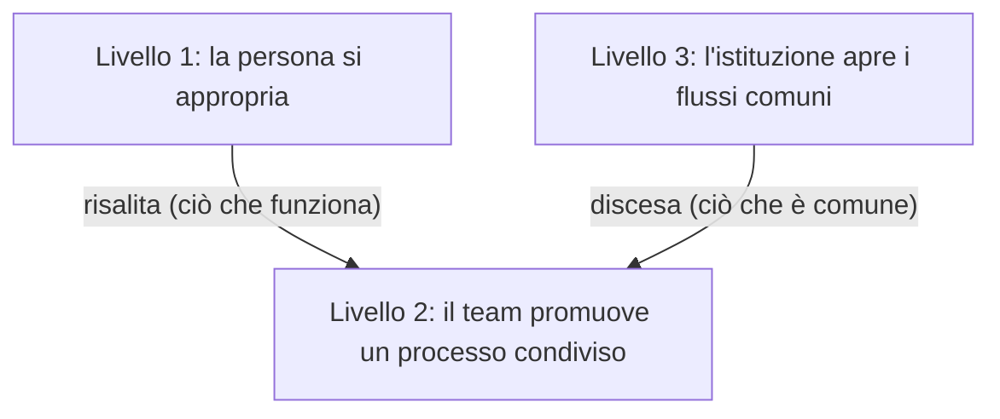

<!-- fr-synced: 816663bbe9448c3c454909e9731a6db8ed8f8267 -->

# L'adozione in un'organizzazione

L'IA non si installa in un'organizzazione come un software: per decreto, in un colpo solo, per tutti. Un'organizzazione può spuntare ogni casella tecnica e ritrovarsi, sei mesi dopo, con solo una manciata di usi isolati che nessuno condivide. L'adozione che dura poggia su due movimenti di senso contrario e sul loro incontro. Dal basso, alcune persone si appropriano del dialogo con l'IA e strutturano il proprio lavoro a modo loro. Dall'alto, l'organizzazione rende disponibili, assistiti dall'IA, i pochi flussi che bloccano tutti. Il primo motore fa risalire ciò che funziona; il secondo fa scendere ciò che è comune.

L'adozione si legge su tre livelli: la persona che si appropria, il team che promuove un uso collaudato in un processo condiviso, l'istituzione che apre i flussi che ciascuno subisce. Ogni livello ha il suo gesto, il suo rituale e la sua governance. Le pagine collegate ne danno i gesti: le pratiche individuali in [Il co-pensiero in pratica](./pratiques-co-pensee.md), la vita di una competenza una volta promossa in [Far vivere una competenza dopo il dispiegamento](./cycle-de-vie-expertise.md), le condizioni di avvio nei kit [PMI svizzera](../audiences/kit-demarrage-pme-suisse.md) e [organizzazione](../audiences/kit-enterprise.md).

## L'altro estremo, e ciò che rinchiude

Di fronte all'IA, molte organizzazioni prendono l'estremo opposto: una grande piattaforma centrale, un parco di licenze dispiegato dall'alto, un catalogo di strumenti imposti, cruscotti di produttività, una cellula che pilota tutto. È rassicurante, a volte efficace in fretta, e produce veri guadagni. Il prezzo si vede più tardi: il metodo finisce rinchiuso nella piattaforma e nel fornitore, e il modo di lavorare con l'IA viene trattato come una cosa da industrializzare al centro, non come una cosa che ciascuno comprende e possiede. Il giorno in cui lo strumento cambia, o il contratto, o il fornitore, restano cruscotti e poca competenza trasmissibile.

BASE prende l'altra via, ed è proprio l'oggetto di questa pagina: far crescere l'adozione a partire dalle persone, tenere il saper fare in file che possedete, industrializzare dall'alto solo il poco che lo merita. Le due cose non si escludono sempre, ma non collocano il valore nello stesso posto: nella piattaforma da un lato, nell'articolazione posseduta dall'altro.

## Il ruolo dell'IT: accesso, strato e strumenti

Prima di ogni livello, l'IT pone le fondamenta: tre decisioni le condizionano.

La prima è l'**accesso autorizzato** a uno o più modelli. La scelta si pesa sulla bilancia beneficio-rischio propria dell'organizzazione: ciò che i modelli fanno guadagnare, contro ciò che espongono in riservatezza, in sovranità dei dati, in percezione interna e presso i clienti. Spetta alla direzione e alla conformità, non alla persona che aprirà lo strumento il giorno dopo. I modelli sovrani e locali entrano qui nella bilancia (vedi [Modelli sovrani e locali](../guides/modeles-souverains.md)), così come il quadro legale dell'organizzazione, nLPD, GDPR, obblighi settoriali, richiamato nel [kit PMI svizzera](../audiences/kit-demarrage-pme-suisse.md).

La seconda è lo **strato leggero** posto al di sopra: uno o più strumenti, secondo ciò che è fattibile da voi, che danno come minimo la capacità di leggere e scrivere file. È la soglia. Al di sotto, l'IA resta una finestra di dialogo senza memoria; al di sopra, ciascuno struttura liberamente le proprie interazioni, tiene a portata di mano i propri file di lavoro e fa crescere una pratica invece di ripetere prompt. Le modalità di dispiegamento di questo strato sono descritte nel [kit organizzazione](../audiences/kit-enterprise.md).

La terza, la più spesso trascurata, sono i **giusti strumenti**. Un modello generativo non sa, da solo, calcolare un indicatore di business, interrogare la tabella giusta di un database, né chiamare un servizio di previsione: queste capacità non arrivano con l'accesso al modello. Bisogna fornirgliele come strumenti che esso aziona al vostro posto, e poi sfrutta nella conversazione: un algoritmo deterministico, una query verso le tabelle giuste, una chiamata API, che qualcuno ha scritto. È il cuore del ruolo dell'IT, al di là dell'accesso e dello strato: attrezzare i flussi che lo richiedono, e anzitutto capire quale calcolo bisogna fare.

Da cui un equivoco frequente, e costoso: credere che basti ripulire il proprio database e collegarlo all'IA. Ripulire un database e collegarlo a un modello dà accesso all'informazione, non all'informazione *pertinente*. A un modello non si dice "arrangiati con il mio database per tirarne fuori degli insight": per un indicatore, bisogna avere stabilito a monte quali tabelle incrociare e quale calcolo condurre, poi affidare quel calcolo a un algoritmo. Questa analisi si conduce volentieri con l'IA, ma va condotta: trovare l'algoritmo giusto ha un costo, anche con i modelli più potenti. In fondo, nessun calcolo è gratis, né nella teoria della complessità né in fisica.

L'errore corrente è attendere l'attrezzatura perfetta prima di aprire l'accesso. La pratica precede lo strumento: date la soglia, lasciate che l'appropriazione faccia il suo lavoro, e attrezzate i flussi man mano che si rivelano.

## Livello 1: la persona si appropria

Il motore primo dell'adozione, e il più importante, è l'appropriazione personale. Ciascuno struttura a modo suo il dialogo uomo-IA, sui propri compiti, al proprio ritmo, ed è questa varietà a fare la differenza, non un difetto da normalizzare. Un'organizzazione che cerca da subito il processo unico spegne il motore prima che si avvii. È qui che nasce l'intuito di verifica, quello senza cui nessun flusso assistito sarà riletto seriamente più tardi.

**Il gesto.** Una persona prende un compito che conosce, lo affronta con l'IA e tiene il timone: verifica rispetto alla propria realtà, segnala le proprie ipotesi, itera invece di cercare il prompt perfetto. [Il co-pensiero in pratica](./pratiques-co-pensee.md) descrive questo ciclo e le cinque pratiche che lo rendono leggero; nulla da duplicare qui, se non la constatazione che un'intera organizzazione poggia anzitutto su individui che la reggono.

**Il rituale.** A questo livello è personale: tenere traccia di ciò che ha funzionato. Un'interazione andata bene si annota, si riprende, si affina. Una pratica si sedimenta così in qualcosa di trasmissibile, prima candidata alla risalita.

**La governance.** Minima, e relativa ai dati, non al metodo. La persona sa cosa ha diritto di immettere nello strumento, e cosa non immette: la regola dei dati autorizzati del [kit PMI svizzera](../audiences/kit-demarrage-pme-suisse.md) basta. La libertà di strutturare resta intera, è lo scopo.

## Livello 2: il team promuove un processo

Una pratica individuale che resta individuale si perde con la persona. Il secondo livello fa risalire ciò che funziona: è la condizione perché una buona interazione diventi un acquisito collettivo piuttosto che un colpo di fortuna ripetuto. L'informazione deve risalire.

**Il gesto.** Far risalire, poi promuovere. Le persone più a proprio agio, i super-utenti, condividono le loro interazioni interessanti: non "l'IA è una bella cosa", ma "ecco come ho ottenuto questo risultato, su questo compito, con questa impostazione". Le migliori sono promosse a **processo di team**. Una promozione non è una messa in comune di file, è un cambiamento di stato: un Markdown leggibile che ciascuno riprende, e non una ricetta che vive in una messaggistica.

**Il rituale.** Un appuntamento regolare, ogni settimana o ogni due settimane, in cui queste interazioni risalgono e si discutono, e in cui il team decide ciò che merita di essere promosso. Promuovere troppo presto congela un'intuizione ancora confusa; troppo tardi lascia che l'organizzazione reinventi ciò che una persona già sa. Il rituale mensile di manutenzione del [kit PMI svizzera](../audiences/kit-demarrage-pme-suisse.md) ne è la versione attrezzata: rileva le risorse personali da promuovere, i marcatori che invecchiano, i workflow che non corrispondono più alla pratica.

**La governance.** Un processo promosso cessa di essere senza padrone. Riceve un responsabile, il più delle volte il suo proprietario d'origine, che lo fa evolvere; e un versionamento, che rende i suoi cambiamenti visibili e discutibili. La regola tiene: l'IA propone, la persona responsabile firma. È qui che comincia davvero il [ciclo di vita di una competenza](./cycle-de-vie-expertise.md): un uso che deraglia si annota in una frase, e un processo promosso si corregge invece di marcire in silenzio.

## Livello 3: l'istituzione apre dall'alto

I primi due livelli salgono dal campo. Il terzo scende. Alcuni flussi non dipendono dall'appropriazione: una richiesta di acquisto, l'accoglienza di un nuovo collaboratore, una verifica di conformità che tutti temono. Bloccano ciascuno nello stesso modo, e attendere che un super-utente li risolva dal basso sarebbe una perdita di tempo collettiva. L'istituzione li identifica e li rende disponibili come **flussi assistiti dall'IA**.

**Il gesto.** Rendere disponibile un flusso, al giusto livello di assistenza. Quando il risultato si verifica automaticamente, tramite un algoritmo dedicato che dà la garanzia che un modello non può dare da solo, il flusso può diventare interamente automatico. Il più delle volte, conserva il giusto livello di attrito nell'interazione uomo-IA: abbastanza perché una persona resti responsabile dell'output, non troppo per non riprodurre il blocco che si voleva rimuovere. Il giusto livello di attrito è il tema, non l'automazione massima.

**Il rituale.** La valutazione su scala. I flussi istituiti sono quelli che si tengono sotto sorveglianza: un harness li valuta sulla superficie reale, un giudice indipendente assegna un punteggio, e ciò che si deprezza viene segnalato. Il [ciclo di vita di una competenza](./cycle-de-vie-expertise.md) descrive questo dispositivo, che prende tutto il suo valore proprio quando alcuni processi sono promossi e istituzionalizzati.

**La governance.** Qui diventa formale. L'istituzione applica ciò che i primi due livelli non portano: diritti di accesso, classificazione, audit, conservazione, revisione di conformità. BASE fornisce una mediazione onesta delle azioni sensibili, confinamento, gate di scrittura, governance di ogni output verso un modello, collegabile senza cedere il saper fare, ma non sostituisce né IAM, né SSO, né RBAC, né DLP, né SIEM. Il [kit organizzazione](../audiences/kit-enterprise.md) dettaglia la configurazione stretta e le modalità di dispiegamento che rendono questi flussi opponibili.

## Là dove i due motori si incontrano

I due motori non funzionano l'uno senza l'altro. Dal basso, l'appropriazione produce pratiche che nessuno avrebbe dettato in anticipo; senza di essa, i flussi istituiti restano gusci che nessuno si appropria. Dall'alto, i flussi assistiti rimuovono i blocchi comuni e danno un quadro; senza di essi, l'appropriazione resta un arcipelago di usi personali che non fa mai organizzazione.

Si incontrano al livello del team. È lì che una pratica individuale diventa un processo condiviso, e lì che un flusso istituito riscende per essere collaudato sul lavoro reale.

La discesa impone una disciplina che la risalita non reclama: una pratica personale impegna solo il suo autore; un flusso istituzionale impegna tutti coloro che vi si affidano. Pochi flussi scendono, e quelli che scendono restano sotto sorveglianza. Un [attrito](./cycle-de-vie-expertise.md) segnalato su un flusso comune è il motore di sotto che corregge il motore di sopra.

Nel tempo, niente di tutto questo si installa in un colpo solo. Si comincia quasi sempre con qualche tentativo isolato; l'uso si diffonde il giorno in cui delle persone se ne appropriano davvero; e solo una manciata di flussi finisce per essere tenuta su scala. È una pendenza, non una scala a gradini: le tappe si sovrappongono, se ne saltano, si torna indietro. Individuarle aiuta a sapere a che punto si è, a condizione di non farne un passaggio obbligato, identico per tutti.

La stessa unità circola nei due sensi: un Markdown leggibile che delle persone scrivono, giudicano, possiedono e versionano, di cui qualcuno risponde. L'adozione tiene quando i tre livelli girano insieme: persone che si appropriano, team che promuovono, un'istituzione che apre e tiene sotto sorveglianza. Nessuno basta da solo, e tutti poggiano sullo stesso fondamento, un accesso autorizzato, di che strutturare e i giusti strumenti, e sulla stessa regola, a ogni livello: l'IA propone, una persona firma.
