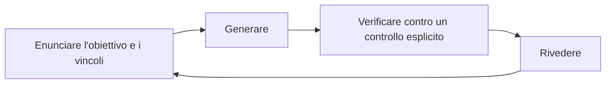

<!-- fr-synced: 254eaff1359db085b870b149459eb5dd80ce822b -->

# Perché BASE

> **La domanda non è dove si trovano i vostri server, ma a chi appartiene l'articolazione del vostro pensiero con l'IA.**
> BASE ve ne rende sovrani: ciò che l'IA sa, ciò che fa, ciò che vi aspettate, le vostre istruzioni, messi per iscritto in un testo che vi appartiene. Ed è questa struttura che vi mantiene capaci di verificare, nel tempo, là dove la verifica spetta a voi.

Questo documento spiega *perché* BASE esiste. Non i suoi comandi (vedi [Avvio rapido](../start/quickstart.md)), non la sua architettura (vedi [Framework pubblico](../reference/framework-public.md)): il metodo che rende eseguibile per pensare insieme all'IA.

## Lo squilibrio tra produrre e verificare

L'IA generativa ha invertito l'economia del lavoro intellettuale. **Produrre una risposta plausibile richiede ormai poco sforzo; assicurarsi che sia giusta è un altro tipo di lavoro, che dipende dal compito.** Il cuore di un modello, il famoso «LLM», è un generatore di completamenti probabili. Sa generare, confrontare e simulare. Ma non verifica al posto vostro la realtà, la responsabilità né le conseguenze per la vostra organizzazione.

In alcuni ambiti esiste un verificatore esterno al modello: un compilatore per il codice, le regole del gioco degli scacchi, uno schema di dati. Lì l'errore si rileva e si corregge da solo. **Ma la maggior parte del lavoro reale non ha un verificatore esterno.** Un'analisi, un'offerta, una decisione, una nota interna: spetta a voi rilevarne e correggerne gli errori, e siete voi nella posizione migliore per sapere se l'output serve davvero alla vostra intenzione, al vostro contesto, alla vostra soglia di rischio.

La conseguenza è semplice: **per questo lavoro, il verificatore siete voi**, calibrato sul rischio che accettate. L'affidabilità non si trova già pronta: si costruisce, e si costruisce attraverso la verifica.

## Il vero rischio: il debito di verifica

Il problema è che per impostazione predefinita verifichiamo male. Un testo scorrevole ispira una fiducia che non ha meritato; una risposta ottenuta senza sforzo spegne lo spirito critico. E di fronte a un tono sicuro, spesso preferiamo affidarci alla fonte piuttosto che valutare l'affermazione.

Allora lo scenario di fallimento più comune si insedia in silenzio: all'inizio verifichiamo bene, poi il sistema produce più in fretta di quanto riusciamo a seguire. Perdiamo la visione d'insieme. Smettiamo di sviluppare l'intuizione necessaria per giudicare. La fiducia diventa cieca, o crolla. Ogni affermazione accettata senza controllo aggiunge un **debito di verifica**: una riserva di ipotesi non verificate che finisce per cedere sotto la prima vera pressione. Il progetto è impressionante in superficie, fragile sotto.

## Le quattro perdite di controllo che BASE evita

| Perdita | Che cosa accade |
|-------|---------------|
| **Perdere la sovranità** | operare senza possedere: il vostro sapere vive sulla piattaforma di un altro. |
| **Perdere la comprensione** | consegnare senza intuizione: si producono risultati che non si saprebbe più difendere. |
| **Perdere nel tempo** | distribuire senza saper mantenere: funziona il primo giorno, non più il centesimo. |
| **Perdere la verifica** | produrre senza controllo: il debito si accumula fino alla rottura. |

BASE è, per l'appunto, la struttura che previene queste quattro perdite.

## Ciò che BASE apporta: una struttura che rende leggera la verifica

Verificare non deve sommergervi. Una struttura forte a monte rende leggera la verifica a valle. Ecco come fa BASE:

- **Puntare a ciò che conta.** Un *process* apre solo le risorse utili a *questo* compito, non tutto il vostro dossier. Decidete voi che cosa l'IA vede. Meno rumore, risposte migliori e una revisione umana incentrata su una tappa leggibile anziché su un blocco opaco.
- **Rendere esplicita la frontiera.** È prima di tutto una questione di sicurezza: le istruzioni si eseguono, il contenuto no. Mescolare i due apre la porta all'injection, quando un documento elaborato finisce per dettare il comportamento del modello. BASE separa dunque il **saper fare** (un testo che il modello segue, senza garanzia) dal **sapere** (contenuto che consulta), e distingue la **consegna** dal **meccanismo** realmente applicato dal codice. Si documenta la frontiera invece di mascherarla.
- **Mantenere visibili le decisioni.** Una proposta viene mostrata (un diff) prima di ogni scrittura; i marcatori `[A VALIDER]` segnalano ciò che attende il vostro giudizio. Questi marcatori contano molto: fungono da riferimento ricercabile nei vostri file e si prestano a un trattamento algoritmico (li si può elencare, contare, bloccare finché ne restano). Niente di importante avviene senza di voi.
- **Dare una memoria condivisa.** Un modello di chat generalista padroneggia una quantità di ambiti verificabili, e non sa nulla del vostro. Ne derivano due difetti reali. Primo, per impostazione predefinita non condivide la vostra memoria: ogni scambio riparte da zero. Secondo, il suo rapporto con il linguaggio è sotto-specificato, il che è al tempo stesso la sua forza (si adatta a tutto) e la sua debolezza (indovina invece di sapere). BASE affronta entrambi: la memoria diventa una semplice struttura di file; il linguaggio diventa un'articolazione esplicita, messa nero su bianco anziché lasciata all'indovinare.

La forma operativa è un **ciclo di pensiero condiviso**: enunciare l'obiettivo e i vincoli, generare, verificare contro un controllo esplicito, rivedere. Si ricomincia, e la struttura porta il contesto perché ogni giro resti leggero.

## Il controllo fine fa l'efficienza

**Avere accesso all'informazione non è avere accesso all'informazione utile.** Collegare tutta la propria casella di posta e tutto il proprio disco come contesto è rumore se nulla è mirato. Scegliere ciò che l'IA vede è questione di riservatezza, ma anche e soprattutto di **efficienza**: in informazione (il contesto giusto, non tutto), in costo (un contesto stretto è più rapido e meno caro) e in attenzione (rileggete una tappa inquadrata, non un mega-risultato).

È anche per questo che il riflesso del «tutto multi-agente» spesso inganna, e vale la pena essere precisi sul suo vero valore. Delegare a più agenti in parallelo è vincente quando i pezzi sono realmente indipendenti, e soprattutto quando un chiaro segnale di verifica fa sì che più calcolo renda più risultati: scorrere i registri per trovarvi incidenti, frugare nel codice in cerca di falle, generare e poi ordinare mille varianti. Lì il parallelismo paga, e bisogna servirsene. Il costo appare non appena il compito non si scompone in modo pulito, cioè non appena gli agenti devono *condividere* del contesto. Il loro unico canale è allora il linguaggio naturale, sotto-specificato per natura: a ogni passaggio il contesto viene copiato, riassunto, riverificato, e un po' di coerenza si disperde. Moltiplicare le copie di uno stesso modello non aggiunge del resto sguardi, solo portata: condividono lo stesso bias. Per il lavoro di giudizio, che raramente si scompone senza perdita, un solo agente che tiene il filo, sorretto da una struttura esplicita, costa meno di un coordinamento che si paga in token e in fraintendimenti. **Il collo di bottiglia dei sistemi agentici non è la potenza, è la comprensione condivisa.** La domanda utile non è dunque «un agente o più d'uno», ma «questo compito si scompone senza costare la coerenza»: spesso no, ed è per questo che l'«agentico ovunque» descrive solo un angolo del lavoro reale.

## I limiti del compito, l'IA li condivide

Un modello non verifica; e nemmeno si affranca dai limiti del compito stesso. Cercare un'informazione richiede di percorrere là dove può trovarsi; calcolare giusto richiede di seguire una procedura senza errori; ragionare lontano richiede di tenere tappe intermedie sempre più numerose. L'essere umano come l'IA si scontrano con queste tre esigenze, e vi rispondono nello stesso modo: un motore di ricerca, una calcolatrice, un supporto su cui scrivere per restare coerenti. La differenza non sta nel bisogno di strumenti, ma nella mano: siete voi a decidere di ricorrervi, e siete voi a giudicare ciò che ne esce.

Questi limiti non sono un difetto dell'IA, sono proprietà del problema, che nessuno aggira con la sola intelligenza. Un calcolo non crea l'informazione assente dai suoi input, e nessun procedimento fisico supera il calcolabile: è la tesi di Church-Turing fisica (ogni processo fisico si simula su una macchina di Turing con la precisione voluta). La sua versione estesa, sull'efficienza (una simulazione classica con un sovraccosto solo polinomiale), è più delicata: il calcolo quantistico la contraddice per certi compiti, ma sotto ipotesi di difficoltà ammesse e non dimostrate, e senza toccare i modelli di linguaggio, che sono classici. La lezione pratica sta in una riga, è il [principio 6 del pensiero condiviso](pratiques-co-pensee.md): ciò che richiederebbe a voi tappe intermedie ne richiede all'IA come a qualunque sistema al mondo.

## L'IA ritrova solo ciò che avete reso trovabile

Si sente spesso che «l'IA riparte da zero» a ogni scambio. Precisiamo, perché la sfumatura cambia il da farsi. Non è l'intero sistema a dimenticare: è il cuore generativo, il modello di linguaggio. A ogni chiamata parte con una **finestra di contesto** vuota, senza ricordo della precedente. La memoria non è per questo scomparsa; è semplicemente *esterna* al modello. Un sistema più ampio attorno a esso, come BASE, può benissimo restituirgliela: i vostri file sono quella memoria, e tutta la posta in gioco diventa riempire la finestra, al momento giusto, con i pezzi giusti.

Come vengono ritrovati questi pezzi nei vostri file? Con mezzi meccanici, gli stessi vostri, ma più rapidi: si elencano cartelle, si cercano parole, si incrociano per somiglianza (glob, grep e ricerca semantica, nel vocabolario degli strumenti). Del vostro mondo, dunque, il sistema ritrova solo ciò che avete reso trovabile, e alla grana con cui l'avete reso trovabile.

La conseguenza pratica: **strutturate l'informazione ogni volta che la toccate, e riordinatela meglio di come l'avete trovata.** Che faccia da memoria (uno storico, una decisione passata) o no (una regola, un fatto, un catalogo), il modello l'avrà davanti agli occhi solo se il sistema la ritrova e la mette nella sua finestra. E non solo per il compito di oggi, ma per tutti quelli che seguiranno: una nota chiaramente nominata, un fatto riposto nel posto giusto, una regola scritta pulitamente una volta si ripagano ogni volta che si torna ad attingervi, come un investimento che rende a ogni uso. È il rovescio di «un accesso non è un accesso utile»: non si riordina per oggi, si rende trovabile per il seguito.

Resta la giusta maglia. Troppo grossa, e non si sa più puntare il pezzo utile in un blocco indistinto; troppo fine, e il pezzo perde il senso che gli dava il suo vicinato. La giusta granularità è quella che si designa con un gesto e basta a se stessa: abbastanza piccola da aprirla senza trascinarsi dietro il resto, abbastanza grande da conservare il suo senso. È questo lavoro ripetuto che fa sì che al momento giusto la giusta informazione affiori nella finestra, pronta a servire con precisione anziché a essere cercata a tentoni. La disciplina è prima di tutto umana; BASE le dà degli appigli (file nominati, una memoria esterna che vi appartiene, competenze riutilizzabili distinte dai process, un router che ritrova la giusta unità di lavoro), ma l'abitudine di riordinare bene, ogni volta, resta la vostra.

## La libertà di pensare qualunque processo

La maggior parte del lavoro consiste nel seguire il filo del proprio pensiero, fluido, non nel ritagliarlo in anticipo in «agenti». Molti strumenti impongono tuttavia una grammatica: scomponete in agenti, ruoli, passaggi di consegne, configurati nella loro interfaccia. È lo strumento a dettare il processo.

BASE non impone questa grammatica. Potete altrettanto bene mantenere un contesto inquadrato e pensare. **L'autonomia senza dialogo resta fragile, qualunque sia l'intelligenza di fronte.** Oltre alla domanda «dove sono i miei server?», il rischio profondo è di perdere la libertà delle nostre interazioni con l'IA, di finire per pensare in agenti e interfacce, tramite istruzioni altrui. BASE difende la libertà di articolare *qualunque* processo, compreso nessuno.

### Perché diciamo «agente» pur criticando la grammatica degli agenti

Perché i modelli e gli strumenti, loro, sono abituati a questa parola. I modelli sono addestrati sul vocabolario di «agents», «skills», «tools»; gli strumenti (editor IA, piattaforme di agenti, server MCP) sono costruiti attorno a esso. Per essere *eseguibile* su questi strumenti, BASE deve parlare la loro lingua alla frontiera. Rifiutare la parola non renderebbe BASE più puro, solo incompatibile.

Adottiamo dunque «agente» **per pragmatismo, non per convinzione**: è un termine d'interfaccia verso gli strumenti, non il modello mentale del lavoro. Concretamente, un «agente» BASE è **il vostro** Markdown, leggibile, confrontabile, eliminabile e **opzionale**. Non è un lavoratore autonomo che si lancia e si dimentica. Ciò che possedete è lo strato di intelligenza; la parola «agente» appartiene allo strato di esecuzione che lo fa girare.

## La sovranità che conta è attorno ai modelli

La sovranità dei server (dove gira il calcolo) è **necessaria, ma non basta**. Si possono possedere i propri chip, la propria elettricità, il proprio disco rigido, e restare estranei a ciò che conta di più: le proprie interazioni con l'IA. Un'IA sovrana per i suoi server ma estranea per i suoi usi resta una trappola: ciò che non sapete né articolare né verificare non vi appartiene davvero, ovunque venga eseguito.

Questa constatazione ha una conseguenza rassicurante. Per l'essenziale del lavoro di conoscenza, **un modello libero che gira su un buon portatile basta già**; la potenza bruta non è il fattore limitante, e i modelli aperti che girano in locale faranno di più domani, mai tutto (alcune applicazioni, come la ricerca su larga scala, richiedono molto più calcolo). Gli investimenti infrastrutturali faraonici riguardano soprattutto un *altro* tipo di IA: quella che impara su dati del mondo al di là del solo umano (per esempio captando lunghezze d'onda oltre lo spettro visibile), e per la quale l'allineamento sulle nostre rappresentazioni non è l'obiettivo primario. Non è, per AI Swiss, l'IA da sviluppare in via prioritaria: molti problemi umani possono essere risolti prima di lasciare l'IA esplorare il mondo con poca rappresentazione umana. La sovranità che conta non è dunque una corsa al calcolo. **Si situa attorno ai modelli: la libertà di articolare, di strutturare, di pensare con queste intelligenze.** È la *sovranità cognitiva*, lo strato che nessun altro vi restituisce.

Da qui una separazione netta:

- **Il vostro strato di intelligenza**: come articolate il lavoro, strutturate il sapere, definite i controlli, mantenete le decisioni. È BASE. In testo, vostro, portabile, indipendente dal modello.
- **Lo strato di esecuzione**: il calcolo, i modelli, l'orchestrazione, la memoria interna, i connettori. Intercambiabile, da affittare e da far evolvere.

La domanda giusta non è dunque «dove sono i miei server?», ma **«a chi appartiene l'articolazione del mio modo di pensare con l'IA, a me o al mio fornitore?»**. BASE non sostituisce i vostri strumenti e non vi impedisce di usarli: ne è lo strato sovrano. Tenete i vostri strumenti per il calcolo e l'esecuzione; possedete, in BASE, l'intelligenza che essi eseguono. Dettaglio: [BASE e i vostri strumenti IA](../reference/base-et-vos-outils-ia.md), e [dove si situa BASE nel panorama degli strumenti](../reference/positionnement.md).

## Un'ancora, quando gli strumenti cambiano più in fretta della literacy

Costruire con l'IA non si riduce a scegliere un prodotto. Le interfacce cambiano così in fretta che persino chi le progetta non sa che aspetto avranno tra qualche mese. La risposta corrente dei grandi attori è implicita: provate, imparate strada facendo, cambiate strumento ogni pochi mesi. Su questo non si costruisce una literacy duratura, e non si forma una squadra su un terreno che si muove.

BASE **mira a fare da ancora**, nella misura in cui i vostri file restano leggibili e portabili. Il vostro metodo, i vostri process, i vostri controlli vivono in una struttura che vi appartiene e che non segue il ritmo dei prodotti. La profondità di integrazione, invece, varia secondo lo strumento; ma adattarsi a un nuovo strumento non richiede di reimparare tutto: avviene tramite gli **strati di adattamento** di BASE (un ponte, un adattatore), con poco sforzo, e l'IA stessa può aiutarvi a riscriverli. Cambiate esecuzione; la vostra intelligenza resta.

## Calibrato, non anti-automazione

Pensare insieme significa **scegliere consapevolmente**, non fare tutto a mano. Delegate ciò che ha un verificatore o non richiede giudizio; pensate insieme ciò che porta rischio e senso. BASE rende semplicemente l'umano-nel-ciclo la scelta *predefinita*, e la delega una scelta *esplicita e visibile*, là dove la tendenza del mercato è l'automazione *invisibile*.

## BASE mette davanti a voi ciò che conta

Una buona collaborazione non fa cercare. Così come un *process* deve dare all'IA l'informazione che conta, BASE deve dare a *voi* ciò che conta, senza che dobbiate chiederlo:

- l'**accoglienza** (concierge) vi orienta non appena siete persi; un **router**, rudimentale ma efficace ed estensibile tramite adattatori, vi toglie il carico mentale di cercare il process giusto; persino la sua onesta astensione vi rimanda all'accoglienza anziché nel vuoto;
- ogni process mette in primo piano ciò che dovete verificare o decidere, e segnala i punti di decisione (`[A VALIDER]`, `[ATTENTION]`) prima che sorga un problema.

Non dovreste mai dover scavare per incontrare ciò che conta.

## Per approfondire

- [I principi del pensiero condiviso](pratiques-co-pensee.md): il metodo, principio per principio.
- [La documentazione interattiva](../reference/documentation-interactive.md): la doc in locale, e BASE Studio per vedere e curare i vostri process, due interfacce locali opzionali.
- [Framework pubblico](../reference/framework-public.md): le astrazioni, la sovranità attorno ai modelli, l'interoperabilità.
- [BASE e i vostri strumenti IA](../reference/base-et-vos-outils-ia.md): con i vostri strumenti, non al loro posto.
- [Manifesto](../../MANIFESTO.md): la visione.
