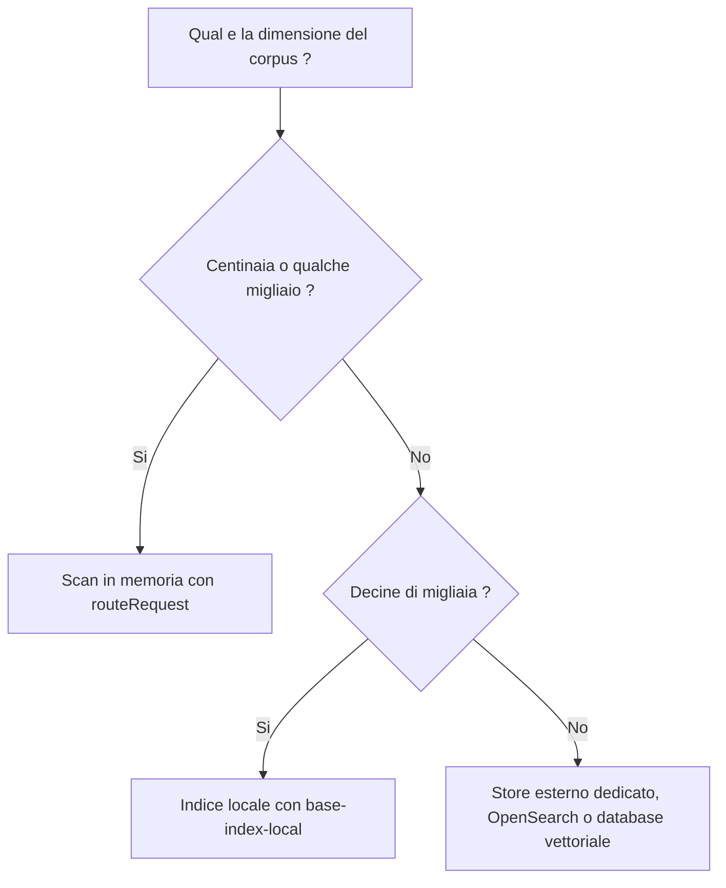

<!-- fr-synced: d75bebf8e1a782dfbd8ac6a8fb4f19069f923fd1 -->

# Scegliere tra scan, indice locale e store esterno in base alla vostra scala

Dimensionare bene il routing di BASE significa evitare due insidie: pagare per un'infrastruttura di cui
non avete bisogno, oppure sbattere contro un muro di lentezza quando il corpus cresce. Questa pagina vi
offre una regola decisionale quantificata, dai piccoli progetti ai corpus voluminosi, per sapere quando
lo scan in memoria basta, quando un indice locale diventa utile e quando uno store esterno si
giustifica.



## Quando lo scan in memoria basta

Per impostazione predefinita, `routeRequest` legge le risorse e le valuta in memoria. Questo approccio
è semplice, senza stato né artefatto da rigenerare, e **basta** per centinaia, persino qualche migliaio
di risorse. La maggior parte dei progetti non ha bisogno di altro. Non aumentate la complessità prima
di osservare un costo reale.

## Quando un indice locale aiuta

Quando il corpus cresce (decine di migliaia di risorse) e uno scan per richiesta diventa scomodo,
derivate un indice locale con `@ai-swiss/base-index-local`:

```bash
base-index-local build  <projet>
base-index-local route  <projet> "préparer un devis client"
base-index-local bench  --sizes 100,1000,10000,50000
```

L'indice è una **proiezione locale**: evita di rileggere l'intero filesystem e può fornire una lista di
postings per la ricerca lessicale. Misurato su un portatile (vedi
[Benchmarks](../guides/benchmarks-echelle.md)): un indice di **52 500 documenti** si costruisce in
~0,4 s e si interroga a caldo in **meno di 1 ms**.

Il routing indicizzato restituisce gli stessi stati del routing in memoria predefinito. Per preservare
questa parità, `routeWithIndex` valuta tutti i routable memorizzati nell'indice con lo stesso Ranker e
lo stesso Router iniettati. I team che sanno che il loro routing è compatibile a livello lessicale
possono attivare un prefiltraggio tramite postings (`candidateMode: "lexical"`) come ottimizzazione
esplicita.

## Quando uno store esterno diventa legittimo

Oltre a questo (milioni di documenti, ricerca distribuita, multi-tenant), un motore dedicato
(OpenSearch, un database vettoriale, un gateway interno) diventa giustificato. BASE non lo impone né lo
incorpora nel cuore: espone la stessa forma (candidati → decisione) affinché possiate collegarvi
dietro il motore di vostra scelta.

## Perché l'indice resta una proiezione

L'indice non è **mai** una fonte di verità. Viene ricostruito in modo deterministico a partire da:
inventario, segnali di routing derivati, frontmatter, titoli/descrizioni, `route_text` ed embedding
opzionali. Conseguenze:

- **Eliminabile.** Cancellate `.ai/index/local.json`: non perdete nulla, rigeneratelo.
- **Deterministico.** Due build degli stessi file sono identici: un gate CI può verificarne la
  freschezza (`git diff --exit-code`). *Gli embedding a runtime non sono coperti da questo gate:
  l'indice resta deterministico per i segnali derivati, non per i punteggi semantici calcolati.*
- **Nessun catalogo manuale.** Nessuna tabella mantenuta a mano può divergere dai file.

## In una frase

BASE sa quando uno scan basta, quando un indice aiuta e quanto costa ciascuna opzione. Benchmark
riproducibili lo misurano: è meglio di un'affermazione.
