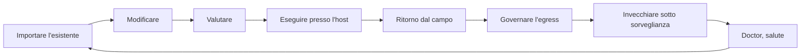

<!-- fr-synced: 270eef117f2e9c6c8e5e3eccda344304b9942590 -->

# Mantenere viva una competenza dopo il deployment

«E dopo il deployment?» È la domanda che pongono i decisori, ed è quella giusta. Questa pagina si rivolge ai responsabili che mettono in produzione un assistente e vogliono sapere come si mantiene nel tempo. Un assistente non è un progetto che finisce: è una competenza che vive. BASE fornisce strumenti per ogni fase di questa vita, dal primo documento importato fino all'invecchiamento sotto sorveglianza. Ecco il ciclo completo.

```
  importare ──> modificare ──> valutare ──> eseguire (presso l'host)
     ▲                                          │
     │                                          ▼
  doctor <── invecchiare <── governare <── ritorno dal campo
  (salute)   (status,         l'egress      (frizioni,
              validità)       (modelli)      astensioni)
```



## 1. Importare l'esistente

Si parte raramente da una pagina bianca. Il processo [`importer-l-existant`](../../.ai/agents/createur-agent/skills/processes/importer-l-existant/SKILL.md)
(fornito con BASE, collegato al creatore di assistenti) esplora i vostri documenti (manuali d'uso, wiki,
checklist) e **propone** la loro conversione in processi, competenze, documenti e template.
Ogni scrittura passa attraverso il gate propose → commit: voi convalidate ogni diff.

## 2. Modificare, con un co-pensatore

In [BASE Studio](../../tools/studio/ui/README.md) i vostri file si aprono come schede modificabili;
la chat di modifica pensa **con** voi sul documento che avete davanti, mai al vostro
posto altrove. Ogni suggerimento del modello arriva come diff, voi lo applicate o lo rifiutate. Il debito
comincia il più delle volte da qualche paragrafo che nessuno ha riletto: qui tutto resta visibile.

## 3. Valutare, sulla superficie reale

L'harness di valutazione ([`tools/eval`](../../tools/eval/README.md)) fornisce al modello sotto test gli
**stessi strumenti della produzione** (MCP): leggere, cercare, instradare, proporre, mai un terminale.
Un utente simulato gioca i vostri scenari, un giudice indipendente valuta la conversazione, e ciò che il
processo dichiara (link, griglie) viene precaricato nel contesto entro un budget. Un passaggio che richiederebbe
l'esecuzione di codice si **dichiara** (`report_limitation`) invece di simularsi. La valutazione assume
tutto il suo valore quando si passa alla scala: tutto BASE mantiene una base di processi scritti e gestiti
dalle persone, ma alcuni processi vengono **promossi e istituzionalizzati**, e sono questi che bisogna
tenere sotto valutazione.

## 4. Eseguire, presso l'host

L'assistente gira in uno strumento IA capace di leggere i vostri file (per esempio GitHub Copilot, Antigravity, Claude Code o Cowork, OpenCode, Kilo Code), o in qualsiasi host MCP, con il broker BASE
come mediatore: confinamento al root, gate di scrittura, traccia locale. L'esecuzione di codice resta
una capacità dell'host; BASE non la simula mai.

## 5. Il ritorno dal campo

Il ciclo non si ferma al deployment. Una **frizione** («la griglia citata non è più quella giusta»)
si registra in una frase: strumento MCP `report_friction`, o semplicemente «non ha funzionato», che
instrada al processo [`signaler-une-friction`](../../.ai/agents/concierge-base/skills/processes/signaler-une-friction/SKILL.md).
Ogni **astensione del router** (una richiesta che nessun agente copre) si registra da sola.
Studio presenta entrambe come pila di lavoro: una frizione è un emendamento di processo in
attesa; una richiesta non servita che continua a tornare è un processo da creare.

## 6. Invecchiare sotto sorveglianza

Un corpus di settore marcisce silenziosamente. Due campi di ciclo di vita (`status`, `review_by`),
due date di validità (`valid_from`, `valid_until`): il router ignora le risorse
deprecate, il contesto annuncia «scaduto dal …», e [`base doctor`](../reference/framework-public.md)
rileva ciò che sta per rompersi: link morti, risorse orfane, valutazioni scadute, riletture
in ritardo, frizioni aperte, ciascuna con la propria pista di correzione.

## 7. Governare ogni uscita verso un modello

Prima che un solo byte parta verso un modello, si verifica una sola regola: una risorsa
`confidential`, o un intero root `local-only`, non parte **mai** verso un provider remoto, e il
rifiuto viene dichiarato, sullo schermo e nella traccia. Vedi [Protezione dei dati](../trust/protection-des-donnees.md)
e [le prove](../trust/evidence.md).

---

L'intero ciclo sta in file che vi appartengono. Importarlo equivale a copiare una
cartella, auditarlo si fa con `base doctor`, e lasciarlo significa andarsene con i vostri file.
