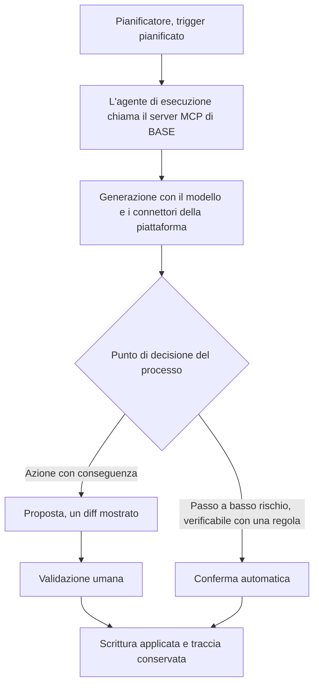

<!-- fr-synced: e9966b96132fd307f127afc28a43dc5262a53401 -->

# Conservate i vostri strumenti IA, possedete l'intelligenza che eseguono

> Questa pagina si rivolge a chi utilizza già uno strumento IA (un assistente, una piattaforma, una suite) e si chiede dove si collochi BASE. In due parole: conservate i vostri strumenti per l'esecuzione e possedete in BASE l'intelligenza che essi eseguono.

«BASE o il mio strumento?» è una falsa alternativa: i due non svolgono lo stesso ruolo. Una piattaforma o una suite vi danno l'esecuzione: il calcolo, l'archiviazione, i connettori e, sempre più, assistenti e automazione al di sopra. BASE fornisce qualcos'altro: **l'articolazione, posseduta e portabile, del modo in cui l'IA lavora sul vostro ambito professionale**.

La vera domanda è: **chi possiede questa articolazione, voi o il vostro fornitore?**

Per collocare BASE categoria per categoria nel panorama degli strumenti del 2026 (assistenti ospitati, copiloti per l'ufficio, pipeline RAG, piattaforme di agenti governate, framework di orchestrazione e il resto: dove è differenziato, complementare o semplice port), vedi [Dove si colloca BASE](positionnement.md). Questa pagina dà il principio; quella mappa dà il posto.

## Dove il confronto è davvero pertinente

Molti strumenti permettono oggi di puntare l'IA verso i vostri file (assistenti personalizzati, taccuini di fonti, memorie). È reale e utile. La differenza si gioca altrove.

«Ho già uno strumento IA», dite. Quale? Non svolgono tutti lo stesso ruolo, e nessuno svolge quello di BASE.

| | Chat generica | Suite per l'ufficio IA | Piattaforma di agenti | BASE |
|---|---|---|---|---|
| **Possedete i file** | No | No | No | **Sì, Markdown leggibile e portabile** |
| **Perimetro del contesto** | La conversazione | Per fonte connessa | Per agente configurato | **Per attività: il processo apre solo l'utile** |
| **Controllo dell'egress (meccanismo)** | No | No | Variabile | **Sì, prima della chiamata, tramite il broker** |
| **Proporre poi confermare (un diff prima della scrittura)** | No | No | Variabile | **Sì** |
| **Scelta del modello** | Imposta | Spesso imposta | Secondo la piattaforma | **La vostra, esterna** |

Il punto decisivo: il perimetro è legato all'**attività** anziché all'assistente. È **testo che possedete** anziché un oggetto alloggiato in una piattaforma, e funziona con **il modello di vostra scelta**. Da qui derivano una verifica più fine, un uso portabile e un'intelligenza sovrana.

E ciò che BASE non sostituisce (IAM, DLP, archiviazione legale, governance): vedi [Sicurezza e limiti](../trust/securite-et-limites.md).

## Quattro promesse che vi hanno venduto, e ciò che dimenticano

Probabilmente vi hanno collegato tutto questo: l'assistente vede la casella di posta e il drive condiviso, potete costruirvi una libreria di agenti, l'IA accede al vostro database curato con cura, e il tutto spunta le caselle, AI Act compreso. Prevale l'impressione che la struttura sia fatta. Rileggete ogni frase: ciò che manca non è mai la potenza, è una struttura che possedete e che si rigioca.

**«La mia IA vede tutte le mie email e il mio drive condiviso.»** L'impostazione predefinita «vedere-tutto» lascia che un processo opaco decida al vostro posto cosa legge, e un modello si degrada quando lo si annega di informazioni fuori tema: risponde peggio, costa di più, è più difficile da rileggere. Queste suite sanno però mirare. Ma lì la mira è manuale e rifatta ogni volta, mai conservata. L'impostazione predefinita, invece, resta «vedere-tutto».

**«Posso creare un'intera libreria di agenti.»** Sì. E con essa, un carico: pensare in agenti invece di seguire il vostro filo, poi ritrovare ogni volta quale si applica. La complessità non è scomparsa, ha cambiato posto: dall'attività a voi.

**«La mia IA vede tutto il mio database accuratamente strutturato.»** Un accesso non è un accesso utile. Senza dire all'IA cosa leggere e perché, aprire tutto il database non crea alcun valore, solo un'ulteriore superficie da sorvegliare.

**«Il mio sistema spunta tutte le caselle, AI Act compreso.»** Essere conformi è necessario. Non rende per questo l'IA utile: la conformità delimita il rischio, non produce il valore.

Nessuno di questi strumenti è in causa. Il problema è l'impostazione predefinita, quella che lascia la strutturazione a un processo opaco, o a voi, senza renderla posseduta né rigiocabile. BASE sposta questa impostazione: lega il perimetro all'**attività**, lo scrive una volta, in testo che conservate, e lo rigioca in modo identico invece di rifarlo a memoria. Voi dite al processo cosa aprire e perché, e questa scelta si conserva invece di perdersi. La lezione sta in una frase: **un accesso non è un accesso utile.**

## Complementarità: BASE si lascia consumare dai vostri strumenti

Essendo testo più un server MCP, BASE si innesta sui vostri strumenti anziché opporvisi:

- **MCP** (uno standard aperto): BASE espone un server MCP; uno strumento compatibile può chiamarlo per instradare, aprire e leggere le sue risorse.
- **File**: il vostro Markdown può vivere dove il vostro strumento lo legge e alimentare un assistente esistente.
- **Protocolli aperti di agenti**: una via di evoluzione per far cooperare agenti definiti in BASE con altri; non implementata a oggi in BASE.

### Una porta, non un guazzabuglio di strumenti

Un server MCP può esporre decine di strumenti granulari. È una comodità ingannevole: ogni strumento aggiunto ingombra il contesto del modello, ne diluisce l'attenzione e moltiplica le superfici di errore e di permesso. Più si attrezza un modello, peggio sceglie.

BASE adotta la posizione opposta, ed è una scelta di progettazione, non un limite. La sua superficie si riduce soprattutto a un punto: una **porta d'ingresso semantica**, il router, che riceve l'intenzione in linguaggio naturale e la dirige verso il giusto agente e il giusto processo, aprendo solo le risorse utili a *questa* attività. Attorno a questa porta, alcune operazioni mediate (leggere una risorsa, proporre poi confermare una scrittura, elencare i marcatori) sotto le garanzie del broker, anziché uno sciame di capacità. Il modello non ha bisogno di conoscere venti strumenti; ha bisogno di varcare bene una porta, e di trovare dietro di essa un contesto già inquadrato.

In altre parole, conservate i vostri strumenti per il calcolo, l'archiviazione e l'esecuzione; possedete, in BASE, lo strato di intelligenza. Vedi anche [Framework pubblico](framework-public.md), sezione «Sovranità attorno ai modelli».

## Agenti pianificati e autonomi

Volete un agente che giri secondo un orario (per esempio ogni lunedì) a partire da un processo definito in BASE? È un buon caso, a una condizione: un agente che gira da solo per mesi è spesso il punto in cui la verifica si allenta di più. La regola sta in una frase: **la generazione può essere automatica, la validazione resta tenuta in mano.**

Il percorso raccomandato, qualunque sia lo strumento, governato e verificabile:

1. Un **pianificatore** avvia l'esecuzione (un trigger pianificato, uno scheduler). Non contiene alcuna logica di business.
2. L'**agente di esecuzione** della vostra piattaforma chiama il **server MCP di BASE** per ottenere il processo e le sue risorse mirate.
3. **Esegue la generazione** con il modello e i connettori della piattaforma.
4. Ai **punti di decisione** del processo, l'agente **si ferma per la validazione umana** (la maggior parte delle piattaforme recenti offre una modalità «bozza» o «richiedere un'approvazione»).
5. Dopo l'approvazione, la scrittura viene **applicata**, e una traccia ne conserva la memoria (al livello di dettaglio che scegliete).

Sul versante di BASE, nulla si scrive alla cieca: le azioni con conseguenza passano per una **proposta** (un diff mostrato) prima di essere applicate; i passi a basso rischio, verificabili con una regola, possono essere confermati automaticamente. Calibrate, passo dopo passo, ciò che è automatico e ciò che attende un umano.

Il pezzo centrale: il processo è testo che **possedete**. Potete cambiare pianificatore, modello o piattaforma senza riscriverlo.

> **Se vi si parla di pianificazione o di agenti autonomi:** tenete la logica in BASE, fatela chiamare dalla piattaforma, e mantenete l'umano al punto di validazione. La pianificazione automatizza la *produzione*, non la *decisione*.

## Per il vostro strumento specifico: chiedete a BASE

Questo documento descrive il **principio**, valido per qualsiasi strumento. Per l'**integrazione concreta con il vostro strumento**, BASE può guidarvi:

- ditegli di quale strumento si tratta;
- fornitegli il link alla sua documentazione di integrazione (o lasciate che la cerchi se il vostro ambiente permette la navigazione web);
- BASE legge questa documentazione e vi guida passo dopo passo, collocando ogni passo nel piano giusto (pianificatore, chiamata al server MCP di BASE, validazione umana, applicazione), e preservando i punti di verifica.

Concretamente: caricate il concierge BASE e chiedete «aiutami a integrare BASE con [il mio strumento]» o «come pianifico un agente con [il mio strumento]». Vedi l'agente di accoglienza in `.ai/agents/concierge-base/`.

---

*Le capacità degli strumenti di terze parti evolvono rapidamente. Questo documento descrive differenze e un principio strutturali e duraturi, senza dipendere da un prodotto preciso; per i dettagli propri del vostro strumento, basatevi sulla sua documentazione aggiornata (BASE può aiutarvi in questo).*
