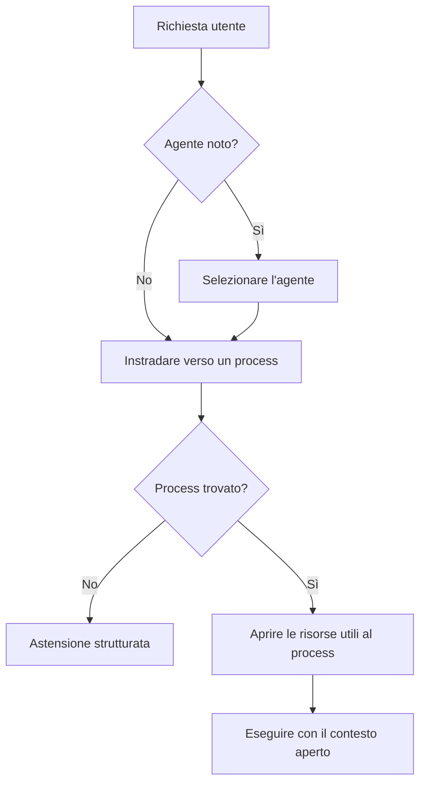

<!-- fr-synced: 26978391401c9a6f07d56c21001a07d8a31fe343 -->

# Adottare BASE public: dal locale al team

Se sei un privato, un libero professionista, una startup, una PMI o un piccolo team, questa pagina ti mostra cosa ti offre BASE public: strutturare la tua collaborazione con l'IA senza installare una piattaforma pesante. Spiega anche come adottarlo per tappe, restando semplice in superficie ma senza bloccare la crescita successiva.

L'idea guida: poche cose imposte all'inizio, astrazioni complete dietro, esigenze che crescono con i tuoi bisogni, e rigore solo dove il contesto lo richiede.

Se stai scoprendo il repository, comincia da `docs/start/lire-dans-quel-ordre.md`. Questo documento è la fonte di verità dei percorsi di lettura: cosa leggere secondo il tuo profilo, cosa ignorare all'inizio e cosa verificare in seguito.

## Chi deve leggere cosa?

Il percorso di lettura per profilo (persona singola, PMI, grande impresa) è mantenuto in un unico posto, per evitare versioni divergenti: vedi [In quale ordine leggere](../start/lire-dans-quel-ordre.md). Questo documento è una delle tappe di tali percorsi.

## Tre livelli da non confondere

| Livello | Contenuto | Perché esiste |
| ------ | ------- | -------------------- |
| Uso | `README.md`, `docs/start/quickstart.md`, `exemples/` | Iniziare senza capire tutta l'architettura |
| Struttura | `.ai/agents/`, `docs/reference/framework-public.md`, `base.schema.json` | Stabilizzare agenti, skill, risorse e workflow |
| Integrazione | `tools/`, `mcp/`, `tests/`, `docs/reference/specification-v0.md` | Verificare, connettere e auditare senza rinchiudere BASE in uno strumento |

`CLAUDE.md` e `.cursor/rules/` sono adattatori di harness. Aiutano Claude Code e Cursor a caricare il contesto giusto, ma non sono la fonte concettuale del framework. Come comodità, mai come obbligo, esistono due interfacce locali opzionali: Studio (`npm run studio -- <dossier>`, su `127.0.0.1:5174`) per sfogliare e modificare le risorse con la barriera proponi poi commit, e la documentazione servita in locale (`npm run docs:serve`).

BASE public è direttamente utilizzabile per il lavoro locale e i piccoli team. Per una grande impresa, serve da base di strutturazione e riferimento di architettura, non da piattaforma di conformità completa.

Per evitare ogni ambiguità, lo stato reale del nucleo pubblico è tracciato in `docs/reference/etat-implementation.md`: cosa è implementato, cosa è previsto come estensione e cosa resta volontariamente fuori dal perimetro.

La pagina `docs/audiences/pour-qui.md` fornisce la lettura per contesto: vita privata, startup, PMI e grande impresa.

## Livelli di adozione

### Personale

Obiettivo: iniziare senza attrito.

- Markdown libero;
- YAML opzionale;
- agente locale o esempio copiato;
- validazione umana prima della scrittura;
- nessun manifest obbligatorio.

Un file personale può essere semplicemente:

```markdown
# Rispondere alle email dei clienti

Quando ricevo un'email...
```

### PMI / team

Obiettivo: condividere senza burocrazia.

- frontmatter minimo raccomandato;
- `base validate --root <dossier>` prima di condividere;
- `base index --root <dossier>` per generare il manifest;
- `base entretien --root <dossier>` per individuare link rotti, marcatori aperti e descrizioni mancanti;
- promozione controllata delle risorse personali verso il team.

Il buon punto di partenza organizzativo è `docs/audiences/kit-demarrage-pme-suisse.md`: dati autorizzati, responsabile della validazione, versioning semplice e rituale mensile. Spesso questo basta prima di aggiungere controlli più pesanti.

Il minimo per il team è:

```yaml
---
schema_version: base.resource.v1
id: nouveau-devis
type: process
title: Nouveau devis
description: Créer un devis professionnel à partir d'une demande client.
scope: team
status: active
sensitivity: internal
---
```

### Grande impresa

Obiettivo: mantenere una struttura duratura che possa essere governata.

BASE struttura le risorse, i process, i tool, le policy e gli adapter. L'organizzazione deve aggiungere i propri controlli enterprise: identità, autorizzazioni, classificazione, DLP, SIEM, archiviazione legale, revisione di conformità, gestione dei segreti e separazione degli ambienti.

Non far portare questi controlli al nucleo pubblico per scorciatoia. BASE resta lo strato di strutturazione e mediazione locale; le garanzie enterprise devono essere applicate dai sistemi che hanno realmente l'autorità tecnica e giuridica per farlo.

La lettura corretta è quindi:

```text
BASE public = quadro local-first + convenzioni + router + MCP locale
Impresa = integrazione governata + politiche interne + controlli tecnici aggiuntivi
```

## Astrazioni stabili

| Concetto | Per l'utente | Ruolo duraturo |
|---------|--------------------|--------------|
| Resource | file utile | Ciò che può essere scoperto e usato |
| Source | luogo dove vive | Origine locale o futura integrazione |
| Connector | accesso | Meccanismo che legge o scrive una source |
| Process | modo di fare | Workflow testuale riutilizzabile |
| Tool | strumento | Azione invocabile, spesso uno script locale |
| Policy | regola d'accesso | Intenzione o limite d'uso |
| Event | traccia utile | Segnale minimo per manutenzione o debug |
| Adapter | integrazione strumento IA | Ponte verso Cursor, Claude, ChatGPT o altro |

Questi concetti non devono apparire tutti nella UX per principianti. Servono a evitare che la struttura debba essere buttata quando un'organizzazione cresce.

**Lingua.** Nessuna di queste astrazioni è legata al francese. Il routing è lessicale e indipendente dalla lingua (confronto di parole normalizzate, senza grammatica né lessico di una lingua data), e un assistente dichiarato con parole chiave tedesche o italiane instrada in quella lingua. La documentazione del quadro comincia in francese; gli assistenti che costruisci, invece, parlano la lingua dei loro utenti.

In questa tabella, `accès` non significa che BASE sostituisce i permessi nativi. Un connector è il meccanismo che tenta di leggere o scrivere una source. La riuscita reale dipende sempre dai diritti del sistema interessato: filesystem, Drive, API, token, account utente, rete o harness.

## Due tipi di skill

BASE riprende il formato `SKILL.md`, già familiare in diversi harness, ma non tratta tutte le skill come uno stesso blocco di istruzioni. È anzitutto una questione di sicurezza: le istruzioni di un process si eseguono, il contenuto di una competenza si consulta senza eseguirlo. Confondere i due apre la porta all'iniezione, dove un dato tenta di farsi passare per un'istruzione.

| Tipo | Domanda | Esempio |
|------|----------|---------|
| **Process skill** | Cosa fare, in quale ordine, con quali punti di decisione? | `nouveau-devis`, `traiter-candidature`, `preparer-newsletter` |
| **Competence skill** | Cosa bisogna sapere per farlo bene? | IVA, politica di sconto, tono di comunicazione, marcatori, registro |

Questa distinzione evita che un agente abbia solo una grande lista di skill. Un process può dichiarare o suggerire le competenze necessarie; il router può ritrovare il process giusto, poi aprire solo le conoscenze utili. È una differenza importante rispetto agli harness che espongono soprattutto un catalogo piatto di skill.

La dottrina completa è: selezionare l'agente quando è noto, instradare verso un process quando il workflow deve essere scelto, poi aprire le risorse utili al process. È dettagliata in `docs/reference/routage-process-et-ressources.md`.



## Modalità di permesso

BASE public è onesto su ciò che può garantire:

- `advisory`: modalità predefinita, l'agente guida e segnala i rischi.
- `hybrid`: alcune azioni sensibili passano per BASE, mentre l'harness conserva capacità native dichiarate.
- `strict`: azioni mediate dalla CLI, dal MCP o da un connector controllato, con confinamento nel progetto e rifiuto dei symlink fuori perimetro quando il connector lo supporta.

BASE non promette né un RBAC enterprise né un blocco totale quando un agente possiede un accesso shell diretto.

La regola pratica è semplice: un permesso è reale solo se l'accesso o l'azione passa per BASE, un connector o uno strumento che può applicarlo. Altrimenti resta un'istruzione e un segnale di audit. Al contrario, BASE non crea mai un accesso che l'OS, il Drive, l'API o l'harness già rifiuta.

Formula di riferimento:

```text
advisory = guida/audit
hybrid = enforcement parziale esplicito
strict = enforcement mediato
```

## Broker e Router locali

Il broker pubblico, condiviso dalla CLI e dal MCP, fornisce:

- inventario delle risorse;
- ricerca locale spiegabile;
- routing agente verso process con astensione strutturata (`base route`, `route_request`);
- test di routing di dominio (`base route-test`);
- apertura di risorsa confinata con proiezione `metadata`, `instructions` o `full`;
- accesso locale ai file o alle risorse;
- invocazione di uno strumento (script) in dry-run per impostazione predefinita, con conferma quando necessario;
- validazione del progetto.

Il Router sceglie tra gli agenti e i process derivati dai file. Non cerca liberamente in tutto il repository e non carica tutte le istruzioni. Le competenze, i tool, i template, i documenti e i dati sono recuperati in seguito come contesto.

BASE potrebbe evolvere verso un routing più ampio, per esempio per ritrovare direttamente una competenza o uno strumento. Il nucleo pubblico non lo fa per impostazione predefinita: instradare un'azione e recuperare contesto sono due responsabilità diverse, e tenerle separate rende il sistema più leggibile e testabile.

La ricerca locale usa metadati YAML, titoli Markdown, descrizioni, parole chiave e testo locale semplice. Il nucleo fornisce anche un `semanticHybridRanker` a zero dipendenze attivabile via config. Per veri embedding, BASE fornisce il pacchetto ufficiale separato `@ai-swiss/base-ranker-semantic`, senza aggiungere alcun modello né SDK cloud al nucleo. Accetta un fornitore esplicito, fornisce un connector OpenAI-compatibile e propone un helper Ollama opzionale (`createOllamaEmbedder`, modello `nomic-embed-text`) per i team che vogliono un percorso locale semplice. Vedi `docs/guides/routage-semantique-quickstart.md`, `docs/guides/choisir-provider-embeddings.md` e `docs/trust/securite-donnees-routage.md`.

Per la scala, `@ai-swiss/base-index-local` fornisce un indice locale opzionale, derivato e cancellabile. Non diventa fonte di verità e resta fuori dal nucleo. Vedi `docs/learn/comprendre-echelle.md` e `docs/guides/benchmarks-echelle.md`.

Il registro `.ai/routing/registry.json` è generabile, ma resta una proiezione di audit e di preparazione alla scala. Non è fonte di verità e il Router non dipende da esso oggi. I limiti precisi sono elencati in `docs/reference/etat-implementation.md`.

## Sovranità attorno ai modelli

La sovranità dei server (dove gira il calcolo) è necessaria, senza essere sufficiente: un'IA sovrana per i suoi server e straniera per i suoi usi resta una trappola. Per l'essenziale del lavoro di conoscenza corrente (dialogare, redigere, riformulare, seguire un process inquadrato), un modello libero che gira su una buona macchina locale già basta, e questa frontiera arretra: il calcolo necessario per raggiungere una data capacità diminuisce di circa la metà ogni otto mesi (Epoch AI, 2024), più in fretta di quanto progredisca l'hardware, e la capacità ottenuta per parametro raddoppia circa ogni tre o quattro mesi (Xiao et al., 2024). Per questa classe di lavoro, la potenza bruta non è dunque il fattore limitante, e gli investimenti infrastrutturali faraonici riguardano soprattutto un altro tipo di IA, che BASE non cerca di servire in priorità. La sovranità che conta si situa quindi **attorno ai modelli**: la libertà di articolare, strutturare e pensare con queste intelligenze.

Da qui una netta separazione delle responsabilità, che si legge meglio livello per livello, non per maturità tecnica ma per **chi possiede ciascun piano**:

| Livello | Chi lo possiede di solito | Ciò che BASE ti restituisce |
| --- | --- | --- |
| Il calcolo e i modelli | Il tuo fornitore di IA | Niente, ed è voluto: affittalo, fallo evolvere, cambialo. |
| La memoria interna e l'orchestrazione | La piattaforma | Il diritto di uscirne: i tuoi dati restano testo, leggibile altrove. |
| Gli strumenti di lettura, scrittura e ricerca | L'editore dello strumento | Strumenti mirati che dichiari, limitati al compito del momento. |
| Il routing e i flussi di lavoro | Il prodotto, tramite i suoi menu e le sue impostazioni | Process in testo che scrivi, versioni e governi. |
| **Le interazioni: l'articolazione del tuo pensiero** | **Nessuno te la restituisce** | **La sovranità cognitiva: come pensi con l'IA resta tuo, in chiaro, indipendente dal modello.** |

Possiedi i livelli intermedi e, soprattutto, quello delle interazioni; il fornitore apporta il calcolo e i modelli, che affitti e fai evolvere.

## Interoperabilità: con i tuoi strumenti, non al loro posto

BASE resta aperto. Essendo testo più un server MCP, si lascia consumare da qualsiasi harness o piattaforma capace di leggere file o di parlare MCP:

- **MCP** (uno standard aperto): BASE espone un server MCP; uno strumento compatibile può chiamare BASE per instradare, aprire e leggere le sue risorse.
- **File**: i tuoi Markdown possono vivere dove il tuo strumento li legge e alimentare un assistente esistente.
- **Protocolli aperti di agenti**: via di evoluzione per far cooperare agenti definiti in BASE con altri, non implementata ad oggi; da non presentare come acquisita.

Concretamente, tre portate, dalla più leggera alla più completa: i tuoi **file allegati** a una chat, la tua **cartella aperta** in uno strumento che legge i file, o il **server MCP** collegato a uno strumento compatibile, fino a una chat di largo consumo quando parla MCP.

La domanda giusta non è dunque "BASE o il mio strumento?" ma "chi possiede l'articolazione del mio modo di pensare con l'IA?". Tieni i tuoi strumenti per l'esecuzione; possiedi, in BASE, l'intelligenza che eseguono. Dettaglio, e aiuto per integrare il tuo strumento preciso: [BASE e i tuoi strumenti IA](base-et-vos-outils-ia.md).

*Nota: le capacità degli strumenti di terze parti evolvono in fretta; questo documento resta indipendente da un prodotto preciso. Per un dettaglio proprio di uno strumento, appoggiati alla sua documentazione aggiornata.*

## Enterprise: solo documentato

I seguenti bisogni sono possibili, ma non fanno parte del nucleo pubblico iniziale:

- SSO e OAuth completi;
- connector SharePoint o Drive avanzati;
- RBAC;
- audit completo;
- trace full;
- vector search;
- ambienti dev, staging, prod;
- data retention e legal holds;
- secrets manager;
- policy engine esterno;
- SIEM.

La struttura BASE non blocca questi bisogni. Si collegano tramite Sources, Connectors, Policies, IndexProviders e Adapters.

La regola di progettazione resta conservativa: non aggiungere un'astrazione enterprise al nucleo pubblico finché non è portata da un bisogno reale, un meccanismo verificabile e almeno due integrazioni plausibili. Altrimenti, documentare il limite vale meglio che aggiungere una promessa fragile.

## Ciò che BASE non promette

BASE non promette:

- un'esattezza automatica delle risposte IA;
- una memoria del modello indipendente dai file;
- un'archiviazione legale;
- una prova di audit completa;
- un isolamento di sicurezza se l'agente possiede un accesso shell diretto;
- una conformità GDPR, FINMA, ISO o SOC 2 senza controllo organizzativo aggiuntivo.

BASE promette un quadro leggibile, local-first ed estensibile, in cui le ipotesi, le decisioni, le risorse e i processi sono espliciti.
