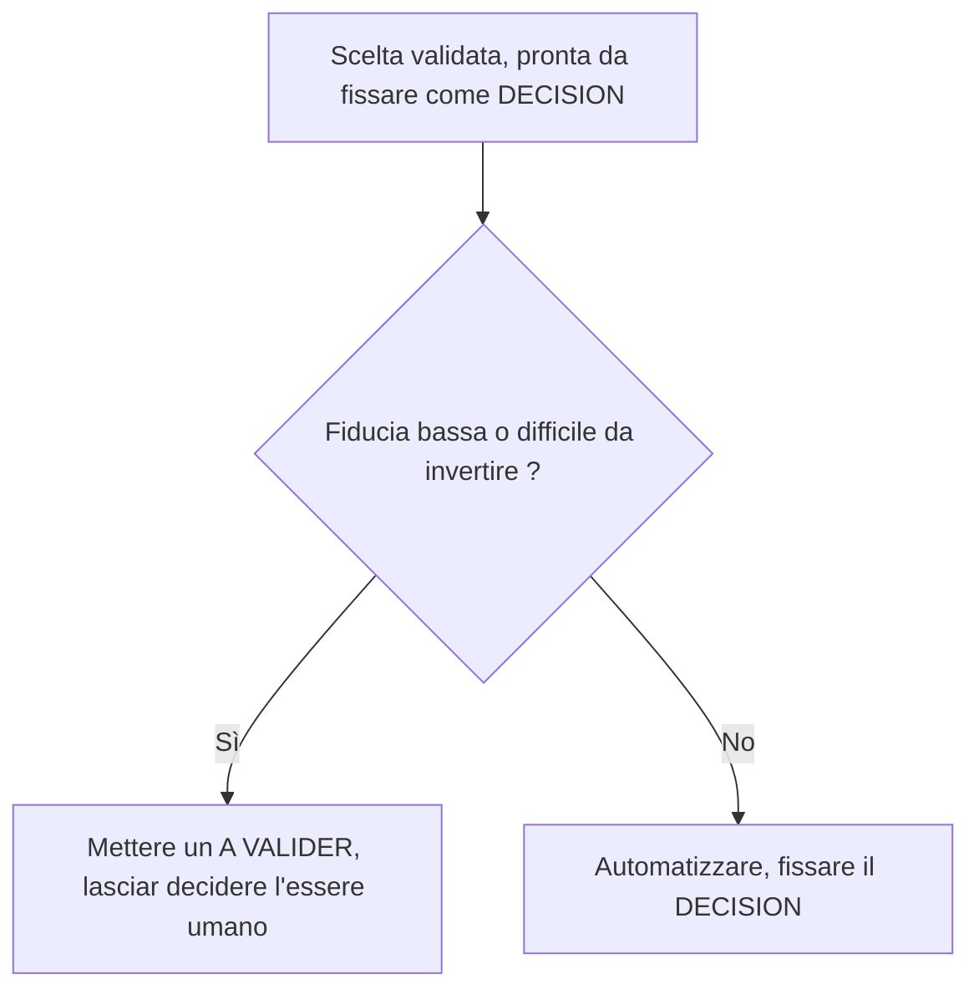

<!-- fr-synced: ea39bb91b48807f14ff61049a74807160db4cf19 -->

# I marcatori di BASE e quando metterli

Un marcatore messo male, o inteso in modo diverso dall'essere umano, dall'agente e dagli strumenti, fa perdere la traccia dello stato reale del lavoro. Per evitarlo, il vocabolario è definito una sola volta qui: quali marcatori esistono, che cosa significa ciascuno e quando metterlo. Un marcatore è un riferimento testuale ricercabile, scritto tra parentesi quadre in un documento, che rende visibile quello stato senza uscire dal file. Serve da riferimento comune a chi redige o rilegge in BASE, così come all'agente che lo assiste.

Un marcatore si tratta tramite ricerca di testo (ricercabile, quindi tracciabile e scriptabile), non a occhio. È proprio questo il punto: un marcatore è un riferimento che si ritrova tramite un metodo algoritmico standard (elencare i documenti marcati e trattarli uno per uno), invece di affidarsi a una ricerca semantica sfumata che deve assorbire tutto per puro volume. BASE ne riconosce un insieme **chiuso**, ripartito su due livelli che non si mescolano:

1. **I marcatori di dominio**, nei documenti utente (preventivi, schede clienti, rapporti, diario). Rendono lo stato del lavoro visibile e tracciabile direttamente nel file.
2. **I marcatori del piano di specifica**, nella spec e nel codice. Segnalano una zona di incertezza assunta o una modifica di codice dichiarata senza modifica della spec.

Questa pagina è la **fonte unica** di tale vocabolario. Lo scanner (`tools/core/markers.mjs`), il requisito FR-CORE-010, il controllo spec-sync e la competenza «marcatori» di ciascun agente derivano tutti da questo insieme chiuso. L'ultima sezione spiega perché non se ne aggiunge nessuno alla leggera.

## A. Marcatori di dominio

Quattro marcatori, e soltanto quattro, vivono nei documenti utente. Ciascuno corrisponde a una fase del ciclo di co-pensiero (Inquadrare, Affidare, Valutare, Adattare). Sono cercati da `base markers` (e dallo strumento MCP `list_markers`), e **vietati** nei file del framework e della spec.

Per ciascun marcatore: il suo significato, il momento in cui metterlo e chi lo chiude.

### `[A COMPLETER: champ]`

- **Significato.** Manca un'informazione necessaria per procedere.
- **Quando usarlo.** Fase Inquadrare: al momento di redigere, quando un dato indispensabile non è ancora noto (per esempio un numero IDE, un'email, un importo).
- **Chi lo chiude.** Scompare quando l'informazione è fornita, dall'agente o dall'utente.

### `[A VALIDER: description]`

- **Significato.** L'agente propone qualcosa che non è ancora stato confermato dall'utente.
- **Quando usarlo.** Fase Affidare: per ogni valore, ipotesi o formulazione che l'agente ha prodotto e che attende una decisione umana.
- **Chi lo chiude.** L'utente. Un `[A VALIDER]` confermato diventa un `[DECISION]`.

### `[ATTENTION: description]`

- **Significato.** Un rischio, un'incoerenza o un'allerta che l'utente dovrebbe esaminare.
- **Quando usarlo.** Fase Valutare: quando l'agente rileva un punto che merita uno sguardo umano prima di proseguire.
- **Chi lo chiude.** Resta finché il rischio non è stato trattato; si chiude quando il punto è stato risolto o esplicitamente accettato.

### `[DECISION: choix | raison]`

- **Significato.** Una scelta è stata confermata dall'utente, registrata per la tracciabilità.
- **Quando usarlo.** Fase Adattare: per fissare una scelta validata e conservare il motivo per cui è stata fatta.
- **Chi lo chiude.** Nulla. Un `[DECISION]` è una traccia duratura della scelta, che resta nel documento come storico, e non un elemento aperto da trattare.
- **Forma arricchita (poste in gioco elevate).** Quando la scelta ha conseguenze importanti (importo elevato, impegno fermo, dato difficile da correggere), si documenta l'alternativa scartata, il livello di fiducia e il costo di un ritorno indietro, per esempio: `[DECISION: Arche florale à 1100 CHF | Pivoines plus coûteuses | Alternative: roses standard 850 CHF | Confiance: haute | Réversibilité: faible (devis à refaire)]`. Vocabolario suggerito, letto dall'essere umano come dall'agente (non è un campo analizzato dallo scanner): **Confiance: haute | moyenne | basse**, **Réversibilité: facile | moyenne | difficile**.
- **Regola di escalation.** Un agente che si appresta a fissare un `[DECISION]` con **fiducia bassa** *oppure* il cui ritorno indietro sarebbe **difficile** non decide da solo: mette un `[A VALIDER]` e lascia decidere l'essere umano. Si automatizza ciò che è sicuro e facilmente reversibile; il resto si fa risalire. È una convenzione di giudizio, non una sintassi imposta.

### Regole comuni ai marcatori di dominio

- Vivono nei **documenti generati** (preventivi, schede clienti, rapporti) e nel **diario**, mai nei file del framework (`AGENT.md`, `SKILL.md`, template) né nella spec.
- Sono scansionati da `base markers` (e dallo strumento MCP `list_markers`), che restituisce solo i file di dominio: `listMarkers` ignora `.ai/agents/`, `docs/`, `specs/`, `tests/`, `tools/`, `mcp/`, i README e i file di test (FR-MARKERS-001). All'avvio di una sessione, l'agente può riassumere lo stato aperto in una riga (per esempio «2 `[A VALIDER]`, 1 `[DECISION]` registrata»).
- Il rapporto di manutenzione (`base entretien`, FR-CORE-010) conta questi stessi marcatori come elementi aperti, e segnala i marcatori **scaduti**: un marcatore aperto in un file di dominio la cui data di modifica supera i 30 giorni, il segnale del «teatro della verifica».
- L'insieme è **chiuso e insensibile al maiuscolo/minuscolo** nello scanner; qualsiasi altra parentesi quadra non è un marcatore di dominio e non viene segnalata.

### Varianti di dominio

I quattro marcatori di dominio formano l'insieme **canonico**: è lui che lo scanner riconosce, che `base markers` segnala e che la competenza «marcatori» standard insegna. Un agente può tuttavia insegnare, **in aggiunta**, annotazioni proprie del suo dominio, per rendere leggibile ciò che conta da lui: l'assistente di riflessione, per esempio, mette `[HYPOTHESE: …]` e `[INCERTITUDE: …]`. Queste annotazioni non sono marcatori di dominio canonici (lo scanner non le segnala) e non pretendono lo status dell'insieme chiuso.

Il confine è tenuto da un controllo (`tools/spec/check-markers.mjs`): una competenza «marcatori» che impiega l'insieme canonico (menziona `A COMPLETER`) ne è una **copia** e deve riportare tutti e quattro i marcatori, senza ometterne nessuno; una competenza che non impiega `A COMPLETER` è trattata come una **variante di dominio**, distinta dal canone e ignorata da questo controllo di completezza. Scegliere una variante resta una scelta dell'agente assunta consapevolmente; non modifica l'insieme canonico, che cambia solo per decisione (vedi più avanti).

## B. Marcatori del piano di specifica

Due marcatori vivono nel piano tecnico (la spec e il codice), mai nei documenti utente. Non sono segnalati da `base markers`: sono convenzioni del repository, applicate dai controlli di disciplina della spec.

### `[NEEDS CLARIFICATION: reason]`

- **Significato.** Un'incognita assunta nella specifica: una zona dove il comportamento atteso non è ancora deciso.
- **Dove si applica.** Nei capitoli di `specs/current/`. La regola della spec è di **non inventare mai un requisito**: una vera incognita si contrassegna inline invece di indovinarla. Il motivo tra parentesi è obbligatorio.
- **Perché.** La spec descrive il comportamento presente, senza stato. Un `[NEEDS CLARIFICATION]` è il modo onesto di dire «questo resta da decidere» senza fabbricare una risposta né infilare lavoro pianificato in un capitolo (il lavoro pianificato vive in `CHANGELOG.md` e `.plans/`).

### `[SPEC-NEUTRAL: reason]`

- **Significato.** La dichiarazione onesta, e revisionata, che una modifica di codice runtime non altera alcun comportamento descritto dalla spec.
- **Dove si applica.** Nel messaggio di commit o nel corpo della pull request, letto dal controllo **spec-sync** (`tools/spec/spec-sync-check.mjs`).
- **Perché.** Il controllo spec-sync garantisce che la verità non resti indietro rispetto alla traiettoria: una modifica di codice sorgente runtime deve toccare `specs/` nella stessa modifica, **oppure** dichiarare `[SPEC-NEUTRAL: reason]`. È la **valvola di sicurezza** del controllo, e non una scorciatoia silenziosa: la dichiarazione è un punto di revisione esplicito, e i revisori verificano che la modifica sia realmente priva di effetto sul comportamento. Il motivo tra parentesi è obbligatorio.

Questi due marcatori rientrano nella disciplina della spec (NFR-CORE-010), allo stesso titolo della matrice requisiti verso test rigenerata e dell'immutabilità degli identificatori. Non hanno nulla a che fare in un preventivo o in una scheda cliente, e i marcatori di dominio non hanno nulla a che fare in un capitolo di spec.

## Mai (regole dure)

Le regole dure per un agente che lavora **dentro** BASE (il repository del framework), non per i documenti di dominio:

- **Mai un marcatore di dominio in un file del framework o della spec.** I marcatori `[A COMPLETER]`, `[A VALIDER]`, `[ATTENTION]`, `[DECISION]` vivono nei documenti generati e nel diario, mai in `AGENT.md`, `SKILL.md`, i template o l'albero `specs/`.
- **Mai modificare a mano un artefatto generato.** Ogni file la cui intestazione indica che è generato (`AGENTS.md`, `CLAUDE.md`, `BASE_BOOTSTRAP.md`, `.cursor/rules/assistant.mdc`, `base.manifest.json`, la matrice `requirements-matrix.md`) è una proiezione: modifica la fonte canonica (per esempio `tools/core/bootstrap.mjs` per i quattro punti di ingresso), poi rigenera. Il gate di freschezza (`build --write` poi `git diff --exit-code`) rifiuta qualsiasi deriva.
- **Mai inventare un dato mancante.** Un'informazione assente si annota `[A COMPLETER: champ]` in un documento di dominio, e un'incognita in una spec si segnala in linea con `[NEEDS CLARIFICATION: raison]`. Non indovinare, non fabbricare un valore, nessuna fiducia simulata.
- **Mai una scrittura diretta su un bersaglio protetto.** Ogni scrittura passa per il flusso mediato proponi poi commit; proporre prepara un diff e non scrive nulla, committare riverifica la decisione e il `base_hash` prima di scrivere e verificare. Una proposta non si auto-esenta mai.
- **Mai rinumerare, riutilizzare né eliminare un identificatore stabile** (`UR`/`NFR`/`FR`/`RC`/`AD`). Un ID fuso è immutabile; un requisito tolto dal perimetro mantiene il suo ID e porta `[DE-SCOPED: raison]`. I nuovi ID sono allocati dagli strumenti (`base spec new <PREFIX> <DOMAIN>`), mai a mano.

## Un insieme chiuso, modificato solo per decisione

Questa pagina è la fonte di verità unica del vocabolario dei marcatori. Tutto il resto ne deriva:

- lo scanner `tools/core/markers.mjs`, il cui motivo riconosce solo i quattro marcatori di dominio;
- il requisito FR-CORE-010, che definisce cosa il rapporto di manutenzione conta e segnala;
- la competenza «marcatori» di ciascun agente, che insegna all'assistente quando mettere ciascun marcatore di dominio.

Poiché questi derivati devono restare coerenti con questa pagina, **aggiungere un marcatore (o cambiarne il significato) è una modifica del framework, non un'improvvisazione**: passa per una registrazione di decisione (`decisions/`) poi per la rigenerazione degli artefatti che ne derivano. Non si inventa un marcatore mentre si redige: si sceglie da questo insieme chiuso, oppure si apre una decisione.
