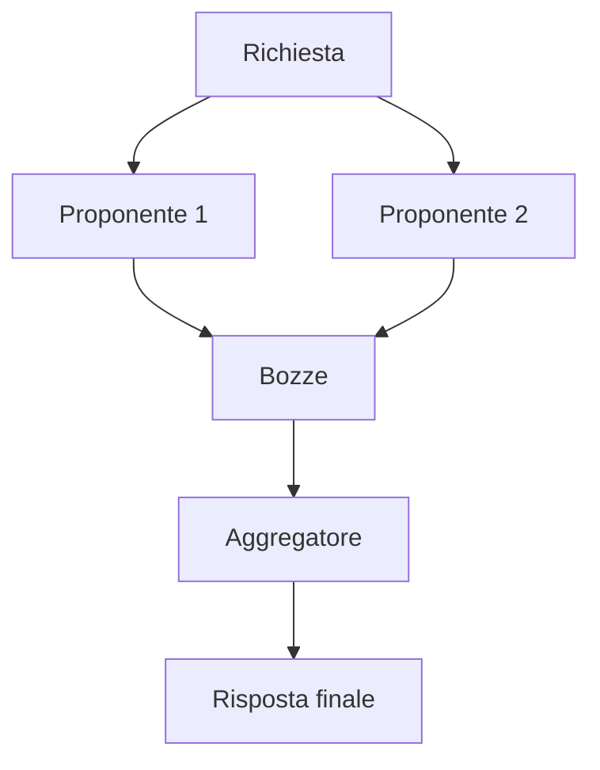

<!-- fr-synced: c3027d43be98ae750a20d8c860fdb5d9cf01023c -->

# Orchestrare più modelli e supervisionare le chiamate

Il pacchetto `@ai-swiss/base-llm` espone un'unica porta di modello: ogni modello offre la stessa interfaccia `complete`. Poiché i meta-modelli rispettano questa porta, si compongono: ciascuno avvolge uno o più modelli e resta esso stesso un modello. Si inserisce quindi ovunque si usi un modello semplice, dalle impostazioni al routing. La scelta di un modello resta sempre una decisione esplicita.

## Mixture of agents

`createMoaModel` interroga più proponenti in parallelo, poi un aggregatore sintetizza le loro bozze in un'unica risposta. I proponenti lavorano senza strumenti e producono testo; l'aggregatore riceve le bozze come guida privata e mantiene gli strumenti originali. L'uso dei token si somma su tutte le chiamate e la sintesi prosegue anche se alcuni proponenti falliscono.

## Triumvirat

`createTriumviratModel` riprende l'architettura di Sakana Fugu e di TRINITY. A ogni turno, un coordinatore sceglie un modello da un insieme intercambiabile e gli affida un ruolo: il pensatore pianifica, l'esecutore produce o corregge la risposta e riceve da solo gli strumenti, il verificatore giudica la bozza e decide l'arresto. Il ciclo gira fino all'accettazione o fino a un limite di turni.

Il coordinatore predefinito si basa su un modello dell'insieme, con un ripiego deterministico pensatore, esecutore, verificatore. Una funzione `decide` fornita dal chiamante sostituisce questo coordinatore senza cambiare l'interfaccia.

## Configurare gli ensemble dalle impostazioni

Un blocco `ensembles` in `.ai/studio.settings.json` rende queste composizioni disponibili senza scrivere codice. Ogni voce nomina un `type` (`moa` o `triumvirat`) e riferimenti dei membri nel formato `<fournisseur>/<modèle>`. Il nome dell'ensemble si usa poi ovunque si usi un riferimento a un modello, per esempio in `routing.model`. Una configurazione errata fallisce con un messaggio chiaro.

## Supervisione con Langfuse

`createLangfuseModel` avvolge qualsiasi modello e traccia ogni chiamata verso Langfuse: input, output, token, durata ed errori. L'involucro non aggiunge alcuna dipendenza: scrive verso l'interfaccia pubblica di ingestione tramite `fetch`. L'invio avviene in background e non aggiunge latenza alla chiamata; `flush()` svuota gli invii in corso prima della fine di un processo breve. Un errore di supervisione non interrompe mai la chiamata supervisionata. Le keys provengono dalle variabili d'ambiente `LANGFUSE_PUBLIC_KEY` e `LANGFUSE_SECRET_KEY`, e un host self-hosted si dichiara tramite `LANGFUSE_HOST`.

## Scegliere tra mixture e triumvirat

La mixture punta all'ampiezza in un solo turno: proposte parallele e poi una sintesi, semplice ed economica. Il triumvirat punta alla profondità in sequenza: pianificare, produrre, verificare, ricominciare, con autocorrezione e uso degli strumenti. Entrambi condividono la stessa porta, quindi la supervisione Langfuse li avvolge allo stesso modo.
