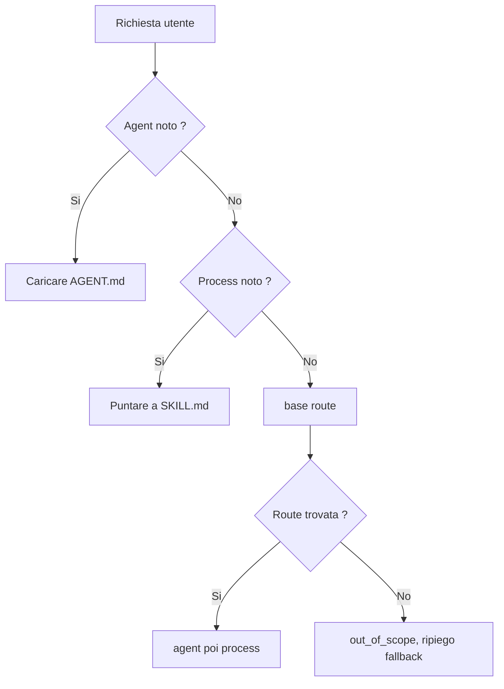

<!-- fr-synced: c192630befb37a2e09652f9440e6e5fc6841ed8a -->

# Instradare una richiesta verso il process giusto (e aprire le risorse giuste)

Una richiesta mal instradata carica tutto, mescola tutto e annega le decisioni che contano sotto un muro di istruzioni. BASE lo evita distinguendo tre gesti che gli strumenti di IA confondono spesso: scegliere un agent, instradare verso un process, aprire le risorse. Tenendoli separati, si mantiene sotto gli occhi ciò che si decide davvero. Se costruite o usate un BASE e volete sapere come una richiesta trova la sua strada, questa pagina lo mostra.



## 1. Scegliere un agent

Quando sapete quale assistente usare, la cosa più semplice è selezionarlo direttamente:

```text
Lis .ai/agents/assistant-devis/AGENT.md
```

L'agent è la scheda di ruolo. Dice quale ruolo ricoprire, come parlare, quali workflow esistono e dove si trovano i file utili.

Per un singolo assistente, questa selezione manuale è spesso sufficiente. Non c'è nulla da installare, nulla da indicizzare e nessun catalogo di routing da mantenere.

## 2. Instradare verso un process

Quando sono possibili più workflow, BASE può instradare una richiesta verso il process giusto:

```bash
base route "je dois préparer un devis client" --root <dossier-base>
```

Il router sceglie una coppia agent → process, oppure si astiene con una motivazione leggibile. Non carica tutte le istruzioni e non cerca liberamente in tutto il repository. Il suo meccanismo resta rudimentale ma efficace, e si estende tramite adattatori. Soprattutto, toglie all'utente il carico mentale di cercare il process giusto.

Questo limite è voluto. Un process risponde alla domanda:

```text
Que faut-il faire maintenant ?
```

È una decisione di workflow. Deve restare breve, testabile e spiegabile.

I segnali consigliati per un process instradabile sono:

- `description`: ciò che fa il process;
- `use_when`: quando usarlo;
- `routing.examples`: formulazioni reali degli utenti;
- `routing.avoid_when`: controesempi che evitano le route sbagliate.

Le fixture `.ai/routing/route-tests.json` proteggono le route importanti dalle regressioni.

## 3. Aprire le risorse utili

Una volta scelto il process, esso può referenziare le risorse necessarie:

- competenze di dominio;
- documenti;
- template;
- tools;
- dati locali;
- fonti esterne tramite connettori.

Queste risorse rispondono a un'altra domanda:

```text
Avec quoi faut-il le faire ?
```

Sono contesto, strumenti o dati. Mantenere questa frontiera è anzitutto una questione di sicurezza: le istruzioni di un process si eseguono, il contenuto di una risorsa non si esegue. Mescolare i due apre la porta all'iniezione, dove un dato cerca di spacciarsi per un'istruzione. La scelta del workflow principale resta quindi da parte.

Un process può dichiararle nel suo frontmatter:

```yaml
requires:
  - ref: calculer-devis
    access: execute
    purpose: chiffrer le devis
may_use:
  - catalogue/services.json
```

Usate `requires` per una risorsa che il process deve aprire o eseguire in modo strutturato, idealmente tramite il suo `id`. Il campo `access` descrive l'uso atteso dal process, per esempio leggere o eseguire. Non concede un diritto di accesso.

Usate `may_use` per un contesto semplice o opzionale, spesso un percorso leggibile nel progetto. Il process può anche citare queste risorse nei suoi passaggi quando il contesto resta semplice. L'importante è che la logica resti leggibile: il router sceglie il process, poi il process indica cosa aprire.

## Chi applica i diritti?

BASE non sostituisce i normali diritti dell'ambiente. Se una fonte vive in una cartella, un Drive, una API o uno strumento esterno, i diritti reali restano quelli di quella cartella, di quel Drive, di quella API o di quello strumento.

BASE applica le proprie barriere di protezione solo sulle azioni che passano attraverso di esso:

- `base open` o `open_resource` per aprire una risorsa inventariata;
- `base access` o `access_resource` per leggere un percorso confinato al progetto;
- `base invoke` o `invoke_tool` per preparare o eseguire una tool;
- `base propose` poi `base commit`, oppure `propose_change` poi `commit_change`, per una scrittura mediata.

La regola pratica è:

```text
Le process déclare les besoins.
BASE médie certaines actions.
Les droits réels restent portés par l'OS, l'outil, le connecteur ou l'API.
```

## Perché non instradare tutte le risorse?

BASE potrebbe evolvere verso un routing più ampio: trovare direttamente una competenza, uno strumento, un template o un documento a partire da una richiesta.

Sarebbe utile in alcuni contesti, ma deve restare un'estensione esplicita. Instradare un'azione e ritrovare del contesto non sono la stessa responsabilità.

La scelta attuale è quindi conservativa:

```text
route = choisir le process à suivre
discover/open = trouver ou ouvrir les ressources utiles
```

Questa separazione mantiene il sistema comprensibile per una singola persona, testabile per un team ed estensibile per un'organizzazione.

## Quando BASE non trova una route: il ripiego (fallback)

Il router resta onesto: se la richiesta non corrisponde ad alcun workflow, si astiene (`out_of_scope`) invece di inventare una route. Ma l'utente non deve mai restare senza un passo successivo.

Un progetto può dichiarare un ripiego di aiuto in `base.config.json` o `base.config.mjs`:

```json
{
  "routing": {
    "fallback": { "agent": "concierge-base", "process": "accueil" }
  }
}
```

Quando il router si astiene onestamente, aggiunge un puntatore `fallback` al risultato. Sono metadati separati, mai una route falsa: lo `status` resta l'astensione onesta. L'assistente carica allora questo ripiego (un agent → process di accoglienza) invece di lasciare l'utente bloccato.

Il nucleo resta agnostico: la destinazione è configurata, mai codificata in modo fisso; una destinazione introvabile non allega alcun ripiego (e `base validate` lo segnala). Il ripiego si limita a orientare, senza promettere altro.

```text
Routage "Bonjour": out_of_scope (below_floor)
Fallback: concierge-base -> accueil
```

Questa promessa vale quando il routing è attivo e quando la destinazione di ripiego esiste nella radice selezionata. In un esempio copiato che carica direttamente un agent di dominio, «Aiuto» può semplicemente aprire l'aiuto di dominio locale. Per ottenere il concierge BASE, aggiungete il ripiego e la cartella `concierge-base`, oppure caricate direttamente `.ai/agents/concierge-base/AGENT.md` quando esiste.

## Radice e workspace

Una **radice** (root) è un progetto BASE confinato: una cartella con il suo `.ai/`, i suoi agent, i suoi dati. Ogni lettura, scrittura o esecuzione resta all'interno della radice selezionata.

Tre situazioni, dalla più semplice alla più avanzata:

- **Una sola radice.** Il caso predefinito. Aprite la cartella, è il vostro BASE.
- **Sottoprogetti annidati.** Una cartella contenitore con più `.ai/agents/` al di sotto: la CLI e l'MCP rilevano la radice più vicina.
- **Più radici dichiarate (multi-cliente).** Un file `base.workspace.json` elenca radici nominate:

```json
{
  "schema_version": "base.workspace.v1",
  "id": "agence",
  "roots": [
    { "id": "client-a", "path": "clients/a", "default": true },
    { "id": "client-b", "path": "clients/b" }
  ]
}
```

`base route "<demande>" --workspace base.workspace.json` può allora cercare tra le radici; `--root-id client-b` punta a una radice precisa. Il routing attraversa le radici, ma ogni azione resta confinata alla radice scelta. Dettagli in `specs/current/10_core/cli.md` e `mcp/README.md`.

## Regola pratica

- Se sapete quale agent usare, caricate il suo `AGENT.md`.
- Se sapete già quale process seguire, puntate direttamente al suo `SKILL.md`: il routing è un punto d'ingresso, non un passaggio obbligato.
- Se la richiesta può seguire più workflow, usate `base route` o `route_request`.
- Se il process ha bisogno di contesto, aprite solo le risorse che referenzia o che scoprite per quel bisogno.

Questa disciplina evita il muro di istruzioni, limita i token inutili e mantiene visibili le decisioni importanti.
