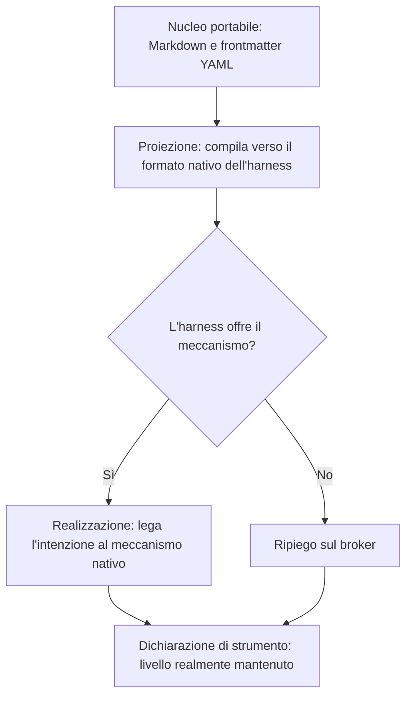

<!-- fr-synced: 07917297c3698cc37ef72c539981af908b860cf0 -->

# Specifica BASE v0: principio fondante e dove leggere la spec attuale

Questa pagina funge da punto di riferimento per chiunque cerchi la specifica di BASE. Enuncia il principio fondante e rimanda alla specifica di ingegneria aggiornata, per evitarvi di lavorare su un testo obsoleto.

> **Questa pagina è volutamente breve.** La specifica di ingegneria degli strumenti BASE (broker, CLI, MCP, ports, schemas) vive in `specs/current/`, in inglese, verificata rispetto al codice e ai test; ogni versione pubblicata è congelata da un tag git (`git show v1.0.0:specs/current/…`). In caso di divergenza, `specs/` fa fede.

Punto di ingresso: [`specs/current/README.md`](../../specs/current/README.md).

La «v0» indicava il racconto concettuale iniziale di BASE, prima che la specifica di ingegneria esistesse. Il suo contenuto normativo è stato assorbito da `specs/current/`; questa pagina conserva il principio fondante e la mappa di lettura.

## Il principio fondamentale, invariato

> L'essere umano e l'IA lavorano con file di testo. Il codice garantisce gli invarianti che il linguaggio naturale non può garantire.

BASE è un protocollo minimale per articolare in modo duraturo conoscenza, istruzioni, processi, dati, strumenti eseguibili, permessi, decisioni umane, tracce utili e adattatori verso diversi agenti o harness. Per chiarire le confusioni più comuni: non è né un'app, né una UI di automazione, né un motore di workflow, né un database, né un semplice prompt impacchettato.

## Dove leggere cosa d'ora in poi

| Ciò che la v0 descriveva | Dove vive oggi |
| ---------------------- | ----------------------- |
| Definizioni (Resource, Source, Connector, Broker, ecc.) e invarianti | [`specs/current/00_overview/`](../../specs/current/00_overview/vision.md) e [`specs/current/10_core/requirements.md`](../../specs/current/10_core/requirements.md) |
| Forma stabile delle risorse (frontmatter YAML + Markdown libero) | [`specs/current/10_core/frontmatter.md`](../../specs/current/10_core/frontmatter.md) e [`base.schema.json`](../../base.schema.json) |
| Process skills vs competence skills | [Capire BASE](../learn/comprendre.md) e [Routing, processi e risorse](routage-process-et-ressources.md) |
| Modalità advisory / hybrid / strict e regola di onestà | [Sicurezza e limiti](../trust/securite-et-limites.md) e la matrice generata [Compatibilità harness](compatibilite-harnesses.md) |
| Primitive del router e del broker | [`specs/current/10_core/routing.md`](../../specs/current/10_core/routing.md) e [`specs/current/10_core/architecture.md`](../../specs/current/10_core/architecture.md) |
| Flusso propose → commit, esecuzione, promozione | [`specs/current/10_core/writes.md`](../../specs/current/10_core/writes.md) |
| Disciplina dei test | [`specs/TESTING.md`](../../specs/TESTING.md) |
| Ciò che è consegnato, previsto o fuori perimetro | [Stato di implementazione](etat-implementation.md) |

## Gli invarianti chiave, una riga ciascuno

Il dettaglio vive in `specs/current/`, ma tre invarianti meritano di restare leggibili qui:

- **Indice derivato**: manifest, cache e indici non sono la fonte di verità; si rigenerano dai file.
- **Dato esterno ≠ istruzione**: un'email, un CV o un contenuto web è trattato come dato, mai come istruzione di governance.
- **Broker canonico**: la CLI, il MCP e gli adattatori delegano alle stesse primitive invece di reimplementare parsing, ricerca, permessi o tracciamento.

## La regola di onestà delle modalità

```text
advisory = guide/audit
hybrid = enforcement partiel explicite
strict = enforcement médié
```

Un adapter deve dichiarare il suo livello reale. BASE non promette la modalità strict se l'harness consente solo l'advisory. La matrice generata [Compatibilità harness](compatibilite-harnesses.md) rende questa regola calcolabile.

## La visione a lungo termine conservata qui: portabilità

L'unica parte della v0 che resta prospettica è l'obiettivo di portabilità tra harness. La compatibilità «totale» non è un obiettivo raggiungibile e non deve essere promessa; l'obiettivo sostenibile è **degradazione graziosa + livello dichiarato**. Tre strati:

1. **Nucleo portabile**: Markdown e un frontmatter YAML semantico, che dichiarano intenzioni e punti di aggancio, mai meccanismi propri di uno strumento.
2. **Strato intermedio**: la proiezione compila il nucleo verso il formato nativo di ogni harness (output generato, mai sorgente); la realizzazione lega ogni intenzione al miglior meccanismo offerto dall'harness, altrimenti ripiega sul broker e registra il livello raggiunto.
3. **Dichiarazione di strumento**: per agente, harness e intenzione, il livello realmente mantenuto, calcolabile anziché redazionale. È ciò che `.ai/tools.md` già proietta.



Il broker è la realizzazione di ripiego: ciò che un harness non fa nativamente, il broker se ne fa carico non appena l'azione passa attraverso di esso (confinamento, dry-run, traccia, scrittura mediata). Un'intenzione come `requires_confirmation` raggiunge un livello strict solo per le azioni che passano effettivamente attraverso di esso.

Obiettivo di migrazione documentato: un unico dialetto semantico (`base.resource.v2`) che assorbirebbe il dialetto risorsa e il dialetto skill oggi distinti; i frontmatter nativi diventerebbero proiezioni, generate e verificate in CI come ogni artefatto derivato.

---

BASE è un framework di [AI Swiss](https://a-i.swiss). Caso d'uso in partnership con [Innovaud](https://innovaud.ch).
