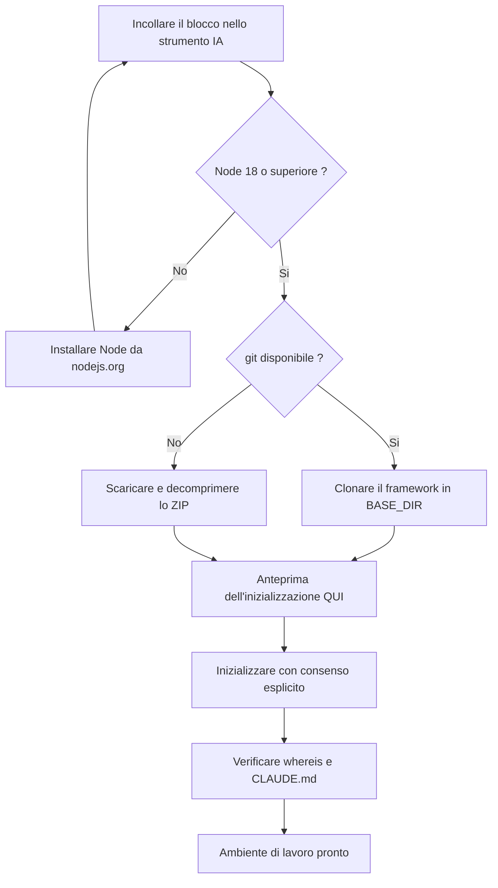

<!-- fr-synced: 54f945b325d420c33afb1ca56d89d61d651a0abd -->

# Fai installare BASE dalla tua IA

Installare BASE può essere compito della tua IA, non tuo: ottieni un ambiente di lavoro pronto
all'uso senza aver digitato un solo comando, a condizione di avere uno strumento capace di
eseguire questi comandi al posto tuo e di poter rivedere ogni passaggio prima che venga applicato.
In concreto, incolli un blocco in uno strumento IA capace di eseguire comandi (per esempio GitHub
Copilot, Antigravity, Claude Code o Cowork, OpenCode, Kilo Code), esso esegue l'installazione al
posto tuo e ti dice quando il tuo ambiente di lavoro è pronto.

## Prima di incollare il blocco

1. Crea una cartella vuota per il tuo lavoro: per esempio, nei tuoi Documenti, una cartella
   `mon-assistant`.
2. Apri questa cartella nel tuo strumento IA capace di leggere i tuoi file (per esempio GitHub
   Copilot, Antigravity, Claude Code o Cowork, OpenCode, Kilo Code): a seconda dello strumento, è
   un *File → Open Folder*, oppure un `cd mon-assistant` seguito dall'avvio dello strumento in
   quella cartella.
3. Apri la chat in **modalità agente** (quella che può eseguire comandi): a seconda dello
   strumento, è una modalità *Agent* da attivare nel pannello della chat, oppure la modalità
   predefinita.
4. Incolla il blocco qui sotto e invialo.

## Il blocco da incollare

```text
Mission: installer BASE et créer mon espace de travail dans le dossier courant.

D'abord, demande-moi: «Où veux-tu installer le framework BASE?»
(propose le sous-dossier "base" de mes Documents, et appelle ce chemin <BASE_DIR>).

Étapes, vérifie chaque sortie avant de continuer:
1. `node --version`: il faut Node 18 ou plus. Sinon, guide-moi pour l'installer depuis
   nodejs.org. Après l'installation, je ferme et rouvre mon outil, je recolle cette
   lettre, et tu reprends ici.
2. Installe le framework dans <BASE_DIR> s'il n'y est pas déjà:
   `git clone https://github.com/ai-swiss/base.git <BASE_DIR>`
   Si git n'est pas disponible, télécharge
   https://github.com/ai-swiss/base/archive/refs/heads/main.zip, décompresse-le, et
   place son contenu dans <BASE_DIR>, puis continue. (Sur Mac, taper git peut ouvrir un
   dialogue d'installation des outils de développement: c'est normal, le ZIP l'évite.)
3. Montre-moi ce que l'initialisation créerait ICI (mon dossier de travail, pas <BASE_DIR>):
   `node <BASE_DIR>/tools/base.mjs init`
   puis, avec mon accord explicite: `node <BASE_DIR>/tools/base.mjs init --yes`
4. Vérifie: `node <BASE_DIR>/tools/base.mjs whereis` montre <BASE_DIR>,
   et le fichier CLAUDE.md existe maintenant dans mon dossier.
5. Dis-moi la phrase exacte à t'écrire pour commencer
   («importer mes procédures existantes» si j'ai déjà des documents à convertir).

Garde-fous: n'écrase JAMAIS un fichier existant; n'installe rien d'autre sans me
demander; si une étape échoue, montre-moi l'erreur exacte au lieu de bricoler.
```

Ecco il flusso che la tua IA segue:



## Cosa succede dopo

La tua cartella ora contiene un agente, la sua configurazione e i file che il tuo strumento
legge per diventare il **router** del tuo settore (a seconda dello strumento, un `CLAUDE.md`, un
`AGENTS.md` o un file di regole equivalente nella cartella dello strumento). Parlagli
normalmente: orienta ogni richiesta verso il processo giusto e lo segue, senza che tu debba
cercare quale usare.

- **Convertire i tuoi documenti esistenti**: di' «importer mes procédures existantes». Ogni
  conversione ti viene proposta come diff; nulla viene scritto senza di te.
- **L'atelier**: per sfogliare, modificare e valutare i tuoi assistenti in un'interfaccia,
  `node <BASE_DIR>/tools/base.mjs studio --root .` apre BASE Studio.
- **Tenere aggiornato il framework**: `node <BASE_DIR>/tools/base.mjs update`.
- **Dove vive BASE**: `node <BASE_DIR>/tools/base.mjs whereis` (la posizione è annotata anche
  in `~/.config/base/config.json`, modificabile a mano).

Preferisci fare tutto da solo? Vedi [Ottenere BASE](obtenir-base.md) e
[Installare un ambiente di lavoro](installer.md).
