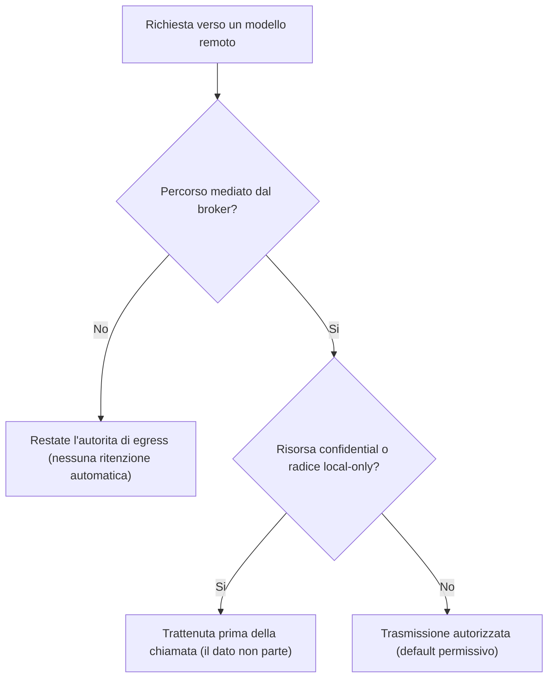

<!-- fr-synced: d6b9fdf9cda323341e86fafd0ba43b7f99fee844 -->

# Il confine, locale per impostazione predefinita

Sapere cosa resta sulla vostra macchina e cosa puo uscire verso un servizio remoto significa sapere cosa potete affidare a BASE con piena consapevolezza. Questa pagina traccia tale confine, per un'istituzione che deve sapere cosa aspettarsi. Il contenuto e informativo e non costituisce ne un parere legale ne un parere di conformita: l'istituzione resta responsabile della propria valutazione d'impatto sulla protezione dei dati (DPIA) e della propria politica di sicurezza.

Lungo tutta questa pagina distinguiamo due livelli di garanzia:

- un **meccanismo**: un comportamento applicato dal broker BASE, verificabile, che non dipende dalla buona volonta di un modello;
- una **direttiva**: un'istruzione scritta in un file e seguita da un modello cooperativo, senza garanzia tecnica.

Questa distinzione fonda l'onesta di BASE. Una garanzia e reale solo se passa attraverso un meccanismo capace di applicarla.

## 1. Cio che e locale per impostazione predefinita

Nella configurazione predefinita, BASE non effettua alcuna uscita di rete.

- **Il routing e al 100 % lessicale e locale.** La selezione dell'agente e del processo avviene tramite corrispondenza lessicale sulla macchina, senza alcuna chiamata di rete (meccanismo). La classificazione semantica tramite embeddings e un'opzione, disattivata per impostazione predefinita.
- **I file non lasciano la macchina.** BASE conserva le vostre risorse localmente. Il nucleo BASE non chiama mai di propria iniziativa un fornitore; in una configurazione senza provider, nessun dato viene inviato fuori dalla macchina (meccanismo).
- **Il registro `.ai/trace` e locale.** Le operazioni mediate dal broker scrivono una riga locale in `.ai/trace/`, sulla macchina, senza contenuto di business per impostazione predefinita (meccanismo). Vedere la sezione dedicata piu in basso.

Il fatto che i vostri file restino locali non significa che tutto cio che affidate poi a uno strumento IA resti locale. Il contenuto di una conversazione o di un file aperto in uno strumento IA puo essere trasmesso al fornitore di tale strumento. E l'oggetto delle due sezioni seguenti.

## 2. Cio che puo uscire solo su scelta esplicita

Nessuna uscita di rete si produce senza una scelta di configurazione assunta. Sono possibili due uscite, e solo se le attivate.

- **Un fornitore di embeddings, se lo attivate.** La classificazione semantica opzionale invia testo (la richiesta e il testo delle risorse instradabili) a un servizio di embeddings. Questa uscita esiste solo se fornite un embedder. Potete mantenerla interamente locale con Ollama (`createOllamaEmbedder`), nel qual caso non vi e comunque alcuna uscita di rete. Potete anche passare per un gateway interno che controllate. I dettagli figurano in [Sicurezza e dati del routing](securite-donnees-routage.md).
- **La chiamata al modello stesso.** La chiamata al modello linguistico e realizzata dallo strumento IA che utilizzate (la CLI, l'estensione o l'applicazione), verso il fornitore che l'istituzione ha scelto. Questa chiamata avviene **al di fuori di BASE**: la scelta del modello e del fornitore, nonche i trattamenti lato fornitore, non rientrano nel perimetro di BASE. Prima di trattare dati personali, di clienti, delle risorse umane, finanziari, medici o regolamentati, verificate le condizioni d'uso, le opzioni di conservazione, le garanzie contrattuali e la localizzazione dei trattamenti di tale strumento.

## 3. Sotto quale autorita

Il confine e custodito in due punti, da due autorita distinte.

- **L'istituzione sceglie il modello e il fornitore.** Questa scelta e esterna a BASE. BASE non seleziona un modello, non impone un fornitore e non si sostituisce alla politica dell'istituzione.
- **BASE rifiuta l'uscita di risorse riservate o strettamente locali verso un modello remoto, prima di ogni chiamata.** E un meccanismo di controllo dell'egress: una risorsa contrassegnata come riservata, o una radice dichiarata local-only, non viene trasmessa a un modello remoto, e la verifica avviene **prima** della chiamata, non dopo. Questo meccanismo protegge da una trasmissione non voluta di risorse poste sotto il controllo del broker. Non controlla cio che l'utente digita direttamente in uno strumento IA al di fuori di BASE, ne cio che il fornitore fa poi dei dati ricevuti.

Un esempio concreto. Una scheda cliente contiene un IBAN, e voi la contrassegnate come `confidential`. Chiedete al vostro assistente, collegato tramite il broker, di redigere un sollecito di pagamento con un modello remoto. Prima della chiamata, BASE vede il contrassegno, trattiene la scheda, e l'assistente lavora senza che l'IBAN parta verso il fornitore. Il dato sensibile non lascia la vostra macchina, e non avete dovuto sorvegliare nulla.

La decisione di egress segue questo percorso prima di ogni chiamata a un modello remoto:

**Portata esatta del meccanismo.** La ritenzione opera sui percorsi mediati dal broker, la dove BASE prepara cio che parte verso il modello: il server MCP, la chat dello Studio, la valutazione. In riga di comando diretta (per esempio `base open` di una risorsa, poi copia-incolla verso uno strumento IA), siete voi a restare l'autorita di egress: nessuna ritenzione automatica opera, per progettazione. E la ritenzione si attiva sul **flag esplicito `confidential`** di una risorsa (o una radice local-only), non sulla tassonomia `sensitivity`: un dato classificato `restricted` o `sensitive` ma non contrassegnato `confidential` non viene trattenuto. Contrassegnate come `confidential` ogni risorsa che non deve mai raggiungere un modello remoto. Infine, il **default e permissivo**: una radice ha politica di egress `any` salvo dichiarazione contraria, quindi al di fuori delle risorse `confidential` il suo contenuto puo essere trasmesso; dichiarate la radice `local-only` in `base.config.json` per trattenere tutto verso un modello remoto.

In sintesi, l'istituzione decide dove vanno i dati a livello del fornitore; BASE impedisce, a livello del broker, che una risorsa esplicitamente riservata o locale parta verso un modello remoto.

## Il registro di trace

Il registro `.ai/trace` rende le operazioni mediate verificabili localmente, senza diventare uno strumento di sorveglianza.

- **Cosa registra.** Le operazioni che passano per il broker (aprire una risorsa, accedere a un file confinato, invocare una tool, proporre e poi convalidare una scrittura) scrivono una riga JSONL minima: identificatori, decisioni, durate. Per impostazione predefinita, **nessun contenuto di business** viene registrato.
- **Dove vive.** Il registro e locale, nella cartella `.ai/trace/` del progetto. Non viene trasmesso a un servizio remoto da BASE, e questa cartella e ignorata da git.
- **Come purgarlo.** Potete svuotare il registro con `base trace clear`, conservare solo gli ultimi N giorni con `base trace prune --keep-days N`, oppure, come ultima risorsa, eliminare manualmente la cartella `.ai/trace/`.

La conservazione di questo registro non e gestita da BASE. E una responsabilita dell'operatore o dell'istituzione: definire una durata di conservazione, la purga e, se del caso, l'archiviazione rientrano nella vostra politica interna. BASE non fornisce ne una conservazione regolamentare ne un'archiviazione legale.

## Limiti da tenere a mente

- BASE non e ne un runtime di agenti, ne un motore di orchestrazione, ne un sistema RAG, ne una piattaforma, ne un IAM, DLP, SIEM, RBAC. Non fornisce ne una conservazione regolamentare ne un'archiviazione legale.
- BASE non garantisce l'esattezza delle risposte del modello, ne i trattamenti realizzati dal fornitore IA.
- I meccanismi di egress e di confinamento si applicano alle azioni mediate dal broker. Un'azione che aggira BASE dipende dai diritti nativi dello strumento e dell'ambiente.

Per il modello di sicurezza completo e i limiti per livello di adozione, vedere [Sicurezza e limiti](securite-et-limites.md). Per il dettaglio delle stringhe inviate nel routing semantico, vedere [Sicurezza e dati del routing](securite-donnees-routage.md).
