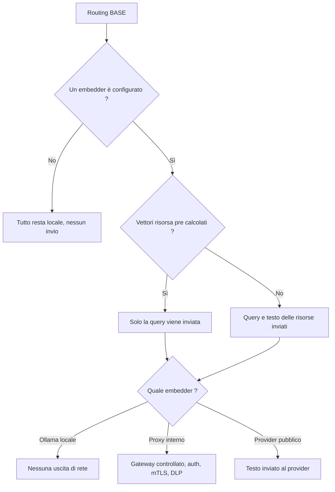

<!-- fr-synced: bba615a9b31faa3b7934e2d24861000553a552de -->

# Mantenere i vostri dati sotto controllo quando il routing usa un provider

Non appena il routing semantico di BASE si appoggia a un provider di embeddings, del testo lascia la vostra macchina, e dovete poter dire esattamente quale e come controllarlo. Per i team che collegano questo routing, questa pagina mostra cosa viene realmente inviato, come ridurre l'esposizione, come passare attraverso un proxy interno e come registrare i log senza mai esporre contenuti di business.

## Nessun invio senza configurazione esplicita

Il cuore di BASE non chiama **mai** un provider. In una configurazione zero-provider, nessun dato viene inviato fuori dalla macchina. Un invio diventa possibile solo se fornite un `embed` (direttamente o tramite `createOpenAICompatibleEmbedder` / `createOllamaEmbedder`). Il percorso zero-config (lessicale + `semanticHybrid`) è interamente locale.

## Quali stringhe vengono inviate

Con un provider configurato, due tipi di testo possono essere embeddati:

1. **La query** (la richiesta dell'utente).
2. **Il testo di ogni risorsa instradabile**: per impostazione predefinita `route_text` + `title` + `description` +
   `keywords` + `body` (`textForResource`). Voi controllate questo perimetro.

## Ridurre l'esposizione

Lo schema seguente riassume cosa lascia la macchina a seconda della configurazione:



- **Pre-calcolate** i vettori delle risorse in un ambiente controllato (`@ai-swiss/base-index-local`)
  e serviteli tramite `getResourceEmbedding`. Al momento della query, viene inviata **solo la query**.
- **Riducete `textOf`** al minimo che instrada ancora bene; spesso `route_text` da solo è sufficiente:

  ```js
  createSemanticRanker({ embed, textOf: (r) => [r.route_text, r.title].filter(Boolean).join("\n") });
  ```

- **Restate in locale** con `createOllamaEmbedder()`: nessuna uscita di rete.
- **Passate attraverso un gateway interno**: `createOpenAICompatibleEmbedder({ baseUrl })` verso un reverse
  proxy che controllate (auth, mTLS, DLP). Ben configurato, questo proxy mantiene il testo di business fuori da qualsiasi endpoint pubblico.

## Secrets

`createOpenAICompatibleEmbedder` legge `OPENAI_API_KEY` per impostazione predefinita, oppure accetta un `apiKey` esplicito.
Conservate le chiavi in un gestore di secrets o in variabili d'ambiente, mai nel
repository. Un fallimento di auth è tipizzato come `EmbeddingAuthError` (`code: "semantic.auth"`) e **non viene mai
ritentato**: una chiave errata fallisce subito invece di martellare il provider.

## Registrare i log senza contenuti di business

L'hook `onMetric` riporta solo segnali operativi (`{ provider, batchSize, attempt,
latencyMs, cacheHit, similarity, dimension }`): **nessun testo, nessun vettore**. Registrateli
liberamente; non registrate mai le stringhe embeddate né la query grezza se il corpus è sensibile.

```js
createSemanticRanker({ embed, onMetric: (m) => logger.info({ embedding: m }) }); // sicuro: nessun contenuto
```

## Annullamento e limiti

Ogni chiamata al provider rispetta un `timeoutMs` e un `AbortSignal` (`ctx.signal`): un embedding troppo lungo o
che va fuori controllo può essere limitato e annullato dalla CLI, dall'MCP o da un server.

## Perimetro

Il routing semantico migliora la **pertinenza**; non sostituisce le politiche IAM, DLP, SIEM o
di retention della vostra organizzazione. Vedi anche [`docs/trust/securite-et-limites.md`](securite-et-limites.md).
