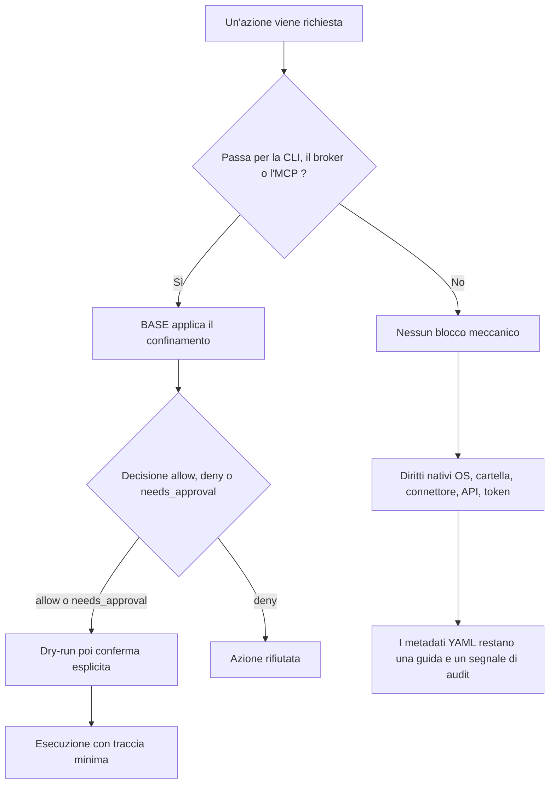

<!-- fr-synced: 17c53c9e60a8dc5b9e9e85da9d6de5220e530b51 -->

# Sicurezza e limiti

Prima di affidare dati o azioni a BASE, dovete sapere che cosa protegge davvero il nucleo locale e che cosa vi resta da aggiungere a seconda del contesto: crederci troppo significa esporre ciò che pensavate coperto. Che decidiate per voi stessi o per un'amministrazione, ecco il confine. BASE migliora il controllo sulla collaborazione tra umano e IA, ma non trasforma uno strumento IA generalista in un ambiente di sicurezza di livello aziendale.

## Principio centrale

Una garanzia è reale solo se l'azione passa attraverso un meccanismo capace di applicarla.

In BASE pubblico, questi meccanismi sono:

- la CLI `base`;
- il broker in `tools/base-core.mjs`;
- il server MCP quando delega al broker;
- un futuro connettore controllato.

Se un agente possiede un accesso diretto alla shell, al filesystem o a un'API esterna senza passare per BASE, i metadati YAML restano utili come guida e segnale di audit, ma non bloccano meccanicamente l'azione.

**Conseguenza concreta, senza un team tecnico:** nel solo browser, le garanzie sono *consignes* (indicazioni) seguite da un modello cooperativo, non meccanismi applicati. Per ottenere un'applicazione reale (confinamento, anteprima prima della scrittura, routing convalidato), serve il broker tramite la CLI o l'MCP. Il dettaglio, livello per livello, si trova in [Provare BASE senza installare nulla](../start/essayer-sans-installer.md), utile in particolare per un'amministrazione che deve sapere che cosa è garantito a ogni livello.

Un processo può dichiarare di aver bisogno di leggere una fonte o di eseguire una tool. Questa dichiarazione esprime un bisogno di lavoro. Non concede un permesso. I diritti reali restano in capo all'OS, alla cartella condivisa, al Drive, al connettore, all'API, al token o al harness utilizzato.

## Azioni che passano per BASE

Un'azione passa per BASE quando usa la CLI, il broker o il server MCP per chiedere a BASE di agire. Esempi tipici:

- `base open <id>` o `open_resource`: aprire una risorsa inventariata, con proiezione e policy;
- `base access <path>` o `access_resource`: leggere un file confinato nella radice del progetto;
- `base invoke <tool>` o `invoke_tool`: preparare un comando in dry-run, poi eseguirlo solo se confermato;
- `base propose` poi `base commit`, o `propose_change` poi `commit_change`: scrivere tramite una modifica proposta, confermata e verificata.

In questi casi, BASE può applicare confinamento, decisioni `allow` / `deny` / `needs_approval`, dry-run, conferma e traccia minima. Se l'azione aggira questi punti di ingresso, dipende dai diritti nativi dello strumento o dell'ambiente.



## Che cosa protegge BASE pubblico

BASE pubblico fornisce protezioni locali:

- confinamento dei percorsi nella radice del progetto;
- rifiuto delle traversie di percorso;
- rifiuto dei symlink che escono dal progetto;
- convalida di identificatori, link relativi, fonti locali ed entrypoint;
- apertura di risorse tramite proiezione `metadata`, `instructions` o `full`;
- decisioni di accesso spiegabili per le risorse sensibili;
- invocazione di strumenti in dry-run per impostazione predefinita;
- conferma esplicita prima dell'esecuzione reale;
- tracce minime JSONL senza contenuto di business per impostazione predefinita.

Queste protezioni rendono BASE auditabile e manutenibile per un uso locale, personale, PMI o prototipo di integrazione.

Per il routing semantico con embedding, vedere anche `docs/trust/securite-donnees-routage.md`: questa pagina
precisa quali stringhe possono partire verso un provider, come ridurre l'esposizione e come
registrare senza contenuto di business.

## Che cosa BASE pubblico non protegge da solo

BASE pubblico non fornisce:

- gestione delle identità;
- SSO;
- RBAC enterprise completo;
- DLP;
- SIEM;
- conservazione regolamentare;
- archiviazione legale;
- classificazione documentale obbligatoria;
- gestione centralizzata dei secrets;
- sandbox completa;
- garanzia di esattezza delle risposte del modello;
- garanzia sui trattamenti effettuati dal fornitore IA;
- trasparenza sulle istruzioni che lo strumento IA inietta sopra i vostri file (prompt di sistema, regole, politiche del fornitore).

Questi elementi spettano all'organizzazione, al suo ambiente tecnico e ai suoi contratti con i fornitori.

**Revisione di sicurezza esterna: prevista, non ancora effettuata.** Il nucleo è progettato per l'audit (senza dipendenze, meccanismi testati e documentati), ma BASE non è ancora stato sottoposto a una revisione di sicurezza indipendente.

## Dati e fornitori IA

BASE conserva i vostri file localmente. Questo non significa che tutto ciò che date a uno strumento IA resti locale.

A seconda dello strumento utilizzato, il contenuto di una conversazione, di un file aperto o di un prompt può essere trasmesso al fornitore del modello. Prima di trattare dati personali, dei clienti, HR, finanziari, medici o regolamentati, verificate:

- le condizioni d'uso dello strumento IA;
- le opzioni di conservazione;
- le garanzie contrattuali;
- la localizzazione dei trattamenti;
- le regole interne della vostra organizzazione.

Per i dati molto sensibili, usate un ambiente adatto o tenete l'IA fuori dal circuito.

## Lettura per livello di adozione

| Livello | Aspettativa ragionevole | Ciò che resta da aggiungere |
| ------ | ------------------- | ---------------------- |
| Personale | File leggibili, decisioni umane, prudenza sui dati sensibili | Scegliere ciò che si affida allo strumento IA |
| PMI | Convalida locale, manutenzione, convenzioni di sensibilità, tracce minime | Regole di team, revisione umana, gestione degli accessi alle cartelle |
| Grande impresa | Base per la strutturazione e l'integrazione | IAM, SSO, RBAC, DLP, SIEM, conservazione, secrets, audit, conformità |

## Minacce tipiche

| Rischio | Risposta di BASE pubblico | Limite |
| ------ | ------------------- | ------ |
| Percorso malevolo | Confinamento locale e rifiuto delle traversie | Solo per gli accessi mediati |
| Symlink in uscita | Rifiuto dei symlink fuori dal progetto | Dipende dal connettore utilizzato |
| Dato sensibile aperto senza motivo | Metadati e decisione di accesso spiegabile | Non blocca un accesso diretto fuori da BASE |
| Azione irreversibile | Dry-run per impostazione predefinita e conferma | Non protegge le azioni fuori dal broker |
| Risposta falsa ma plausibile | Punti di decisione, marcatori, verifica umana | Il modello può sempre sbagliare |
| Prompt injection tramite dato esterno | Principio di progettazione (indicazione, non meccanismo applicato dal codice come il confinamento o il controllo di egress): un'istruzione viene eseguita, un dato esterno resta un contenuto da leggere | Richiede disciplina e mediazione tecnica |
| Istruzioni invisibili dello strumento IA | Sovranità sul vostro strato: file leggibili, portabili, auditabili | BASE non vede ciò che il harness inietta sopra i vostri file |

## Regola di responsabilità

BASE aiuta a strutturare, verificare e tracciare. L'umano mantiene la responsabilità delle decisioni, e l'organizzazione mantiene la responsabilità della sicurezza, della conformità e degli accessi.

La promessa giusta è dunque:

```text
BASE augmente la maîtrise locale.
BASE ne remplace pas une politique de sécurité.
```

## Conforme non vuol dire utile

Essere in regola ed essere utili sono due esigenze distinte. La conformità (registro dei trattamenti, valutazione d'impatto e, a seconda della giurisdizione, il GDPR, l'nLPD svizzera o l'AI Act europeo) regola ciò che avete il diritto di fare con l'IA. Non rende però per questo il lavoro utile né verificabile: spuntare le caselle di un quadro normativo non struttura l'interazione, non mira all'informazione pertinente e non chiude il ciclo di verifica. È questo ciò che BASE aggiunge, accanto alla conformità e mai al suo posto. Questo riferimento è informativo e non costituisce un parere di conformità.
