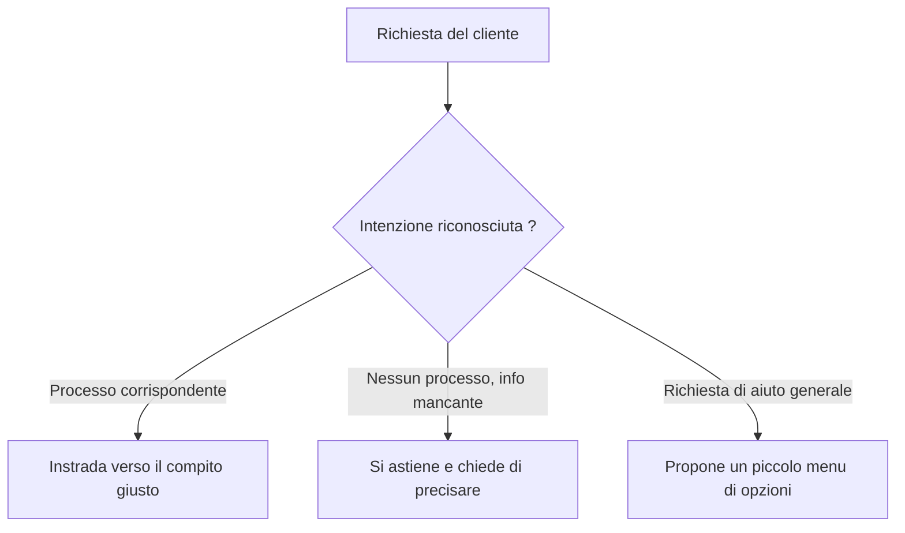

<!-- fr-synced: 440a02337e57dba37c7c76a6916b993840433f2d -->

# Fate parlare l'ufficio del turismo

*⏱ ~10 min · modulo 1/3, percorso Scoperta*

**Imparerete a**: riconoscere quando l'assistente instrada e quando si astiene onestamente, dimostrato dal ✅ qui sotto.
**Vi serve**: uno strumento IA installato e connesso, e la cartella exemples/veytaux-tourisme aperta (vedi [Passo 0](harnais.md)).

Inviate queste quattro richieste, una alla volta:

```routage-fixture
Quelles activités à faire cet après-midi ?
Organiser une sortie pour notre groupe de 30 personnes
Vous avez une plage où se baigner ?
Quelles sont mes options ?
```

1. *«Quali attività posso fare questo pomeriggio?»*: cerca nelle schede e cita la sua fonte.
   Verifica anche che l'agenda sia aggiornata e si basa sull'agenda e sulle schede citate invece di inventare.
2. *«Organizzare una gita per il nostro gruppo di 30 persone»*: passa alla preparazione di un'offerta.
3. *«Avete una spiaggia dove fare il bagno?»*: una vera domanda turistica, ma nessun processo corrisponde.
4. *«Quali sono le mie opzioni?»*: una richiesta di aiuto generale.



✅ **Verificate**: l'assistente deve, in sostanza: (1-2) entrare nel compito giusto; (3) NON inventare una spiaggia e chiedervi di precisare cosa cercate invece di indovinare; (4) proporre un piccolo menu di opzioni. Entrambi gli esiti di (3) sono istruttivi: vedi Perché.

💡 **Perché ha funzionato**: il processo giusto è scelto dall'intenzione, non dalle parole chiave. Al livello delle istruzioni (senza CLI/MCP), è il modello che segue il router scritto in CLAUDE.md: PUÒ andare oltre e improvvisare una risposta a «una spiaggia?» invece di chiedere di precisare. È proprio questo il limite che il routing deterministico elimina (la lettera, l'aggiornamento).

🔁 **Da voi**: quali sono le 2 o 3 richieste che i vostri clienti/colleghi vi rivolgono più spesso? Annotatele: saranno i vostri processi.

→ **E adesso**: [Modulo 2: cambiate una regola](decouverte-2-changez-une-regle.md): vedrete l'assistente obbedire a un file che modificate VOI.

🆘 **Guasti comuni**: *Improvvisa una risposta a «una spiaggia?» come se fosse normale*: previsto al livello delle istruzioni; è la lezione, non un bug. *Una richiesta non entra nel compito giusto*: riformulatela con l'intenzione («vorrei un'informazione», «organizzare una gita per un gruppo»).
