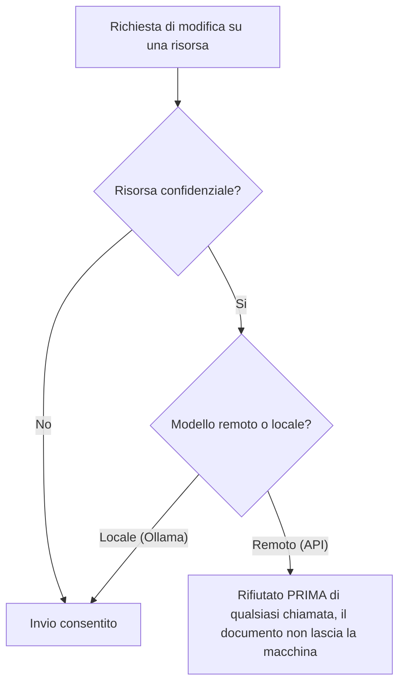

<!-- fr-synced: 677f5f82e5965291bdd5fadd5e565f06d119a93d -->

# Perimetri e governance dell'egress

*⏱ ~15 min · modulo 2/3, percorso Team*

**Farete**: attivare e poi leggere un rifiuto di egress su una vera risorsa confidenziale, dimostrato dal ✅ qui sotto.
**Vi serve**: il modulo 1 completato; lo Studio aperto su `exemples/agence-multi-clients`; un modello REMOTO (API) connesso nelle Impostazioni (guida «Connettere un modello», percorso Praticante modulo 6). Il controllo avviene PRIMA di qualsiasi chiamata al modello: anche una chiave non valida basta per osservare il rifiuto.
↻ **Promemoria**: senza guardare: cosa garantisce un root? (un perimetro di scrittura isolato)

Il cliente Dupont Conseil contiene una risorsa gia contrassegnata come confidenziale:
`clients/dupont-conseil/tarifs/remises-confidentielles.md` (`confidential: true`).

1. Nello Studio, aprite questa risorsa.
2. Aprite la sua chat e scegliete il vostro modello REMOTO.
3. Chiedete una modifica (per esempio *«riformula questa tabella di sconti»*).

✅ **Verificate**: BASE rifiuta l'invio al modello remoto e ne spiega il motivo («questo documento e confidenziale … scegliete un modello locale»); vedete il motivo sullo schermo. La stessa richiesta con un modello LOCALE (Ollama) passa: e esattamente la regola.

💡 **Perche ha funzionato**: la governance vive nei file (`confidential: true` su una risorsa, oppure `egress: local-only` su un intero root), non in una console. La regola e unica: nulla di confidenziale parte verso un modello remoto, e il controllo avviene PRIMA della chiamata, quindi il documento non lascia mai la macchina. Il rifiuto viene DETTO: e la differenza tra una consegna (seguita) e un meccanismo (applicato).

🔁 **Da voi**: quali dei vostri dati non devono MAI lasciare la vostra macchina verso una API? Contrassegnateli con `confidential: true`, oppure portate tutto il root su `egress: local-only`.

→ **E adesso**: [Modulo 3: distribuire](equipe-3-distribuer.md).

🆘 **Guasti frequenti**: *Nessun rifiuto*: il modello scelto e davvero REMOTO? (un modello locale come Ollama e consentito, e voluto). La risorsa porta `confidential: true`? *Nessun modello da scegliere nella chat*: aggiungete prima un provider nelle Impostazioni (percorso Praticante modulo 6).
