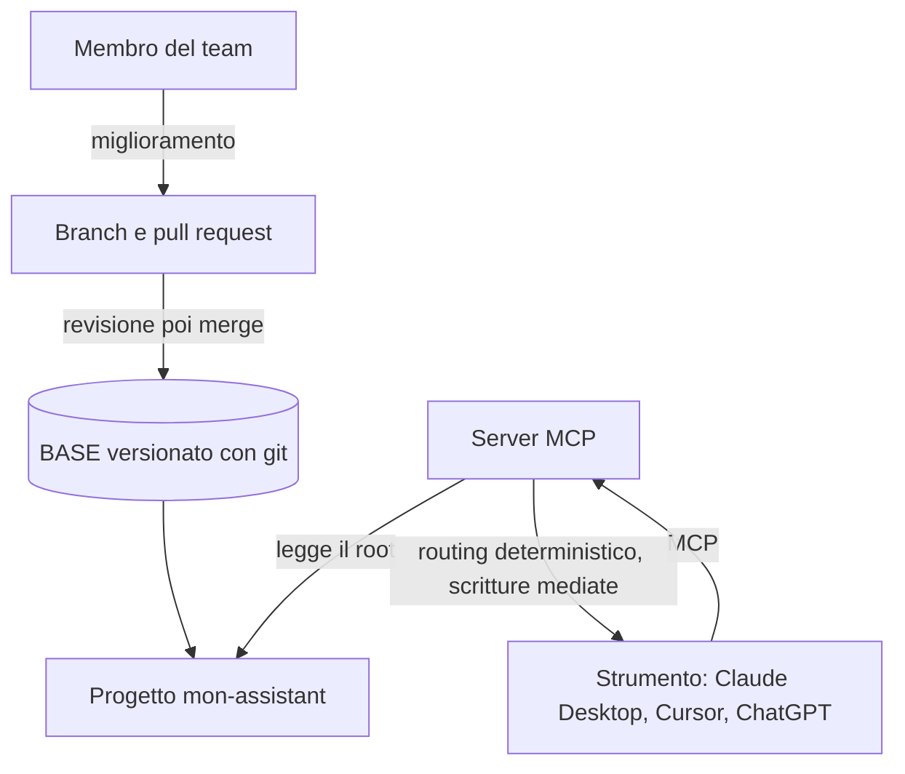

<!-- fr-synced: e1a44dba9171206c397c7c670d5b5e173decdbc1 -->

# Distribuire a un team

*⏱ ~20 min · modulo 3/3, percorso Team*

**Farete**: versionare il vostro BASE con git E avviare un server MCP che uno strumento interroga, dimostrato dal ✅ qui sotto.
**Vi serve**: il modulo 2 completato; git e Node 18+ installati; il repository BASE in locale; il vostro progetto `~/mon-assistant`.
↻ **Promemoria**: senza guardare: come impedisce BASE una fuga di dati riservati? (la regola di egress, controllata prima della chiamata)

Distribuire un BASE significa distribuire file: **git** per la cronologia e la revisione, **MCP**
per le garanzie meccaniche condivise (routing deterministico, scritture mediate), per tutto il team.



1. **Versionate.** Nel vostro progetto, inizializzate git e fate il commit:

   ```
   cd ~/mon-assistant
   git init && git add -A && git commit -m "Mon BASE, départ"
   ```

   Le risorse sono in Markdown: un cambiamento di processo si rilegge come un diff. Un
   miglioramento = un branch + una **pull request**, rivista prima di unirla.

2. **Avviate il server MCP.** Dal repository BASE:

   ```
   cd mcp/
   npm install
   npm run build
   npm start -- --root ~/mon-assistant
   ```

3. **Collegate uno strumento.** Per Claude Desktop (Cursor è identico, nelle sue impostazioni MCP),
   aggiungete a `claude_desktop_config.json` un percorso ASSOLUTO, poi riavviate lo strumento:

   ```
   {
     "mcpServers": {
       "base": {
         "command": "node",
         "args": ["/chemin/absolu/vers/mcp/dist/index.js", "--root", "/chemin/absolu/vers/mon-assistant"]
       }
     }
   }
   ```

   (ChatGPT richiede inoltre un URL HTTPS e un token: la guida passo passo per ogni strumento si trova in
   [installare il server MCP](../start/installer-mcp.md).)

✅ **Verificate**: `git log` mostra il vostro commit (un cambiamento di processo apparirà come un diff leggibile, pronto per una revisione); e il vostro strumento, collegato via MCP, risponde a *«Quali agenti ho?»* elencando gli agenti di `mon-assistant`.

💡 **Perché ha funzionato**: git rende l'evoluzione tracciabile e rivedibile; MCP fornisce a tutto il team lo STESSO router deterministico e scritture mediate, senza che ciascuno tocchi la CLI. La sicurezza si applica per impostazione predefinita: in HTTP il server è in sola lettura, e un'esposizione di rete senza `BASE_MCP_BEARER_TOKEN` viene rifiutata all'avvio. La governance resta verificabile perché è in chiaro, nei file.

🔁 **Da voi**: chi, nel vostro team, riesaminerà i cambiamenti di processo prima del merge? E quale macchina ospiterà il server MCP?

→ **E adesso**: avete percorso tutti e tre i percorsi. Mantenete il riflesso: gesto, verifica, poi solo il concetto.

🆘 **Guasti comuni**: *`npm: command not found`*: installate Node 18+ da nodejs.org. *Il server si rifiuta di avviarsi in rete*: è voluto senza autenticazione, definite `BASE_MCP_BEARER_TOKEN`. *La piattaforma non vede alcun agente*: verificate il `--root` (percorso assoluto) e che contenga `.ai/agents/*/AGENT.md`. *Configurazione per ogni strumento*: vedi [installare il server MCP](../start/installer-mcp.md).
