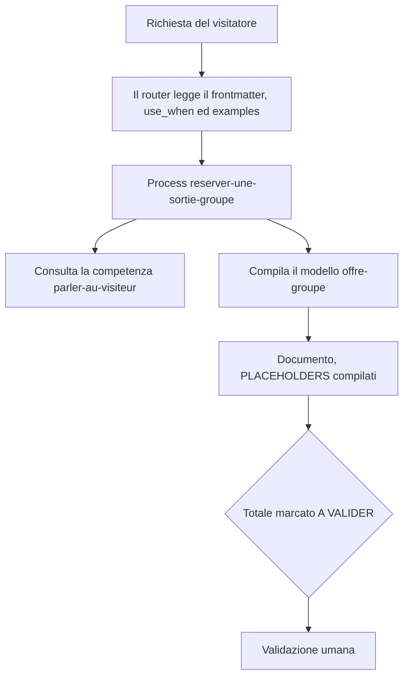

<!-- fr-synced: 229d5f5f900909fec589c145be550895fd2d71cb -->

# Competenze e modelli

*⏱ ~18 min · modulo 4/9, percorso Praticante*

**Farete**: aggiungere una competenza e un modello, referenziarli da un process e generare un documento che si compila da solo e si ferma per la validazione, dimostrato dal ✅ qui sotto.
**Vi serve**: i moduli 1-3 completati, la vostra cartella `~/mon-office-tourisme`.
↻ **Promemoria**: senza guardare: che cos'è un process? (un frontmatter che il router legge, più un corpo che il modello segue)

Un process dice COSA fare. Ma altri due mattoni separano il semplice routing di una richiesta
dalla produzione di **un vero deliverable**, ed è ciò che manca alla maggior parte degli assistenti.

- una **competenza** (`type: competence`): un know-how riutilizzabile (tono, regole, convenzioni)
  che un process **consulta**. La si cita in più process invece di ripetersi.
- un **modello / template** (`type: template`): un documento con spazi vuoti che si **compila** invece di
  seguirlo. È ciò che produce un'offerta, una lettera, un verbale.

1. **Una competenza.** Create `.ai/agents/mon-office-tourisme/skills/competences/parler-au-visiteur/SKILL.md`:

   ```
   ---
   schema_version: base.resource.v1
   id: parler-au-visiteur
   type: competence
   title: Parler au visiteur
   description: "Ton et clarté pour parler aux visiteurs. À consulter dans toute interaction."
   scope: team
   status: active
   sensitivity: internal
   name: parler-au-visiteur
   user-invocable: false
   allowed-tools: Read
   ---

   # Parler au visiteur

   - Dans la langue du visiteur, accueillant et bref.
   - Une question à la fois.
   - Annoncer le prix au barème, jamais un chiffre inventé.
   ```

2. **Un modello.** Create `.ai/agents/mon-office-tourisme/templates/offre-groupe_v1.md`. Un template porta dei
   `[PLACEHOLDERS]` da compilare e un `[A VALIDER]` là dove un umano deve decidere:

   ```
   ---
   schema_version: base.resource.v1
   id: template-offre-groupe
   type: template
   title: Trame d'offre de sortie de groupe
   description: Modèle d'offre à remplir (un template se remplit, il ne se suit pas).
   scope: team
   status: active
   sensitivity: internal
   ---
   # Offre de sortie de groupe: [NOM_GROUPE]

   **Type:** [TYPE_GROUPE]  ·  **Personnes:** [NOMBRE_PERSONNES]
   | Poste | Montant (CHF) |
   |-------|---------------|
   | Visite guidée | [NOMBRE_PERSONNES] x [PRIX_PAR_PERSONNE] = [SOUS_TOTAL] |
   | **Total** | **[TOTAL] [A VALIDER]** |
   ```

3. **Un process che li utilizza.** Create `.ai/agents/mon-office-tourisme/skills/processes/reserver-une-sortie-groupe/SKILL.md`.
   Esso `may_use` il modello e **consulta la competenza nel suo corpo**:

   ```
   ---
   schema_version: base.resource.v1
   id: reserver-une-sortie-groupe
   type: process
   title: Réserver une sortie de groupe
   description: "Chiffrer une sortie de groupe et préparer une offre depuis le modèle."
   scope: team
   status: active
   sensitivity: internal
   use_when: Quand quelqu'un veut organiser une visite ou une sortie pour un groupe à Veytaux.
   routing:
     examples:
       - Organiser une sortie pour notre groupe de 30 personnes
   may_use:
     - templates/offre-groupe_v1.md
   name: reserver-une-sortie-groupe
   user-invocable: true
   allowed-tools: Read
   ---

   # Réserver une sortie de groupe

   ## Étapes
   1. Recueillir les besoins (type de groupe, date, nombre de personnes), une question à la fois
      (compétence `skills/competences/parler-au-visiteur/SKILL.md`).
   2. Remplir le modèle `templates/offre-groupe_v1.md`: compléter les `[PLACEHOLDERS]`.
   3. Laisser `[A VALIDER]` sur le total. Ne rien envoyer sans accord.
   ```

4. **Generate il documento.** Nel vostro strumento IA, su `~/mon-office-tourisme`, chiedete:
   *«prepara un'offerta per una gita di gruppo di 30 persone»*. L'assistente instrada verso
   `reserver-une-sortie-groupe`, segue la competenza (tono, una domanda alla volta), **compila il modello** e lascia
   `[A VALIDER]` sul totale. Come nella Scoperta: propone, niente viene scritto senza di voi.

```routage-fixture
Organiser une sortie pour notre groupe de 30 personnes
```

✅ **Verificate**: `base validate --root .` passa (competenza, modello e process sono risorse valide); `base route "Organiser une sortie pour notre groupe de 30 personnes" --root .` instrada verso `reserver-une-sortie-groupe`; e l'offerta generata ha i suoi `[PLACEHOLDERS]` compilati con un `[A VALIDER]` sull'importo.

💡 **Perché ha funzionato**: un process orchestra, una **competenza** fattorizza un know-how riutilizzabile, un **modello** porta la forma del deliverable. Il router legge solo il frontmatter (use_when, examples); il corpo, invece, punta alla competenza e al modello, che il modello di linguaggio applica poi. Il `[A VALIDER]` nel modello chiede che un umano decida la cifra: la consegna è che la generazione si fermi invece di decidere al posto vostro.



🔁 **Da voi**: quale documento ripetitivo del vostro mestiere (preventivo, lettera tipo, verbale) trarrebbe vantaggio dal diventare un modello con spazi vuoti? Quale know-how (un tono, delle regole) merita una competenza riutilizzabile?

→ **E adesso**: [Modulo 5: i dati che scadono](praticien-5-donnees-qui-periment.md): il ciclo di vita di una competenza.

🆘 **Guasti comuni**: *`base route` non trova `reserver-une-sortie-groupe`*: avvicinate i vostri `routing.examples` a una vera richiesta di gita di gruppo. *L'assistente inventa un totale invece di `[A VALIDER]`*: il passo 3 deve esigerlo esplicitamente, e il modello deve portare il marcatore. *validate fallisce*: un template non ha né `name` né `user-invocable`; una competenza sì (mantenete la forma degli scheletri).
