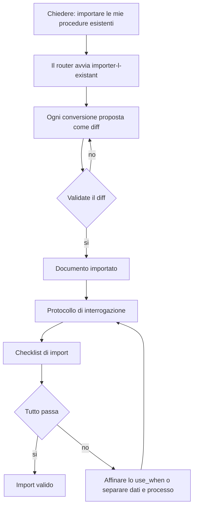

<!-- fr-synced: f338f764998f078a3f148c1681946fe159d0a91c -->

# Migrare i VOSTRI contenuti

*⏱ ~15 min · modulo 9/9, percorso Professionista*

**Farete**: trasformare due o tre dei vostri documenti reali in contenuto che il vostro assistente usa davvero, dimostrato dal ✅ qui sotto.
**Vi serve**: i moduli precedenti; la vostra cartella `mon-office-tourisme` (o una cartella vostra) aperta.
↻ **Promemoria**: senza guardare, attraverso cosa passa ogni scrittura in BASE? (il gate: proporre poi committare)

Avete accumulato una lista «Da voi» nel corso dei moduli. È il vostro backlog.

1. Nella vostra cartella, chiedete: *«importare le mie procedure esistenti»*. Il router avvia il
   processo `importer-l-existant`, che propone ogni conversione come diff: nulla viene scritto senza di voi.
2. Importate due o tre documenti dalla vostra lista.
3. Verificate ogni import con il **protocollo di interrogazione** (modulo Scoperta 3): una
   domanda a cui risponde solo il documento, una domanda trabocchetto fuori dal documento, una richiesta di routing.
4. Passate la **checklist di import**:
   - [ ] lo use_when di ogni processo descrive un'intenzione, non un titolo;
   - [ ] i dati (tariffe, schede) sono separati dai processi che li usano;
   - [ ] i passaggi a decisione umana riportano un `[A VALIDER]`;
   - [ ] ciò che può scadere riporta una data (`valid_until`).

✅ **Verificate**: per ogni documento importato, il protocollo di interrogazione passa (cita il documento giusto, ammette l'ignoranza, instrada bene) E la checklist è spuntata.

💡 **Perché ha funzionato**: è qui che il tutorial diventa il vostro strumento: la stessa struttura dell'ufficio del turismo di Veytaux, sul vostro mestiere. La checklist codifica ciò che i moduli hanno insegnato: importate con una griglia, mai alla cieca.

🔁 **Da voi**: pianificate il prossimo: quale terzo documento, quale prossimo compito automatizzare?

→ **E adesso**: avete finito il percorso Professionista: il VOSTRO assistente risponde sui VOSTRI contenuti. Per più persone, vedere il [percorso Team](equipe-1-workspace.md).

🆘 **Guasti comuni**: *L'import propone qualsiasi cosa*: guidatelo documento per documento invece che tutto in una volta. *Il protocollo fallisce*: affinate lo use_when, oppure separate dati e processo.
