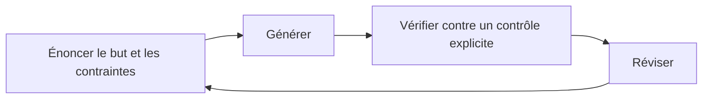

# Pourquoi BASE

> **La question n'est pas où sont vos serveurs, mais qui possède l'articulation de votre pensée avec l'IA.**
> BASE vous en rend souverain: ce que l'IA sait, ce qu'elle fait, ce que vous attendez, vos instructions, posés en texte que vous possédez. Et c'est cette structure qui vous garde capable de vérifier, dans la durée, là où la vérification vous revient.

Ce document explique *pourquoi* BASE existe. Pas ses commandes (voir [Démarrage express](../start/quickstart.md)), pas son architecture (voir [Framework public](../reference/framework-public.md)): la méthode qu'il rend exécutable pour co-penser avec l'IA.

## Le déséquilibre entre produire et vérifier

L'IA générative a inversé l'économie du travail intellectuel. **Produire une réponse plausible demande désormais peu d'effort; s'assurer qu'elle est juste relève d'un autre travail, qui dépend de la tâche.** Le cœur d'un modèle, le fameux «LLM», est un générateur de complétions probables. Il sait générer, comparer et simuler. Mais il ne vérifie pas à votre place la réalité, la responsabilité ni les conséquences pour votre organisation.

Dans certains domaines, un vérificateur existe en dehors du modèle: un compilateur pour du code, les règles du jeu d'échecs, un schéma de données. L'erreur s'y détecte et se corrige toute seule. **Mais la plupart du travail réel n'a pas de vérificateur externe.** Une analyse, une offre, une décision, une note interne: c'est à vous d'y détecter et corriger les erreurs, et vous êtes le mieux placé pour savoir si la sortie sert vraiment votre intention, votre contexte, votre seuil de risque.

La conséquence est simple: **pour ce travail, c'est vous le vérificateur**, calibré au risque que vous acceptez. La fiabilité ne se trouve pas toute faite: elle se construit, et elle se construit par la vérification.

## Le vrai risque: la dette de vérification

Le problème, c'est que nous vérifions mal par défaut. Un texte fluide inspire une confiance qu'il n'a pas méritée; une réponse obtenue sans effort éteint l'esprit critique. Et face à un ton assuré, on préfère souvent déférer à la source plutôt qu'évaluer le propos.

Alors le scénario d'échec le plus courant s'installe en silence: on valide bien au début, puis le système produit plus vite qu'on ne suit. On perd la vue d'ensemble. On cesse de développer l'intuition nécessaire pour juger. La confiance devient aveugle, ou s'effondre. Chaque affirmation acceptée sans contrôle ajoute une **dette de vérification**: une réserve d'hypothèses non vérifiées qui finit par céder sous la première vraie pression. Le projet est impressionnant en surface, fragile en dessous.

## Les quatre pertes de contrôle que BASE évite

| Perte | Ce qui arrive |
|-------|---------------|
| **Perdre la souveraineté** | opérer sans posséder: votre savoir vit dans la plateforme d'un autre. |
| **Perdre la compréhension** | délivrer sans intuition: on produit des résultats qu'on ne saurait plus défendre. |
| **Perdre dans la durée** | déployer sans savoir maintenir: ça marche le premier jour, plus le centième. |
| **Perdre la vérification** | produire sans contrôle: la dette s'accumule jusqu'à la rupture. |

BASE est, précisément, la structure qui prévient ces quatre pertes.

## Ce que BASE apporte: une structure qui rend la vérification légère

Vérifier ne doit pas vous noyer. Une structure forte en amont rend la vérification légère en aval. Voici comment BASE s'y prend:

- **Pointer ce qui compte.** Un *process* n'ouvre que les ressources utiles à *cette* tâche, pas tout votre dossier. Vous décidez ce que l'IA voit. Moins de bruit, de meilleures réponses, et une revue humaine portant sur une étape lisible plutôt que sur un bloc opaque.
- **Rendre la frontière explicite.** C'est d'abord une question de sécurité: les instructions s'exécutent, le contenu non. Mélanger les deux ouvre la porte à l'injection, quand un document traité finit par dicter le comportement du modèle. BASE sépare donc le **savoir-faire** (un texte que le modèle suit, sans garantie) du **savoir** (du contenu qu'il consulte), et distingue la **consigne** du **mécanisme** réellement appliqué par le code. On documente la frontière au lieu de la maquiller.
- **Garder les décisions visibles.** Une proposition est montrée (un diff) avant toute écriture; les marqueurs `[A VALIDER]` signalent ce qui attend votre jugement. Ces marqueurs comptent beaucoup: ils servent de repère cherchable dans vos fichiers et se prêtent à un traitement algorithmique (on peut les lister, les compter, bloquer tant qu'il en reste). Rien d'important ne se fait sans vous.
- **Donner une mémoire partagée.** Un modèle de chat généraliste maîtrise quantité de domaines vérifiables, et ne connaît rien du vôtre. Deux défauts réels suivent. D'abord, par défaut, il ne partage pas votre mémoire: chaque échange repart de zéro. Ensuite, son rapport au langage est sous-spécifié, ce qui est à la fois sa force (il s'adapte à tout) et sa faiblesse (il devine au lieu de savoir). BASE traite les deux: la mémoire devient une simple structure de fichiers; le langage devient une articulation explicite, posée noir sur blanc plutôt que laissée à la devinette.

La forme opérationnelle est une **boucle de co-pensée**: énoncer le but et les contraintes, générer, vérifier contre un contrôle explicite, réviser. On recommence, et la structure porte le contexte pour que chaque tour reste léger.

## Le contrôle fin fait l'efficacité

**Avoir accès à l'information n'est pas avoir accès à l'information utile.** Brancher toute sa boîte mail et tout son disque comme contexte, c'est du bruit si rien n'est ciblé. Choisir ce que l'IA voit relève de la confidentialité, mais aussi et surtout de l'**efficacité**: en information (le bon contexte, pas tout), en coût (un contexte serré est plus rapide et moins cher), et en attention (vous relisez une étape cadrée, pas un méga-résultat).

C'est aussi pourquoi le réflexe du «tout multi-agent» trompe souvent, et il vaut la peine d'être juste sur sa vraie valeur. Déléguer à plusieurs agents en parallèle est gagnant quand les morceaux sont réellement indépendants, et surtout quand un signal de vérification clair fait que plus de calcul rapporte plus de résultats: parcourir des journaux pour y trouver des incidents, fouiller du code à la recherche de failles, générer puis trier mille variantes. Là, le parallélisme paie, et il faut s'en servir. Le coût apparaît dès que la tâche ne se découpe pas proprement, c'est-à-dire dès que les agents doivent se *partager* du contexte. Leur seul canal est alors le langage naturel, sous-spécifié par nature: à chaque passage, le contexte est copié, résumé, re-vérifié, et un peu de cohérence fuit. Multiplier les copies d'un même modèle n'ajoute d'ailleurs pas de regards, seulement du débit: elles partagent le même biais. Pour le travail de jugement, qui se découpe rarement sans perte, un seul agent qui garde le fil, porté par une structure explicite, coûte moins qu'une coordination qui se paie en jetons et en malentendus. **Le goulot des systèmes agentiques n'est pas la puissance, c'est la compréhension partagée.** La question utile n'est donc pas «un agent ou plusieurs», mais «cette tâche se découpe-t-elle sans coûter la cohérence»: souvent non, et c'est pourquoi l'«agentique partout» ne décrit qu'un coin du travail réel.

## Les limites de la tâche, l'IA les partage

Un modèle ne vérifie pas; il ne s'affranchit pas davantage des limites de la tâche elle-même. Chercher une information demande de parcourir là où elle peut se trouver; calculer juste demande de suivre une procédure sans faute; raisonner loin demande de tenir des étapes intermédiaires toujours plus nombreuses. L'humain comme l'IA butent sur ces trois exigences, et y répondent de la même façon: un moteur de recherche, une machine à calculer, un support où écrire pour rester cohérent. La différence n'est pas dans le besoin d'outils, mais dans la main: c'est vous qui décidez d'y recourir, et vous qui jugez ce qui en sort.

Ces limites ne sont pas un défaut de l'IA, ce sont des propriétés du problème, que nul ne contourne par la seule intelligence. Un calcul ne crée pas l'information absente de ses entrées, et aucun procédé physique ne dépasse le calculable: c'est la thèse de Church-Turing physique (tout processus physique se simule sur une machine de Turing avec la précision voulue). Sa version étendue, sur l'efficacité (une simulation classique à un surcoût seulement polynomial), est plus délicate: le calcul quantique la contredit pour certaines tâches, mais sous des hypothèses de difficulté admises et non démontrées, et sans toucher les modèles de langage, qui sont classiques. La leçon pratique tient en une ligne, c'est le [principe 6 de la co-pensée](pratiques-co-pensee.md): ce qui vous demanderait des étapes intermédiaires en demande à l'IA comme à tout système au monde.

## L'IA ne retrouve que ce que vous avez rendu trouvable

On entend souvent que «l'IA repart de zéro» à chaque échange. Précisons, car la nuance change la conduite à tenir. Ce n'est pas le système entier qui oublie: c'est le cœur génératif, le modèle de langage. À chaque appel, il démarre avec une **fenêtre de contexte** vide, sans souvenir de la précédente. La mémoire n'a pas disparu pour autant; elle est simplement *externe* au modèle. Un système plus large autour de lui, comme BASE, peut très bien la lui rendre: vos fichiers sont cette mémoire, et tout l'enjeu devient de remplir la fenêtre, au bon moment, avec les bons morceaux.

Comment ces morceaux sont-ils retrouvés dans vos fichiers? Par des moyens mécaniques, les mêmes que les vôtres, mais plus rapides: on liste des dossiers, on cherche des mots, on recoupe par ressemblance (glob, grep et recherche sémantique, dans le vocabulaire des outils). De votre monde, le système ne retrouve donc que ce que vous avez rendu trouvable, et au grain où vous l'avez rendu trouvable.

La conséquence pratique: **structurez l'information chaque fois que vous y touchez, et rangez-la mieux que vous ne l'avez trouvée.** Qu'elle tienne lieu de mémoire (un historique, une décision passée) ou non (une règle, un fait, un catalogue), le modèle ne l'aura sous les yeux que si le système la retrouve et la place dans sa fenêtre. Et pas pour la seule tâche du jour, mais pour toutes celles qui suivront: une note nommée clairement, un fait rangé au bon endroit, une règle écrite proprement une fois se remboursent à chaque fois qu'on revient y puiser, comme un placement qui rapporte à chaque usage. C'est l'envers d'«un accès n'est pas un accès utile»: on ne range pas pour aujourd'hui, on rend trouvable pour la suite.

Reste la bonne maille. Trop grosse, et l'on ne sait plus pointer le morceau utile dans un bloc indistinct; trop fine, et le morceau perd le sens que lui donnait son voisinage. La bonne granularité est celle qui se désigne d'un geste et se suffit à elle-même: assez petite pour qu'on l'ouvre sans charrier le reste, assez grande pour qu'elle garde son sens. C'est ce travail répété qui fait qu'au bon moment la bonne information affleure dans la fenêtre, prête à servir avec précision plutôt qu'à être cherchée à tâtons. La discipline est d'abord humaine; BASE lui donne des appuis (des fichiers nommés, une mémoire externe que vous possédez, des compétences réutilisables distinctes des process, un routeur qui retrouve la bonne unité de travail), mais l'habitude de bien ranger, à chaque fois, reste la vôtre.

## La liberté de penser n'importe quel processus

La plupart du travail consiste à suivre le fil de sa propre pensée, fluide, pas à le découper d'avance en «agents». Beaucoup d'outils imposent pourtant une grammaire: décomposez en agents, rôles, passages de relais, configurés dans leur interface. C'est l'outil qui dicte le processus.

BASE n'impose pas cette grammaire. Vous pouvez tout aussi bien garder un contexte cadré et penser. **L'autonomie sans dialogue reste fragile, quelle que soit l'intelligence en face.** Au-delà de la question «où sont mes serveurs?», le risque profond est de perdre la liberté de nos interactions avec l'IA, de finir par penser en agents et en interfaces, via des instructions étrangères. BASE défend la liberté d'articuler *n'importe quel* processus, y compris aucun.

### Pourquoi nous disons «agent» alors que nous critiquons la grammaire des agents

Parce que les modèles et les outils, eux, sont habitués à ce mot. Les modèles sont entraînés sur le vocabulaire d'«agents», de «skills», de «tools»; les outils (éditeurs IA, plateformes d'agents, serveurs MCP) sont construits autour. Pour être *exécutable* sur ces outils, BASE doit parler leur langue à la frontière. Refuser le mot ne rendrait pas BASE plus pur, seulement incompatible.

Nous adoptons donc «agent» **par pragmatisme, pas par conviction**: c'est un terme d'interface vers les outils, pas le modèle mental du travail. Concrètement, un «agent» BASE est **votre** Markdown, lisible, comparable, supprimable, et **optionnel**. Ce n'est pas un travailleur autonome qu'on lance et qu'on oublie. Ce que vous possédez, c'est la couche d'intelligence; le mot «agent» appartient à la couche d'exécution qui la fait tourner.

## La souveraineté qui compte est autour des modèles

La souveraineté des serveurs (où tourne le calcul) est **nécessaire, mais elle ne suffit pas**. On peut posséder ses puces, son électricité, son disque dur, et rester étranger à ce qui compte le plus: ses interactions avec l'IA. Une IA souveraine par ses serveurs mais étrangère par ses usages reste un piège: ce que vous ne savez ni articuler ni vérifier ne vous appartient pas vraiment, où qu'il s'exécute.

Ce constat a une conséquence rassurante. Pour l'essentiel du travail de connaissance, **un modèle libre tournant sur un bon ordinateur portable suffit déjà**; la puissance brute n'est pas le facteur limitant, et les modèles ouverts qui tournent en local feront davantage demain, jamais tout (certaines applications, comme la recherche à grande échelle, demandent bien plus de calcul). Les investissements d'infrastructure pharaoniques relèvent surtout d'un *autre* type d'IA: celle qui apprend sur des données du monde au-delà du seul humain (par exemple en captant des longueurs d'onde au-delà du spectre visible), et pour laquelle l'alignement sur nos représentations n'est pas l'objectif premier. Ce n'est pas, pour AI Swiss, l'IA à développer en priorité: beaucoup de problèmes humains peuvent être résolus avant de laisser l'IA explorer le monde avec peu de représentation humaine. La souveraineté qui compte n'est donc pas une course au calcul. **Elle se situe autour des modèles: la liberté d'articuler, de structurer, de penser avec ces intelligences.** C'est la *souveraineté cognitive*, la couche que personne d'autre ne vous rend.

D'où une séparation nette:

- **Votre couche d'intelligence**: comment vous articulez le travail, structurez le savoir, définissez les contrôles, gardez les décisions. C'est BASE. En texte, à vous, portable, indépendante du modèle.
- **La couche d'exécution**: le calcul, les modèles, l'orchestration, la mémoire interne, les connecteurs. Interchangeable, à louer et à faire évoluer.

La bonne question n'est donc pas «où sont mes serveurs?» mais **«qui possède l'articulation de ma façon de penser avec l'IA, moi ou mon fournisseur?»**. BASE ne remplace pas vos outils et ne vous empêche pas de les utiliser: il en est la couche souveraine. Gardez vos outils pour le calcul et l'exécution; possédez, dans BASE, l'intelligence qu'ils exécutent. Détail: [BASE et vos outils IA](../reference/base-et-vos-outils-ia.md), et [où se situe BASE dans le paysage des outils](../reference/positionnement.md).

## Une ancre, quand les outils changent plus vite que la littératie

Construire avec l'IA ne se résume pas à choisir un produit. Les interfaces changent si vite que même ceux qui les conçoivent ne savent pas à quoi elles ressembleront dans quelques mois. La réponse courante des grands acteurs est implicite: essayez, apprenez en avançant, changez d'outil tous les quelques mois. On ne construit pas une littératie durable là-dessus, et on ne forme pas une équipe sur un sol qui bouge.

BASE **vise à servir d'ancre**, dans la mesure où vos fichiers restent lisibles et portables. Votre méthode, vos process, vos contrôles vivent dans une structure que vous possédez et qui ne suit pas le rythme des produits. La profondeur d'intégration, elle, varie selon l'outil; mais s'adapter à un nouvel outil ne demande pas de tout réapprendre: cela se fait via les **couches d'adaptation** de BASE (un pont, un adaptateur), avec peu d'effort, et l'IA elle-même peut vous aider à les réécrire. Vous changez d'exécution; votre intelligence reste.

## Calibré, pas anti-automatisation

Co-penser, c'est **choisir consciemment**, pas tout faire à la main. Déléguez ce qui a un vérificateur ou ne demande pas de jugement; co-pensez ce qui porte du risque et du sens. BASE fait simplement de l'humain-dans-la-boucle le choix *par défaut*, et de la délégation un choix *explicite et visible*, là où la tendance du marché est l'automatisation *invisible*.

## BASE met ce qui compte devant vous

Une bonne collaboration ne fait pas chercher. Tout comme un *process* doit donner à l'IA l'information qui compte, BASE doit vous donner, à *vous*, ce qui compte, sans que vous ayez à le demander:

- l'**accueil** (concierge) vous oriente dès que vous êtes perdu; un **routeur**, rudimentaire mais efficace et extensible par adaptateurs, vous enlève la charge mentale de chercher le bon process; même son abstention honnête vous renvoie vers l'accueil plutôt que vers le vide;
- chaque process met en avant ce que vous devez vérifier ou décider, et signale les points de décision (`[A VALIDER]`, `[ATTENTION]`) avant qu'un problème ne survienne.

Vous ne devriez jamais avoir à creuser pour rencontrer ce qui compte.

## Pour aller plus loin

- [Les principes de la co-pensée](pratiques-co-pensee.md): la méthode, principe par principe.
- [La documentation interactive](../reference/documentation-interactive.md): la doc en local, et BASE Studio pour voir et soigner vos process, deux interfaces locales optionnelles.
- [Framework public](../reference/framework-public.md): les abstractions, la souveraineté autour des modèles, l'interopérabilité.
- [BASE et vos outils IA](../reference/base-et-vos-outils-ia.md): avec vos outils, pas à leur place.
- [Manifeste](../../MANIFESTO.md): la vision.
