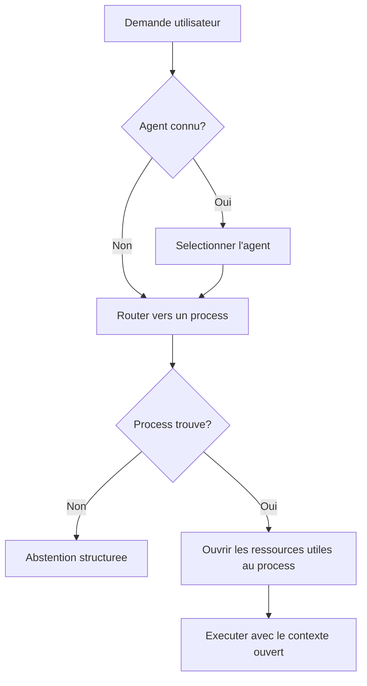

# Adopter BASE public: du local à l'équipe

Si vous êtes un particulier, un indépendant, une startup, une PME ou une petite équipe, cette page vous montre ce que BASE public vous apporte: structurer votre collaboration avec l'IA sans installer de plateforme lourde. Elle explique aussi comment l'adopter par étapes, en restant simple en surface mais sans bloquer la croissance ensuite.

L'idée directrice: peu de choses imposées au départ, des abstractions complètes derrière, des exigences qui montent avec vos besoins, et de la rigueur uniquement là où le contexte la réclame.

Si vous découvrez le dépôt, commencez par `docs/start/lire-dans-quel-ordre.md`. Ce document est la source de vérité des parcours de lecture: quoi lire selon votre profil, quoi ignorer au début et quoi auditer ensuite.

## Qui doit lire quoi?

Le parcours de lecture par profil (personne seule, PME, grande entreprise) est tenu à un seul endroit, pour éviter les versions divergentes: voir [Lire dans quel ordre](../start/lire-dans-quel-ordre.md). Ce document-ci est l'une des étapes de ces parcours.

## Trois couches à ne pas confondre

| Couche | Contenu | Pourquoi elle existe |
| ------ | ------- | -------------------- |
| Usage | `README.md`, `docs/start/quickstart.md`, `exemples/` | Démarrer sans comprendre toute l'architecture |
| Structure | `.ai/agents/`, `docs/reference/framework-public.md`, `base.schema.json` | Stabiliser les agents, skills, ressources et workflows |
| Intégration | `tools/`, `mcp/`, `tests/`, `docs/reference/specification-v0.md` | Vérifier, connecter et auditer sans enfermer BASE dans un outil |

`CLAUDE.md` et `.cursor/rules/` sont des adaptateurs de harness. Ils aident Claude Code et Cursor à charger le bon contexte, mais ils ne sont pas la source conceptuelle du framework. En agrément, jamais en obligation, deux interfaces locales optionnelles existent: Studio (`npm run studio -- <dossier>`, sur `127.0.0.1:5174`) pour parcourir et éditer les ressources avec la barrière propose puis commit, et la documentation en local (`npm run docs:serve`).

BASE public est directement utilisable pour le local et les petites équipes. Pour une grande entreprise, il sert de socle de structuration et de référence d'architecture, pas de plateforme de conformité complète.

Pour éviter toute ambiguïté, l'état réel du cœur public est suivi dans `docs/reference/etat-implementation.md`: ce qui est implémenté, ce qui est prévu comme extension et ce qui reste volontairement hors périmètre.

La page `docs/audiences/pour-qui.md` donne la lecture par contexte: vie privée, start-up, PME et grande entreprise.

## Niveaux d'adoption

### Personnel

Objectif: démarrer sans friction.

- Markdown libre;
- YAML optionnel;
- agent local ou exemple copié;
- validation humaine avant écriture;
- pas de manifest obligatoire.

Un fichier personnel peut être simplement:

```markdown
# Répondre aux emails clients

Quand je reçois un email...
```

### PME / équipe

Objectif: partager sans bureaucratie.

- frontmatter minimal recommandé;
- `base validate --root <dossier>` avant partage;
- `base index --root <dossier>` pour générer le manifest;
- `base entretien --root <dossier>` pour repérer liens cassés, marqueurs ouverts et descriptions manquantes;
- promotion contrôlée des ressources personnelles vers l'équipe.

Le bon point de départ organisationnel est `docs/audiences/kit-demarrage-pme-suisse.md`: données autorisées, responsable de validation, versioning simple et rituel mensuel. Cela suffit souvent avant d'ajouter des contrôles plus lourds.

Le minimum équipe est:

```yaml
---
schema_version: base.resource.v1
id: nouveau-devis
type: process
title: Nouveau devis
description: Créer un devis professionnel à partir d'une demande client.
scope: team
status: active
sensitivity: internal
---
```

### Grande entreprise

Objectif: garder une structure durable qui peut être gouvernée.

BASE structure les ressources, les processes, les tools, les policies et les adapters. L'organisation doit ajouter ses propres contrôles enterprise: identité, autorisations, classification, DLP, SIEM, archivage légal, revue conformité, gestion des secrets et séparation des environnements.

Ne faites pas porter ces contrôles au cœur public par raccourci. BASE reste la couche de structuration et de médiation locale; les garanties enterprise doivent être appliquées par les systèmes qui ont réellement l'autorité technique et juridique pour le faire.

La bonne lecture est donc:

```text
BASE public = cadre local-first + conventions + routeur + MCP local
Entreprise = intégration gouvernée + politiques internes + contrôles techniques additionnels
```

## Abstractions stables

| Concept | Pour l'utilisateur | Rôle durable |
|---------|--------------------|--------------|
| Resource | fichier utile | Ce qui peut être découvert et utilisé |
| Source | endroit où ça vit | Origine locale ou future intégration |
| Connector | accès | Mécanisme qui lit ou écrit une source |
| Process | façon de faire | Workflow textuel réutilisable |
| Tool | outil | Action invocable, souvent un script local |
| Policy | règle d'accès | Intention ou limite d'usage |
| Event | trace utile | Signal minimal pour entretien ou debug |
| Adapter | intégration outil IA | Pont vers Cursor, Claude, ChatGPT ou autre |

Ces concepts ne doivent pas tous apparaître dans l'UX débutant. Ils servent à éviter que la structure doive être jetée quand une organisation grandit.

**Langue.** Aucune de ces abstractions n'est liée au français. Le routage est lexical et indépendant de la langue (comparaison de mots normalisés, sans grammaire ni lexique d'une langue donnée), et un assistant déclaré avec des mots-clés allemands ou italiens route dans cette langue. La documentation du cadre commence en français; les assistants que vous construisez, eux, parlent la langue de leurs utilisateurs.

Dans cette table, `accès` ne veut pas dire que BASE remplace les permissions natives. Un connecteur est le mécanisme qui tente de lire ou écrire une source. La réussite réelle dépend toujours des droits du système concerné: filesystem, Drive, API, token, compte utilisateur, réseau ou harness.

## Deux types de skills

BASE reprend le format `SKILL.md`, déjà familier dans plusieurs harnesses, mais ne traite pas tous les skills comme un même bloc d'instructions. C'est d'abord une question de sécurité: les consignes d'un process s'exécutent, le contenu d'une compétence se consulte sans s'exécuter. Confondre les deux ouvre la porte à l'injection, où une donnée tente de se faire passer pour une consigne.

| Type | Question | Exemple |
|------|----------|---------|
| **Process skill** | Que faire, dans quel ordre, avec quels points de décision? | `nouveau-devis`, `traiter-candidature`, `preparer-newsletter` |
| **Competence skill** | Que faut-il savoir pour bien le faire? | TVA, politique de remise, ton de communication, marqueurs, journal |

Cette distinction évite qu'un agent ait seulement une grande liste de skills. Un process peut déclarer ou suggérer les compétences nécessaires; le routeur peut retrouver le bon processus, puis ouvrir seulement les connaissances utiles. C'est une différence importante avec les harnesses qui exposent surtout un catalogue plat de skills.

La doctrine complète est: sélectionner l'agent quand il est connu, router vers un process quand le workflow doit être choisi, puis ouvrir les ressources utiles au process. Elle est détaillée dans `docs/reference/routage-process-et-ressources.md`.



## Modes de permission

BASE public est honnête sur ce qu'il peut garantir:

- `advisory`: mode par défaut, l'agent guide et signale les risques.
- `hybrid`: certaines actions sensibles passent par BASE, tandis que le harness garde des capacités natives déclarées.
- `strict`: actions médiées par la CLI, le MCP ou un connecteur contrôlé, avec confinement dans le projet et refus des symlinks hors périmètre quand le connecteur le supporte.

BASE ne promet pas un RBAC enterprise ni un blocage total quand un agent possède un accès shell direct.

La règle pratique est simple: une permission n'est réelle que si l'accès ou l'action passe par BASE, un connecteur ou un outil qui peut l'appliquer. Sinon, elle reste une instruction et un signal d'audit. À l'inverse, BASE ne crée jamais un accès que l'OS, le Drive, l'API ou le harness refuse déjà.

Formule de référence:

```text
advisory = guide/audit
hybrid = enforcement partiel explicite
strict = enforcement médié
```

## Broker et Router locaux

Le broker public, partagé par la CLI et le MCP, fournit:

- inventaire des ressources;
- recherche locale explicable;
- routage agent → process avec abstention structurée (`base route`, `route_request`);
- tests de routage métier (`base route-test`);
- ouverture de ressource confinée avec projection `metadata`, `instructions` ou `full`;
- accès local aux fichiers ou ressources;
- invocation d'un outil (script) en dry-run par défaut, avec confirmation quand nécessaire;
- validation du projet.

Le Router choisit parmi les agents et processes dérivés des fichiers. Il ne cherche pas librement dans tout le dépôt et ne charge pas toutes les instructions. Les compétences, tools, templates, documents et données sont récupérés ensuite comme contexte.

BASE pourrait évoluer vers un routage plus large, par exemple pour retrouver directement une compétence ou un outil. Le cœur public ne le fait pas par défaut: router une action et retrouver du contexte sont deux responsabilités différentes, et les garder séparées rend le système plus lisible et testable.

La recherche locale utilise métadonnées YAML, titres Markdown, descriptions, mots-clés et texte local simple. Le cœur livre aussi un `semanticHybridRanker` zéro dépendance activable par config. Pour les vrais embeddings, BASE fournit le package officiel séparé `@ai-swiss/base-ranker-semantic`, sans ajouter de modèle ni de SDK cloud au cœur. Il accepte un fournisseur explicite, fournit un connecteur OpenAI-compatible, et propose un helper Ollama optionnel (`createOllamaEmbedder`, modèle `nomic-embed-text`) pour les équipes qui veulent un chemin local simple. Voir `docs/guides/routage-semantique-quickstart.md`, `docs/guides/choisir-provider-embeddings.md` et `docs/trust/securite-donnees-routage.md`.

Pour l'échelle, `@ai-swiss/base-index-local` fournit un index local optionnel, dérivé et supprimable. Il ne devient pas source de vérité et reste hors du cœur. Voir `docs/learn/comprendre-echelle.md` et `docs/guides/benchmarks-echelle.md`.

Le registre `.ai/routing/registry.json` est générable, mais il reste une projection d'audit et de préparation à l'échelle. Il n'est pas source de vérité et le Router ne dépend pas de lui aujourd'hui. Les limites précises sont listées dans `docs/reference/etat-implementation.md`.

## Souveraineté autour des modèles

La souveraineté des serveurs (où tourne le calcul) est nécessaire, sans être suffisante: une IA souveraine par ses serveurs et étrangère par ses usages reste un piège. Pour l'essentiel du travail de connaissance courant (dialoguer, rédiger, reformuler, suivre un process cadré), un modèle libre tournant sur une bonne machine locale suffit déjà, et cette frontière recule: le calcul nécessaire pour atteindre une capacité donnée diminue d'environ moitié tous les huit mois (Epoch AI, 2024), plus vite que le matériel ne progresse, et la capacité obtenue par paramètre double environ tous les trois à quatre mois (Xiao et al., 2024). Pour cette classe de travail, la puissance brute n'est donc pas le facteur limitant, et les investissements d'infrastructure pharaoniques relèvent surtout d'un autre type d'IA, que BASE ne cherche pas à servir en priorité. La souveraineté qui compte se situe donc **autour des modèles**: la liberté d'articuler, de structurer et de penser avec ces intelligences.

D'où une séparation nette des responsabilités, qu'on lit mieux couche par couche, non par maturité technique mais par **qui possède chaque étage**:

| Couche | Qui la possède d'ordinaire | Ce que BASE vous rend |
| --- | --- | --- |
| Le calcul et les modèles | Votre fournisseur d'IA | Rien, et c'est voulu: louez-le, faites-le évoluer, changez-en. |
| La mémoire interne et l'orchestration | La plateforme | Le droit d'en sortir: vos données restent du texte, lisible ailleurs. |
| Les outils de lecture, d'écriture et de recherche | L'éditeur de l'outil | Des outils ciblés que vous déclarez, bornés à la tâche du moment. |
| Le routage et les flux de travail | Le produit, par ses menus et ses réglages | Des process en texte que vous écrivez, versionnez et gouvernez. |
| **Les interactions: l'articulation de votre pensée** | **Personne ne vous la rend** | **La souveraineté cognitive: comment vous pensez avec l'IA reste à vous, en clair, indépendant du modèle.** |

Vous possédez les couches du milieu et, surtout, celle des interactions; le fournisseur apporte le calcul et les modèles, que vous louez et faites évoluer.

## Interopérabilité: avec vos outils, pas à leur place

BASE reste ouvert. Étant du texte plus un serveur MCP, il se laisse consommer par tout harness ou plateforme capable de lire des fichiers ou de parler MCP:

- **MCP** (un standard ouvert): BASE expose un serveur MCP; un outil compatible peut appeler BASE pour router, ouvrir et lire ses ressources.
- **Fichiers**: vos Markdown peuvent vivre là où votre outil les lit et nourrir un assistant existant.
- **Protocoles ouverts d'agents**: voie d'évolution pour faire coopérer des agents définis dans BASE avec d'autres, non implémentée à ce jour; à ne pas présenter comme acquise.

Concrètement, trois portées, de la plus légère à la plus complète: vos **fichiers joints** à un chat, votre **dossier ouvert** dans un outil qui lit les fichiers, ou le **serveur MCP** branché à un outil compatible, jusqu'à un chat grand public quand il parle MCP.

La bonne question n'est donc pas «BASE ou mon outil?» mais «qui possède l'articulation de ma façon de penser avec l'IA?». Gardez vos outils pour l'exécution; possédez, dans BASE, l'intelligence qu'ils exécutent. Détail, et aide pour intégrer votre outil précis: [BASE et vos outils IA](base-et-vos-outils-ia.md).

*Note: les capacités des outils tiers évoluent vite; ce document reste indépendant d'un produit précis. Pour un détail propre à un outil, appuyez-vous sur sa documentation à jour.*

## Enterprise: seulement documenté

Les besoins suivants sont possibles, mais ne font pas partie du cœur public initial:

- SSO et OAuth complet;
- connecteurs SharePoint ou Drive avancés;
- RBAC;
- audit complet;
- trace full;
- vector search;
- environnements dev, staging, prod;
- data retention et legal holds;
- secrets manager;
- policy engine externe;
- SIEM.

La structure BASE ne bloque pas ces besoins. Ils se branchent via Sources, Connectors, Policies, IndexProviders et Adapters.

La règle de conception reste conservatrice: ne pas ajouter une abstraction enterprise au cœur public tant qu'elle n'est pas portée par un besoin réel, un mécanisme vérifiable et au moins deux intégrations plausibles. Sinon, documenter la limite vaut mieux qu'ajouter une promesse fragile.

## Ce que BASE ne promet pas

BASE ne promet pas:

- une exactitude automatique des réponses IA;
- une mémoire du modèle indépendante des fichiers;
- un archivage légal;
- une preuve d'audit complète;
- une isolation de sécurité si l'agent possède un accès shell direct;
- une conformité RGPD, FINMA, ISO ou SOC 2 sans contrôle organisationnel additionnel.

BASE promet un cadre lisible, local-first et extensible, dans lequel les hypothèses, décisions, ressources et processus sont explicites.
