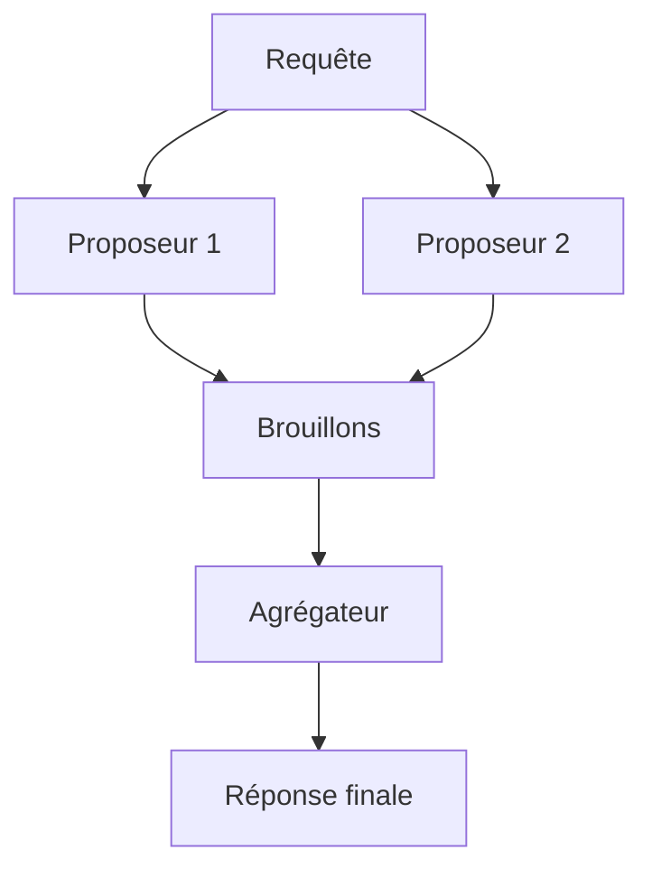

# Orchestrer plusieurs modèles et superviser les appels

Le paquet `@ai-swiss/base-llm` expose un port de modèle unique: tout modèle offre la même interface `complete`. Comme les méta-modèles respectent ce port, ils se composent: chacun enveloppe un ou plusieurs modèles et reste lui-même un modèle. Il s'insère donc partout où un modèle simple s'utilise, des réglages au routage. Choisir un modèle reste toujours une décision explicite.

## Mixture d'agents

`createMoaModel` interroge plusieurs proposeurs en parallèle, puis un agrégateur synthétise leurs brouillons en une seule réponse. Les proposeurs travaillent sans outils et produisent du texte; l'agrégateur reçoit les brouillons comme guidage privé et garde les outils d'origine. L'usage des jetons s'additionne sur tous les appels, et la synthèse continue même si certains proposeurs échouent.

## Triumvirat

`createTriumviratModel` reprend l'architecture de Sakana Fugu et de TRINITY. À chaque tour, un coordinateur choisit un modèle dans un vivier interchangeable et lui confie un rôle: le penseur planifie, l'exécutant produit ou corrige la réponse et reçoit seul les outils, le vérificateur juge le brouillon et décide de l'arrêt. La boucle tourne jusqu'à l'acceptation ou jusqu'à une limite de tours.

Le coordinateur par défaut s'appuie sur un modèle du vivier, avec un repli déterministe penseur, exécutant, vérificateur. Une fonction `decide` fournie par l'appelant remplace ce coordinateur sans changer l'interface.

## Configurer les ensembles depuis les réglages

Un bloc `ensembles` dans `.ai/studio.settings.json` rend ces compositions disponibles sans écrire de code. Chaque entrée nomme un `type` (`moa` ou `triumvirat`) et des références de membres au format `<fournisseur>/<modèle>`. Le nom de l'ensemble s'utilise ensuite partout où une référence de modèle s'utilise, par exemple dans `routing.model`. Une configuration incorrecte échoue avec un message clair.

## Supervision avec Langfuse

`createLangfuseModel` enveloppe n'importe quel modèle et trace chaque appel vers Langfuse: entrée, sortie, jetons, durée et erreurs. L'enveloppe n'ajoute aucune dépendance: elle écrit vers l'interface publique d'ingestion par `fetch`. L'envoi se fait en arrière-plan et n'ajoute pas de latence à l'appel; `flush()` vide les envois en cours avant la fin d'un processus court. Un échec de supervision n'interrompt jamais l'appel supervisé. Les clés viennent des variables d'environnement `LANGFUSE_PUBLIC_KEY` et `LANGFUSE_SECRET_KEY`, et un hôte auto-hébergé se déclare par `LANGFUSE_HOST`.

## Choisir entre mixture et triumvirat

La mixture vise la largeur en un seul tour: des propositions parallèles puis une synthèse, simple et économe. Le triumvirat vise la profondeur en séquence: planifier, produire, vérifier, recommencer, avec autocorrection et usage des outils. Les deux partagent le même port, donc la supervision Langfuse les enveloppe de la même façon.
