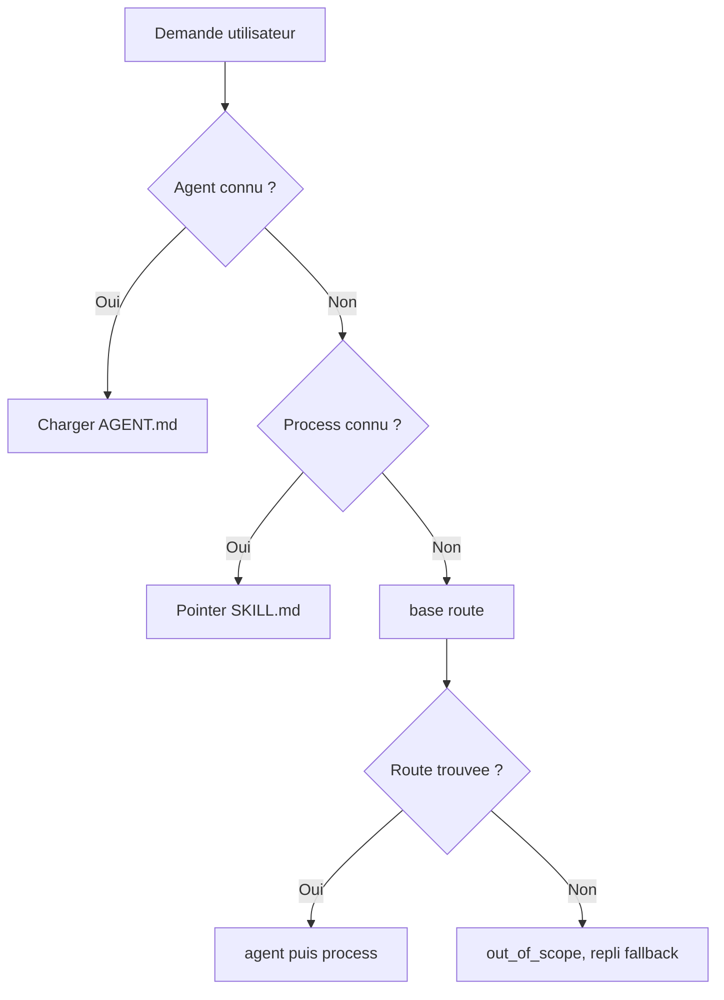

# Router une demande vers le bon process (et ouvrir les bonnes ressources)

Une demande mal aiguillée charge tout, mélange tout et noie les décisions qui comptent sous un mur d'instructions. BASE l'évite en distinguant trois gestes que les outils d'IA confondent souvent: choisir un agent, router vers un process, ouvrir les ressources. En les séparant, on garde sous les yeux ce qui se décide vraiment. Si vous construisez ou utilisez un BASE et voulez savoir comment une demande trouve son chemin, cette page le montre.



## 1. Choisir un agent

Quand vous savez quel assistant utiliser, le plus simple est de le sélectionner directement:

```text
Lis .ai/agents/assistant-devis/AGENT.md
```

L'agent est la fiche de poste. Il dit quel rôle tenir, comment parler, quels workflows existent et où se trouvent les fichiers utiles.

Pour un assistant unique, cette sélection manuelle suffit souvent. Il n'y a rien à installer, rien à indexer et aucun catalogue de routage à maintenir.

## 2. Router vers un process

Quand plusieurs workflows sont possibles, BASE peut router une demande vers le bon process:

```bash
base route "je dois préparer un devis client" --root <dossier-base>
```

Le routeur choisit un couple agent → process, ou s'abstient avec une raison lisible. Il ne charge pas toutes les instructions et ne cherche pas librement dans tout le dépôt. Son mécanisme reste rudimentaire mais efficace, et s'étend par adaptateurs. Il enlève surtout à l'utilisateur la charge mentale de chercher le bon process.

Cette limite est volontaire. Un process répond à la question:

```text
Que faut-il faire maintenant ?
```

C'est une décision de workflow. Elle doit rester courte, testable et explicable.

Les signaux recommandés pour un process routable sont:

- `description`: ce que fait le process;
- `use_when`: quand l'utiliser;
- `routing.examples`: formulations réelles d'utilisateurs;
- `routing.avoid_when`: contre-exemples qui évitent les fausses routes.

Les fixtures `.ai/routing/route-tests.json` protègent les routes importantes contre les régressions.

## 3. Ouvrir les ressources utiles

Une fois le process choisi, il peut référencer les ressources nécessaires:

- compétences métier;
- documents;
- templates;
- tools;
- données locales;
- sources externes via connecteurs.

Ces ressources répondent à une autre question:

```text
Avec quoi faut-il le faire ?
```

Elles sont du contexte, des outils ou des données. Garder cette frontière est d'abord une question de sécurité: les instructions d'un process s'exécutent, le contenu d'une ressource ne s'exécute pas. Mélanger les deux ouvre la porte à l'injection, où une donnée tente de se faire passer pour une consigne. Le choix du workflow principal reste donc à l'écart.

Un process peut les déclarer dans sa frontmatter:

```yaml
requires:
  - ref: calculer-devis
    access: execute
    purpose: chiffrer le devis
may_use:
  - catalogue/services.json
```

Utilisez `requires` pour une ressource que le process doit ouvrir ou exécuter de façon structurée, idéalement via son `id`. Le champ `access` décrit l'usage attendu par le process, par exemple lire ou exécuter. Il ne donne pas un droit d'accès.

Utilisez `may_use` pour du contexte simple ou optionnel, souvent un chemin lisible dans le projet. Le process peut aussi citer ces ressources dans ses étapes quand le contexte reste simple. L'important est que la logique reste lisible: le routeur choisit le process, puis le process indique ce qu'il faut ouvrir.

## Qui applique les droits?

BASE ne remplace pas les droits normaux de l'environnement. Si une source vit dans un dossier, un Drive, une API ou un outil externe, les droits réels restent ceux de ce dossier, de ce Drive, de cette API ou de cet outil.

BASE applique ses propres garde-fous seulement sur les actions qui passent par lui:

- `base open` ou `open_resource` pour ouvrir une ressource inventoriée;
- `base access` ou `access_resource` pour lire un chemin confiné au projet;
- `base invoke` ou `invoke_tool` pour préparer ou exécuter une tool;
- `base propose` puis `base commit`, ou `propose_change` puis `commit_change`, pour une écriture médiée.

La règle pratique est:

```text
Le process déclare les besoins.
BASE médie certaines actions.
Les droits réels restent portés par l'OS, l'outil, le connecteur ou l'API.
```

## Pourquoi ne pas router toutes les ressources?

BASE pourrait évoluer vers un routage plus large: trouver directement une compétence, un outil, un template ou un document à partir d'une demande.

Ce serait utile dans certains contextes, mais cela doit rester une extension explicite. Router une action et retrouver du contexte ne sont pas la même responsabilité.

Le choix actuel est donc conservateur:

```text
route = choisir le process à suivre
discover/open = trouver ou ouvrir les ressources utiles
```

Cette séparation garde le système compréhensible pour une personne seule, testable pour une équipe et extensible pour une organisation.

## Quand BASE ne trouve pas de route: le repli (fallback)

Le routeur reste honnête: si la demande ne correspond à aucun workflow, il s'abstient (`out_of_scope`) au lieu d'inventer une route. Mais l'utilisateur ne doit jamais rester sans suite.

Un projet peut déclarer un repli d'aide dans `base.config.json` ou `base.config.mjs`:

```json
{
  "routing": {
    "fallback": { "agent": "concierge-base", "process": "accueil" }
  }
}
```

Quand le routeur s'abstient honnêtement, il ajoute un pointeur `fallback` au résultat. C'est une métadonnée séparée, jamais une fausse route: le `status` reste l'abstention honnête. L'assistant charge alors ce repli (un agent → process d'accueil) plutôt que de laisser l'utilisateur bloqué.

Le cœur reste agnostique: la cible est configurée, jamais codée en dur; une cible introuvable n'attache aucun repli (et `base validate` le signale). Le repli se contente d'orienter, sans rien promettre de plus.

```text
Routage "Bonjour": out_of_scope (below_floor)
Fallback: concierge-base -> accueil
```

Cette promesse vaut quand le routage est activé et quand la cible de repli existe dans la racine sélectionnée. Dans un exemple copié qui charge directement un agent métier, «Aide» peut simplement ouvrir l'aide métier locale. Pour obtenir le concierge BASE, ajoutez le repli et le dossier `concierge-base`, ou chargez directement `.ai/agents/concierge-base/AGENT.md` quand il existe.

## Racine et workspace

Une **racine** (root) est un projet BASE confiné: un dossier avec son `.ai/`, ses agents, ses données. Toute lecture, écriture ou exécution reste dans la racine sélectionnée.

Trois situations, du plus simple au plus avancé:

- **Une seule racine.** Le cas par défaut. Ouvrez le dossier, c'est votre BASE.
- **Des sous-projets imbriqués.** Un dossier conteneur avec plusieurs `.ai/agents/` en dessous: la CLI et le MCP détectent la racine la plus proche.
- **Plusieurs racines déclarées (multi-client).** Un fichier `base.workspace.json` liste des racines nommées:

```json
{
  "schema_version": "base.workspace.v1",
  "id": "agence",
  "roots": [
    { "id": "client-a", "path": "clients/a", "default": true },
    { "id": "client-b", "path": "clients/b" }
  ]
}
```

`base route "<demande>" --workspace base.workspace.json` peut alors chercher entre les racines; `--root-id client-b` cible une racine précise. Le routage traverse les racines, mais chaque action reste confinée à la racine choisie. Détail dans `specs/current/10_core/cli.md` et `mcp/README.md`.

## Règle pratique

- Si vous savez quel agent utiliser, chargez son `AGENT.md`.
- Si vous savez déjà quel process suivre, pointez son `SKILL.md` directement: le routage est un point d'entrée, pas un passage obligé.
- Si la demande peut suivre plusieurs workflows, utilisez `base route` ou `route_request`.
- Si le process a besoin de contexte, ouvrez seulement les ressources qu'il référence ou que vous découvrez pour ce besoin.

Cette discipline évite le mur d'instructions, limite les tokens inutiles et garde les décisions importantes visibles.
