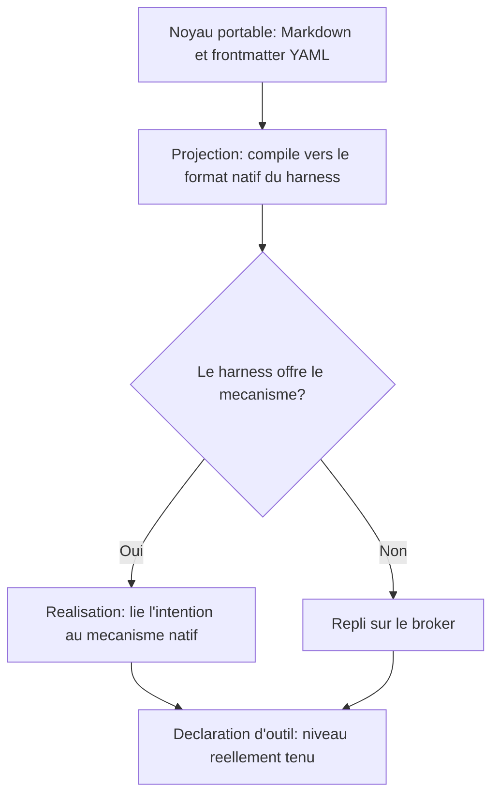

# Spécification BASE v0: principe fondateur et où lire la spec actuelle

Cette page sert de repère à quiconque cherche la spécification de BASE. Elle énonce le principe fondateur et renvoie vers la spécification d'ingénierie à jour, pour vous éviter de travailler sur un texte périmé.

> **Cette page est volontairement courte.** La spécification d'ingénierie de l'outillage BASE (broker, CLI, MCP, ports, schémas) vit dans `specs/current/`, en anglais, vérifiée contre le code et les tests; chaque version publiée est gelée par un tag git (`git show v1.0.0:specs/current/…`). En cas de divergence, `specs/` fait foi.

Point d'entrée: [`specs/current/README.md`](../../specs/current/README.md).

La «v0» désignait le récit conceptuel initial de BASE, avant que la spécification d'ingénierie n'existe. Son contenu normatif a été absorbé par `specs/current/`; cette page conserve le principe fondateur et la carte de lecture.

## Le principe fondamental, inchangé

> L'humain et l'IA travaillent avec des fichiers texte. Le code garantit les invariants que le langage naturel ne peut pas garantir.

BASE est un protocole minimal pour articuler durablement du savoir, des instructions, des processus, des données, des outils exécutables, des permissions, des décisions humaines, des traces utiles et des adaptateurs vers différents agents ou harnesses. Pour lever les confusions courantes: ce n'est ni une app, ni une UI d'automation, ni un moteur de workflow, ni une base de données, ni un simple prompt packagé.

## Où lire quoi désormais

| Ce que la v0 décrivait | Où cela vit aujourd'hui |
| ---------------------- | ----------------------- |
| Définitions (Resource, Source, Connector, Broker, etc.) et invariants | [`specs/current/00_overview/`](../../specs/current/00_overview/vision.md) et [`specs/current/10_core/requirements.md`](../../specs/current/10_core/requirements.md) |
| Forme stable des ressources (frontmatter YAML + Markdown libre) | [`specs/current/10_core/frontmatter.md`](../../specs/current/10_core/frontmatter.md) et [`base.schema.json`](../../base.schema.json) |
| Process skills vs competence skills | [Comprendre BASE](../learn/comprendre.md) et [Routage, process et ressources](routage-process-et-ressources.md) |
| Modes advisory / hybrid / strict et règle d'honnêteté | [Sécurité et limites](../trust/securite-et-limites.md) et la matrice générée [Compatibilité harnesses](compatibilite-harnesses.md) |
| Primitives du routeur et du broker | [`specs/current/10_core/routing.md`](../../specs/current/10_core/routing.md) et [`specs/current/10_core/architecture.md`](../../specs/current/10_core/architecture.md) |
| Flux propose → commit, exécution, promotion | [`specs/current/10_core/writes.md`](../../specs/current/10_core/writes.md) |
| Discipline de tests | [`specs/TESTING.md`](../../specs/TESTING.md) |
| Ce qui est livré, prévu ou hors périmètre | [État d'implémentation](etat-implementation.md) |

## Les invariants clés, en une ligne chacun

Le détail vit dans `specs/current/`, mais trois invariants méritent de rester lisibles ici:

- **Index dérivé**: manifests, caches et index ne sont pas la source de vérité; ils se régénèrent depuis les fichiers.
- **Donnée externe ≠ instruction**: un email, un CV ou un contenu web est traité comme donnée, jamais comme instruction de gouvernance.
- **Broker canonique**: la CLI, le MCP et les adaptateurs délèguent aux mêmes primitives au lieu de réimplémenter parsing, recherche, permissions ou trace.

## La règle d'honnêteté des modes

```text
advisory = guide/audit
hybrid = enforcement partiel explicite
strict = enforcement médié
```

Un adapter doit déclarer son niveau réel. BASE ne promet pas le mode strict si le harness ne permet que l'advisory. La matrice générée [Compatibilité harnesses](compatibilite-harnesses.md) rend cette règle calculable.

## La vision long terme conservée ici: portabilité

La seule partie de la v0 qui reste prospective est la cible de portabilité entre harnesses. La compatibilité «totale» n'est pas un objectif atteignable et ne doit pas être promise; l'objectif tenable est **dégradation gracieuse + niveau déclaré**. Trois strates:

1. **Noyau portable**: du Markdown et un frontmatter YAML sémantique, qui déclarent des intentions et des prises, jamais des mécanismes propres à un outil.
2. **Couche intermédiaire**: la projection compile le noyau vers le format natif de chaque harness (sortie générée, jamais source); la réalisation lie chaque intention au meilleur mécanisme offert par le harness, sinon retombe sur le broker, et enregistre le niveau atteint.
3. **Déclaration d'outil**: par agent, harness et intention, le niveau réellement tenu, calculable plutôt que rédactionnel. C'est ce que projette déjà `.ai/tools.md`.



Le broker est la réalisation de repli: ce qu'un harness ne fait pas nativement, le broker le prend en charge dès lors que l'action passe par lui (confinement, dry-run, trace, écriture médiée). Une intention comme `requires_confirmation` n'atteint un niveau strict que pour les actions qui passent effectivement par lui.

Cible de migration documentée: un dialecte sémantique unique (`base.resource.v2`) qui absorberait le dialecte ressource et le dialecte skill aujourd'hui distincts; les frontmatter natifs deviendraient des projections, générées et vérifiées en CI comme tout artefact dérivé.

---

BASE est un framework par [AI Swiss](https://a-i.swiss). Cas d'usage en partenariat avec [Innovaud](https://innovaud.ch).
