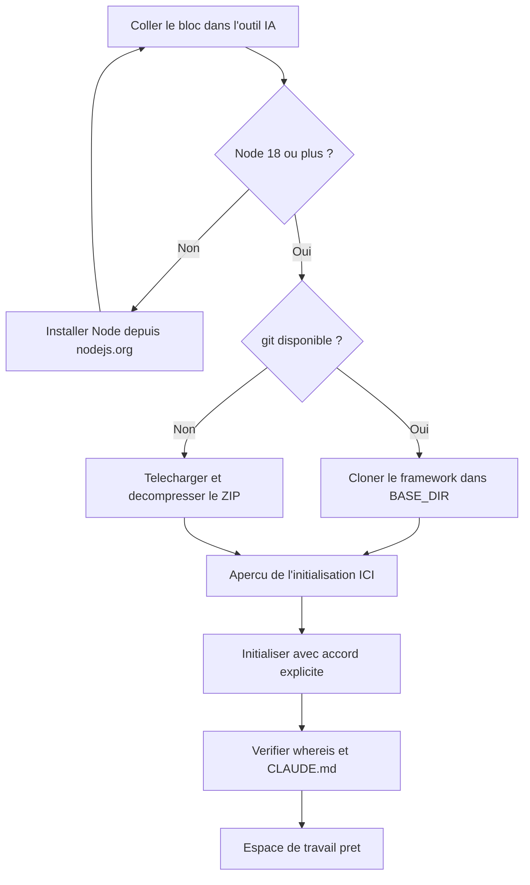

# Faites installer BASE par votre IA

Installer BASE peut être l'affaire de votre IA, pas de la vôtre: vous repartez avec un espace de
travail prêt à l'emploi sans avoir tapé une seule commande, à condition d'avoir un outil capable
d'exécuter ces commandes à votre place et de pouvoir relire chaque étape avant qu'elle s'applique.
Concrètement, vous collez un bloc dans un outil IA capable d'exécuter des commandes (par exemple
GitHub Copilot, Antigravity, Claude Code ou Cowork, OpenCode, Kilo Code), il fait l'installation
à votre place et vous dit quand votre espace de travail est prêt.

## Avant de coller le bloc

1. Créez un dossier vide pour votre travail: par exemple, dans vos Documents, un dossier
   `mon-assistant`.
2. Ouvrez ce dossier dans votre outil IA capable de lire vos fichiers (par exemple GitHub
   Copilot, Antigravity, Claude Code ou Cowork, OpenCode, Kilo Code): selon l'outil, c'est un
   *File → Open Folder*, ou bien un `cd mon-assistant` puis le lancement de l'outil dans ce
   dossier.
3. Ouvrez le chat en **mode agent** (celui qui peut exécuter des commandes): selon l'outil,
   c'est un mode *Agent* à activer dans le panneau de chat, ou bien le mode par défaut.
4. Collez le bloc ci-dessous et envoyez.

## Le bloc à coller

```text
Mission: installer BASE et créer mon espace de travail dans le dossier courant.

D'abord, demande-moi: «Où veux-tu installer le framework BASE?»
(propose le sous-dossier "base" de mes Documents, et appelle ce chemin <BASE_DIR>).

Étapes, vérifie chaque sortie avant de continuer:
1. `node --version`: il faut Node 18 ou plus. Sinon, guide-moi pour l'installer depuis
   nodejs.org. Après l'installation, je ferme et rouvre mon outil, je recolle cette
   lettre, et tu reprends ici.
2. Installe le framework dans <BASE_DIR> s'il n'y est pas déjà:
   `git clone https://github.com/ai-swiss/base.git <BASE_DIR>`
   Si git n'est pas disponible, télécharge
   https://github.com/ai-swiss/base/archive/refs/heads/main.zip, décompresse-le, et
   place son contenu dans <BASE_DIR>, puis continue. (Sur Mac, taper git peut ouvrir un
   dialogue d'installation des outils de développement: c'est normal, le ZIP l'évite.)
3. Montre-moi ce que l'initialisation créerait ICI (mon dossier de travail, pas <BASE_DIR>):
   `node <BASE_DIR>/tools/base.mjs init`
   puis, avec mon accord explicite: `node <BASE_DIR>/tools/base.mjs init --yes`
4. Vérifie: `node <BASE_DIR>/tools/base.mjs whereis` montre <BASE_DIR>,
   et le fichier CLAUDE.md existe maintenant dans mon dossier.
5. Dis-moi la phrase exacte à t'écrire pour commencer
   («importer mes procédures existantes» si j'ai déjà des documents à convertir).

Garde-fous: n'écrase JAMAIS un fichier existant; n'installe rien d'autre sans me
demander; si une étape échoue, montre-moi l'erreur exacte au lieu de bricoler.
```

Voici le déroulé que votre IA suit:



## Ce qui se passe ensuite

Votre dossier contient maintenant un agent, sa configuration, et les fichiers que votre outil
lit pour devenir le **routeur** de votre métier (selon l'outil, un `CLAUDE.md`, un
`AGENTS.md` ou un fichier de règles équivalent dans le dossier de l'outil). Parlez-lui
normalement: il oriente chaque demande vers le bon process et le suit, sans que vous ayez à
chercher lequel utiliser.

- **Convertir vos documents existants**: dites «importer mes procédures existantes». Chaque
  conversion vous est proposée en diff; rien n'est écrit sans vous.
- **L'atelier**: pour parcourir, éditer et évaluer vos assistants dans une interface,
  `node <BASE_DIR>/tools/base.mjs studio --root .` ouvre BASE Studio.
- **Garder le framework à jour**: `node <BASE_DIR>/tools/base.mjs update`.
- **Où vit BASE**: `node <BASE_DIR>/tools/base.mjs whereis` (l'emplacement est aussi noté
  dans `~/.config/base/config.json`, modifiable à la main).

Vous préférez tout faire vous-même? Voir [Obtenir BASE](obtenir-base.md) et
[Installer un espace de travail](installer.md).
