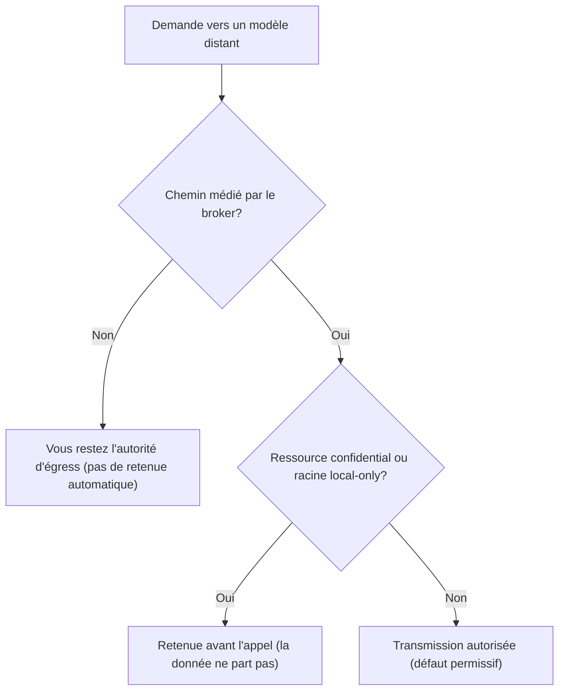

# La frontière, local par défaut

Savoir ce qui reste sur votre machine et ce qui peut partir vers un service distant, c'est savoir ce que vous pouvez confier à BASE en connaissance de cause. Cette page trace cette frontière, pour une institution qui doit savoir quoi attendre. Le propos est informatif et ne constitue ni un avis juridique ni un avis de conformité: l'institution reste responsable de sa propre analyse d'impact (DPIA) et de sa politique de sécurité.

Tout au long de cette page, nous distinguons deux niveaux de garantie:

- un **mécanisme**: un comportement appliqué par le broker BASE, vérifiable, qui ne dépend pas de la bonne volonté d'un modèle;
- une **consigne**: une instruction inscrite dans un fichier et suivie par un modèle coopératif, sans garantie technique.

Cette distinction fonde l'honnêteté de BASE. Une garantie n'est réelle que si elle passe par un mécanisme capable de l'appliquer.

## 1. Ce qui est local par défaut

En configuration par défaut, BASE ne fait aucune sortie réseau.

- **Le routage est 100 % lexical et local.** La sélection de l'agent et du process se fait par appariement lexical sur la machine, sans aucun appel réseau (mécanisme). Le classement sémantique par embeddings est une option, désactivée par défaut.
- **Les fichiers ne quittent pas la machine.** BASE garde vos ressources localement. Le cœur BASE n'appelle jamais de lui-même un fournisseur; en configuration sans provider, aucune donnée n'est envoyée hors de la machine (mécanisme).
- **Le journal `.ai/trace` est local.** Les opérations médiées par le broker écrivent une ligne locale dans `.ai/trace/`, sur la machine, sans contenu métier par défaut (mécanisme). Voir la section dédiée plus bas.

Le fait que vos fichiers restent locaux ne signifie pas que tout ce que vous confiez ensuite à un outil IA reste local. Le contenu d'une conversation ou d'un fichier ouvert dans un outil IA peut être transmis au fournisseur de cet outil. C'est l'objet des deux sections suivantes.

## 2. Ce qui ne peut sortir que sur choix explicite

Aucune sortie réseau ne se produit sans un choix de configuration assumé. Deux sorties sont possibles, et seulement si vous les activez.

- **Un fournisseur d'embeddings, si vous l'activez.** Le classement sémantique optionnel envoie du texte (la requête, et le texte des ressources routables) à un service d'embeddings. Cette sortie n'existe que si vous fournissez un embedder. Vous pouvez la garder entièrement locale avec Ollama (`createOllamaEmbedder`), auquel cas il n'y a toujours aucune sortie réseau. Vous pouvez aussi passer par une passerelle interne que vous contrôlez. Le détail figure dans [Sécurité et données du routage](securite-donnees-routage.md).
- **L'appel au modèle lui-même.** L'appel au modèle de langage est réalisé par l'outil IA que vous utilisez (la CLI, l'extension ou l'application), vers le fournisseur que l'institution a choisi. Cet appel se fait **en dehors de BASE**: le choix du modèle et du fournisseur, ainsi que les traitements côté fournisseur, ne sont pas dans le périmètre de BASE. Avant de traiter des données personnelles, clients, RH, financières, médicales ou réglementées, vérifiez les conditions d'utilisation, les options de rétention, les garanties contractuelles et la localisation des traitements de cet outil.

## 3. Sous quelle autorité

La frontière est gardée à deux endroits, par deux autorités distinctes.

- **L'institution choisit le modèle et le fournisseur.** Ce choix est externe à BASE. BASE ne sélectionne pas de modèle, n'impose pas de fournisseur et ne se substitue pas à la politique de l'institution.
- **BASE refuse la sortie de ressources confidentielles ou strictement locales vers un modèle distant, avant tout appel.** C'est un mécanisme de contrôle d'égress: une ressource marquée confidentielle, ou une racine déclarée locale uniquement, n'est pas transmise à un modèle distant, et la vérification a lieu **avant** l'appel, pas après. Ce mécanisme protège contre une transmission non voulue de ressources placées sous le contrôle du broker. Il ne contrôle pas ce que l'utilisateur saisit directement dans un outil IA hors BASE, ni ce que le fournisseur fait ensuite des données reçues.

Un exemple concret. Une fiche client contient un IBAN, et vous la marquez `confidential`. Vous demandez à votre assistant, branché par le broker, de rédiger un rappel de paiement avec un modèle distant. Avant l'appel, BASE voit le marqueur, retient la fiche, et l'assistant travaille sans que l'IBAN parte vers le fournisseur. La donnée sensible ne quitte pas votre machine, et vous n'avez rien eu à surveiller.

La décision d'égress suit ce cheminement avant tout appel à un modèle distant:

**Portée exacte du mécanisme.** La retenue opère sur les chemins médiés par le broker, là où BASE prépare ce qui part vers le modèle: le serveur MCP, le chat du Studio, l'évaluation. En ligne de commande directe (par exemple `base open` d'une ressource, puis copier-coller vers un outil IA), c'est vous qui restez l'autorité d'égress: aucune retenue automatique n'opère, par conception. Et la retenue se déclenche sur le **drapeau explicite `confidential`** d'une ressource (ou une racine locale uniquement), pas sur la taxonomie `sensitivity`: une donnée classée `restricted` ou `sensitive` mais non marquée `confidential` n'est pas retenue. Marquez `confidential` toute ressource qui ne doit jamais atteindre un modèle distant. Enfin, le **défaut est permissif**: une racine est en politique d'égress `any` sauf déclaration contraire, donc hors ressources `confidential` son contenu peut être transmis; déclarez la racine `local-only` dans `base.config.json` pour tout retenir vers un modèle distant.

En résumé, l'institution décide où vont les données au niveau du fournisseur; BASE empêche, au niveau du broker, qu'une ressource explicitement confidentielle ou locale parte vers un modèle distant.

## Le journal de trace

Le journal `.ai/trace` rend les opérations médiées auditables localement, sans devenir un outil de surveillance.

- **Ce qu'il enregistre.** Les opérations qui passent par le broker (ouvrir une ressource, accéder à un fichier confiné, invoquer une tool, proposer puis valider une écriture) écrivent une ligne JSONL minimale: identifiants, décisions, durées. Par défaut, **aucun contenu métier** n'est enregistré.
- **Où il vit.** Le journal est local, dans le dossier `.ai/trace/` du projet. Il n'est pas transmis à un service distant par BASE, et ce dossier est ignoré par git.
- **Comment le purger.** Vous pouvez vider le journal avec `base trace clear`, ne conserver que les N derniers jours avec `base trace prune --keep-days N`, ou, en dernier recours, supprimer manuellement le dossier `.ai/trace/`.

La rétention de ce journal n'est pas gérée par BASE. C'est une responsabilité de l'opérateur ou de l'institution: définir une durée de conservation, la purge et, le cas échéant, l'archivage relèvent de votre politique interne. BASE ne fournit pas de rétention réglementaire ni d'archivage légal.

## Limites à garder en tête

- BASE n'est ni un runtime d'agents, ni un moteur d'orchestration, ni un système RAG, ni une plateforme, ni un IAM, DLP, SIEM, RBAC. Il ne fournit ni rétention réglementaire, ni archivage légal.
- BASE ne garantit pas l'exactitude des réponses du modèle, ni les traitements réalisés par le fournisseur IA.
- Les mécanismes d'égress et de confinement s'appliquent aux actions médiées par le broker. Une action qui contourne BASE dépend des droits natifs de l'outil et de l'environnement.

Pour le modèle de sécurité complet et les limites par niveau d'adoption, voir [Sécurité et limites](securite-et-limites.md). Pour le détail des chaînes envoyées en routage sémantique, voir [Sécurité et données du routage](securite-donnees-routage.md).
