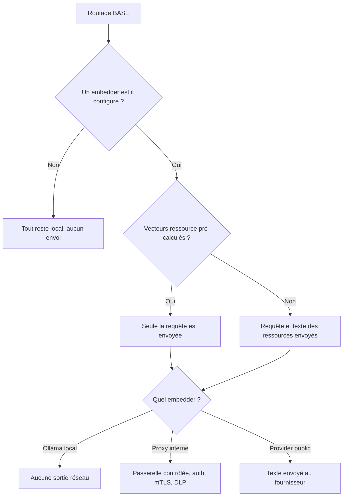

# Garder vos données sous contrôle quand le routage utilise un provider

Dès que le routage sémantique de BASE s'appuie sur un provider d'embeddings, du texte quitte votre machine, et vous devez pouvoir dire exactement lequel et comment le maîtriser. Pour les équipes qui branchent ce routage, vous verrez ici ce qui est réellement envoyé, comment réduire l'exposition, comment passer par un proxy interne et comment journaliser sans jamais exposer de contenu métier.

## Aucun envoi sans configuration explicite

Le cœur BASE n'appelle **jamais** un fournisseur. En configuration zéro-provider, aucune donnée n'est envoyée hors de la machine. Un envoi ne devient possible que si vous fournissez un `embed` (directement ou via `createOpenAICompatibleEmbedder` / `createOllamaEmbedder`). Le chemin zéro-config (lexical + `semanticHybrid`) est entièrement local.

## Quelles chaînes sont envoyées

Avec un provider configuré, deux types de texte peuvent être embeddés:

1. **La requête** (la demande de l'utilisateur).
2. **Le texte de chaque ressource routable**: par défaut `route_text` + `title` + `description` +
   `keywords` + `body` (`textForResource`). Vous contrôlez ce périmètre.

## Réduire l'exposition

Le schéma suivant résume ce qui quitte la machine selon la configuration:



- **Pré-calculez** les vecteurs ressource dans un environnement maîtrisé (`@ai-swiss/base-index-local`)
  et servez-les via `getResourceEmbedding`. À la requête, **seule la requête** est envoyée.
- **Réduisez `textOf`** au minimum qui route bien; souvent `route_text` seul suffit:

  ```js
  createSemanticRanker({ embed, textOf: (r) => [r.route_text, r.title].filter(Boolean).join("\n") });
  ```

- **Restez local** avec `createOllamaEmbedder()`: aucune sortie réseau.
- **Passez par une passerelle interne**: `createOpenAICompatibleEmbedder({ baseUrl })` vers un reverse
  proxy que vous contrôlez (auth, mTLS, DLP). Bien configuré, ce proxy garde le texte métier hors de tout endpoint public.

## Secrets

`createOpenAICompatibleEmbedder` lit `OPENAI_API_KEY` par défaut, ou accepte un `apiKey` explicite.
Stockez les clés dans un gestionnaire de secrets ou des variables d'environnement, jamais dans le
dépôt. Un échec d'auth est typé `EmbeddingAuthError` (`code: "semantic.auth"`) et **n'est jamais
retenté**: une mauvaise clé échoue vite au lieu de marteler le fournisseur.

## Journaliser sans contenu métier

Le hook `onMetric` ne rapporte que des signaux opérationnels (`{ provider, batchSize, attempt,
latencyMs, cacheHit, similarity, dimension }`): **aucun texte, aucun vecteur**. Journalisez-les
librement; ne journalisez jamais les chaînes embeddées ni la requête brute si le corpus est sensible.

```js
createSemanticRanker({ embed, onMetric: (m) => logger.info({ embedding: m }) }); // sûr: pas de contenu
```

## Annulation et limites

Chaque appel provider respecte un `timeoutMs` et un `AbortSignal` (`ctx.signal`): un embedding trop long ou
qui s'emballe peut être borné et annulé depuis la CLI, le MCP ou un serveur.

## Périmètre

Le routage sémantique améliore la **pertinence**; il ne remplace pas les politiques IAM, DLP, SIEM ou
de rétention de votre organisation. Voir aussi [`docs/trust/securite-et-limites.md`](securite-et-limites.md).
