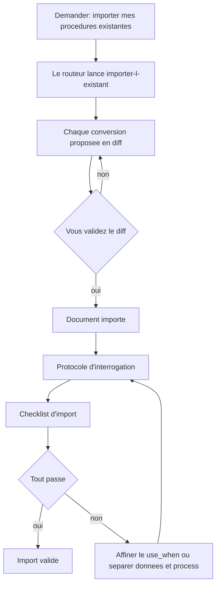

# Migrer VOS contenus

*⏱ ~15 min · module 9/9, parcours Praticien*

**Vous allez**: transformer deux ou trois de vos vrais documents en contenu que votre assistant utilise vraiment, prouvé par le ✅ ci-dessous.
**Il vous faut**: les modules précédents; votre dossier `mon-office-tourisme` (ou un dossier à vous) ouvert.
↻ **Rappel**: sans regarder: par quoi passe toute écriture dans BASE? (le gate: propose puis commit)

Vous avez accumulé une liste «Chez vous» au fil des modules. C'est votre backlog.

1. Dans votre dossier, demandez: *«importer mes procédures existantes»*. Le routeur lance le
   process `importer-l-existant`, qui propose chaque conversion en diff: rien n'est écrit sans vous.
2. Importez deux ou trois documents de votre liste.
3. Vérifiez chaque import par le **protocole d'interrogation** (module Découverte 3): une
   question que seul le document répond, une question piège hors-document, une demande de routage.
4. Passez la **checklist d'import**:
   - [ ] le use_when de chaque process décrit une intention, pas un titre;
   - [ ] les données (tarifs, fiches) sont séparées des process qui les utilisent;
   - [ ] les étapes à décision humaine portent un `[A VALIDER]`;
   - [ ] ce qui peut périmer porte une date (`valid_until`).

✅ **Vérifiez**: pour chaque document importé, le protocole d'interrogation passe (cite le bon doc, admet l'ignorance, route bien) ET la checklist est cochée.

💡 **Pourquoi ça a marché**: c'est ici que le tutoriel devient votre outil: la même structure que l'office du tourisme de Veytaux, sur votre métier. La checklist encode ce que les modules ont enseigné: vous importez avec une grille, jamais à l'aveugle.

🔁 **Chez vous**: planifiez le prochain: quel troisième document, quelle prochaine tâche automatiser?

→ **Et maintenant**: vous avez fini le parcours Praticien: VOTRE assistant répond sur VOTRE contenu. Pour plusieurs personnes, voir le [parcours Equipe](equipe-1-workspace.md).

🆘 **Pannes courantes**: *L'import propose n'importe quoi*: guidez-le document par document plutôt que tout d'un coup. *Le protocole échoue*: affinez le use_when, ou séparez données et process.
