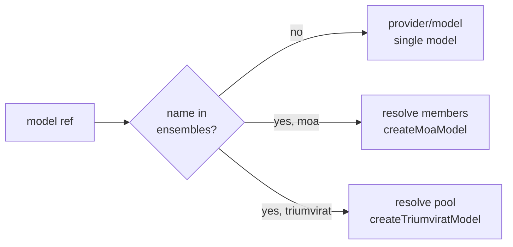

# Configuring ensembles in settings

MoA (`createMoaModel`) and Triumvirat (`createTriumviratModel`) are usable from
`.ai/studio.settings.json` without code. Add an `ensembles` block; each entry
names a `type` and member refs. A member ref is the same `<provider>/<model>`
string a normal model uses, so members are resolved through the existing
provider registry. The ensemble name then works anywhere a model ref does
(for example `routing.model`).



## Example

```json
{
  "providers": [
    { "id": "openai", "type": "openai-compatible", "baseUrl": "https://api.openai.com/v1", "apiKeyEnv": "OPENAI_API_KEY" },
    { "id": "openrouter", "type": "openai-compatible", "baseUrl": "https://openrouter.ai/api/v1", "apiKeyEnv": "OPENROUTER_API_KEY" }
  ],
  "ensembles": {
    "council": {
      "type": "moa",
      "proposers": ["openai/gpt-5.5", "openrouter/deepseek/deepseek-v4-pro"],
      "aggregator": "openrouter/qwen3-max"
    },
    "trio": {
      "type": "triumvirat",
      "pool": {
        "deepseek": "openrouter/deepseek/deepseek-v4-pro",
        "gpt": "openai/gpt-5.5",
        "qwen": "openrouter/qwen3-max"
      },
      "maxTurns": 6
    }
  }
}
```

## Fields

`type: "moa"`

| Field | Required | Meaning |
| --- | --- | --- |
| `proposers` | yes | List of member refs that draft in parallel. |
| `aggregator` | yes | Member ref that synthesizes the drafts. |
| `synthesisPrompt` | no | Override the aggregator guidance. |

`type: "triumvirat"`

| Field | Required | Meaning |
| --- | --- | --- |
| `pool` | yes | Object of member refs, keyed by name, cheapest-first. |
| `coordinator` | no | Member ref for a dedicated coordinator. Defaults to the cheapest pool member. |
| `maxTurns` | no | Turn budget (default 6). |

Member refs resolve through the same registry as any model, so a missing
provider, an unknown ensemble type, or a missing required field fails with a
clear `BAD_REQUEST` error.
