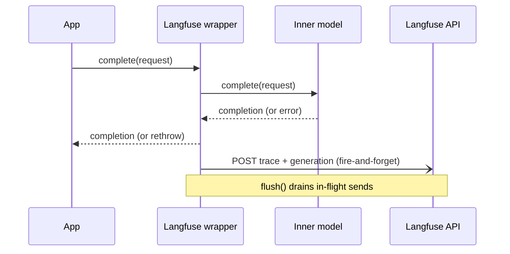

# Langfuse monitoring

`createLangfuseModel` wraps any base-llm model and conforms to the same port
(`{ id, complete, stream? }`), so it composes over a single adapter, a MoA, or a
Triumvirat. Every call is traced to [Langfuse](https://langfuse.com): input,
output, token usage, latency, and errors.

Zero new dependencies: no Langfuse SDK, just native `fetch` against the public
ingestion API. Ingestion is fire-and-forget, so it never adds latency to the
model call. A telemetry failure never breaks the wrapped call.

## Flow



## Usage

```js
import { createLangfuseModel, createOpenAICompatibleModel } from "@ai-swiss/base-llm";

const model = createLangfuseModel({
  model: createOpenAICompatibleModel({ model: "gpt-5.5" }),
  // publicKey / secretKey default to env LANGFUSE_PUBLIC_KEY / LANGFUSE_SECRET_KEY
});

const out = await model.complete({ messages: [userMessage("Explain CRDTs.")] });

// Before a short-lived process exits, drain in-flight telemetry:
await model.flush();
```

Because it wraps any model, you can monitor an ensemble by wrapping it:

```js
const monitored = createLangfuseModel({ model: createMoaModel({ proposers, aggregator }) });
```

## Options

| Option | Default | Meaning |
| --- | --- | --- |
| `model` | (required) | The model to wrap. |
| `publicKey` | env `LANGFUSE_PUBLIC_KEY` | Langfuse public key. |
| `secretKey` | env `LANGFUSE_SECRET_KEY` | Langfuse secret key. |
| `baseUrl` | env `LANGFUSE_HOST` or `https://cloud.langfuse.com` | Langfuse host (self-hosted supported). |
| `fetch` | `globalThis.fetch` | Injectable fetch (used in tests). |
| `onError` | swallow | Called with any ingestion failure. |

`flush()` resolves once all in-flight ingestion sends complete. `stream()` is
exposed only when the wrapped model streams; it accumulates the streamed text and
the final usage chunk for the generation record.

## What gets sent

Per call, one batch with two events to `POST {baseUrl}/api/public/ingestion`
(HTTP Basic auth):

- `trace-create` with the input messages and the output text.
- `generation-create` with the model id, input, output, mapped token usage
  (`{ input, output, total, unit: "TOKENS" }`), `startTime`/`endTime`, and on
  failure `level: "ERROR"` plus the error message.
