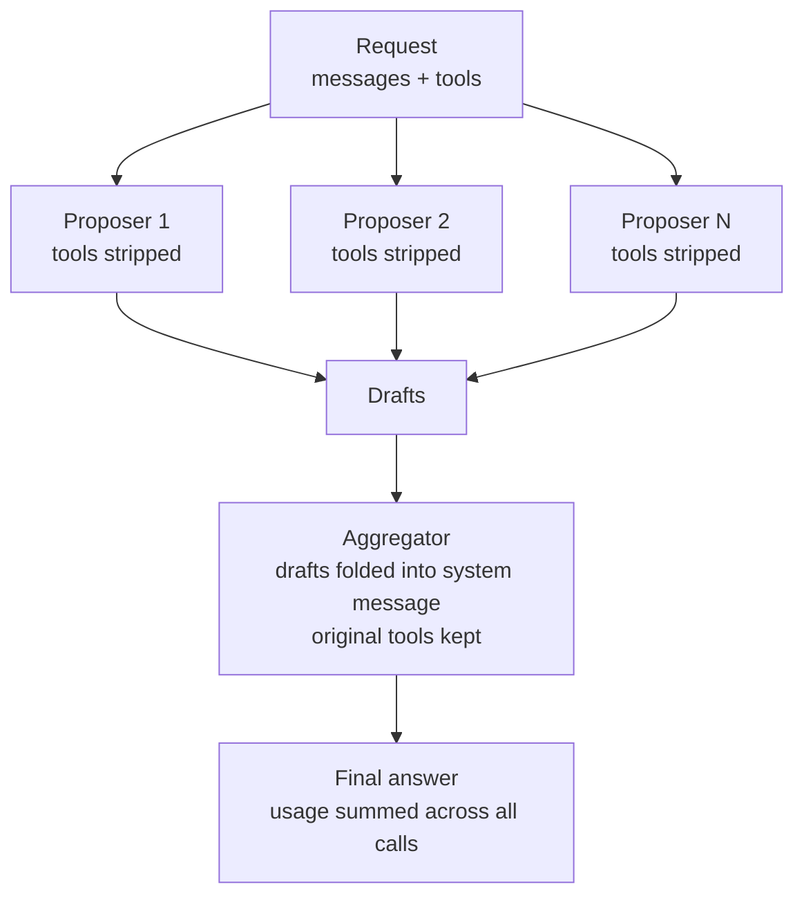

# Mixture of Agents (MoA)

`createMoaModel` wraps N proposer models and one aggregator into a single model
that conforms to the base-llm port (`{ id, complete, stream? }`). It drops in
anywhere a normal model is used: settings, Studio, the CLI.

It follows the Mixture-of-Agents pattern (Wang et al. 2024), the shape Sakana
Hermes' `moa` provider uses: many models answer in parallel, then one model
synthesizes their drafts into the final answer. There is no ground-truth judge
in chat, so the aggregator LLM is the selector.

## Flow



Key rules:

- Proposers run in parallel and receive the request with tools removed. They
  draft prose; they do not act. Merging N independent tool-call sets is
  undefined, so only the aggregator gets tools.
- The aggregator receives the original conversation plus the drafts as private
  guidance folded into the system message (never shown to the user), with the
  original tools intact so tool-calling still works.
- If some proposers fail, MoA synthesizes from the survivors. It throws only if
  every proposer fails.
- `usage` is summed across all proposer and aggregator calls.

## Usage

```js
import {
  createMoaModel,
  createOpenAICompatibleModel,
} from "@ai-swiss/base-llm";

const moa = createMoaModel({
  proposers: [
    createOpenAICompatibleModel({ model: "gpt-5.5" }),
    createOpenAICompatibleModel({ baseUrl: openrouter, model: "deepseek/deepseek-v4-pro" }),
  ],
  aggregator: createOpenAICompatibleModel({ baseUrl: openrouter, model: "qwen3-max" }),
});

const out = await moa.complete({ messages: [userMessage("Explain CRDTs.")] });
```

## Options

| Option | Default | Meaning |
| --- | --- | --- |
| `proposers` | (required) | Non-empty list of models that draft in parallel. |
| `aggregator` | (required) | Model that synthesizes the drafts. |
| `id` | `"moa"` | Value reported as `model.id`. |

`stream()` is exposed only when the aggregator supports streaming; proposers are
gathered first, then the aggregator streams.

## MoA vs Triumvirat

MoA is one-shot breadth: parallel proposals, one synthesis pass, cheap. For
sequential plan / execute / verify with self-correction, see Triumvirat
(`createTriumviratModel`).
