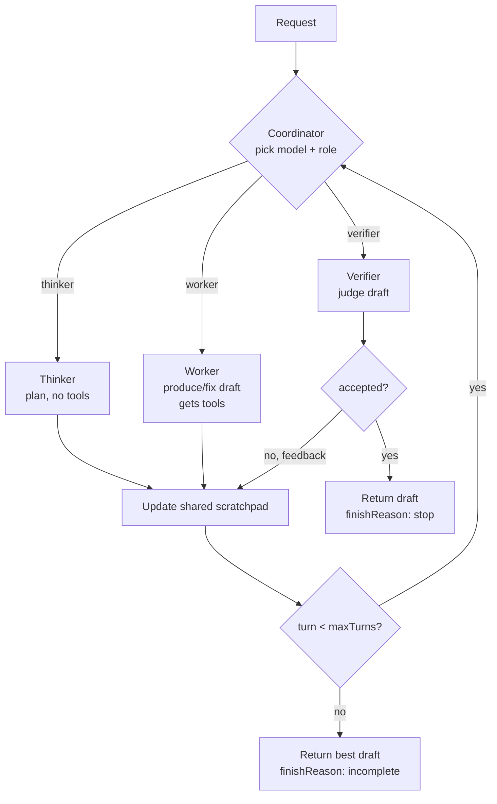

# Triumvirat orchestrator

`createTriumviratModel` implements the inference-time architecture of Sakana Fugu /
TRINITY (arXiv:2512.04695) as a base-llm model. The name nods to the three roles
(Thinker, Worker, Verifier) it coordinates. It conforms to the port
(`{ id, complete }`), so a coordinated pool of models is usable anywhere a single
model is.

Each turn a coordinator picks one model from a swappable pool and assigns it a
role. The loop runs until the Verifier accepts or a turn budget is hit.

- Thinker: plans and decomposes. No tools, no final answer.
- Worker: produces or fixes the answer. The only role that receives the
  request's tools.
- Verifier: judges the current draft, returns `{ accepted, feedback }`. On
  reject, the feedback feeds the next Worker turn.

## What is and is not reproduced

TRINITY's contribution is a ~0.6B coordinator trained with separable CMA-ES.
That training is out of scope for a library. The default coordinator here is
prompted (an LLM choosing model + role + stop), with a deterministic
Thinker / Worker / Verifier cadence as the fallback. The `coordinator.decide`
seam lets a heuristic or trained coordinator drop in later with no API change.

## The turn loop



A failed role turn is recorded as rejected feedback so the loop can recover
rather than crash. The abort signal is checked between turns. `usage` is summed
across the coordinator and every role call. `raw` carries `turns`, `accepted`,
the last verifier feedback, and the full transcript.

## Usage

```js
import {
  createTriumviratModel,
  createOpenAICompatibleModel,
} from "@ai-swiss/base-llm";

const triumvirat = createTriumviratModel({
  // Order cheapest-first: the default coordinator uses the first entry.
  pool: {
    deepseek: createOpenAICompatibleModel({ baseUrl: openrouter, model: "deepseek/deepseek-v4-pro" }),
    gpt: createOpenAICompatibleModel({ model: "gpt-5.5" }),
    qwen: createOpenAICompatibleModel({ baseUrl: openrouter, model: "qwen3-max" }),
  },
  maxTurns: 6,
});

const out = await triumvirat.complete({ messages: [userMessage("Write and verify a binary search.")] });
```

## Options

| Option | Default | Meaning |
| --- | --- | --- |
| `pool` | (required) | Non-empty map of pool models, keyed by name, cheapest-first. |
| `coordinator` | prompted over cheapest | A dedicated model, or a custom `{ decide(state, ctx) }`. |
| `maxTurns` | `6` | Hard turn budget; guarantees termination. |
| `id` | `"triumvirat"` | Value reported as `model.id`. |

## A custom coordinator

The `decide` seam takes the loop state and returns the next move:

```js
const heuristic = {
  decide(state) {
    if (state.turn === 0) return { model: "deepseek", role: "thinker" };
    if (!state.lastDraft) return { model: "gpt", role: "worker" };
    return { model: "qwen", role: "verifier" };
  },
};
createTriumviratModel({ pool, coordinator: heuristic });
```

## Triumvirat vs MoA

Triumvirat is sequential depth: plan, execute, verify, repeat, self-correcting and
tool-using. For one-shot breadth (parallel proposals, one synthesis pass), see
MoA (`createMoaModel`).
